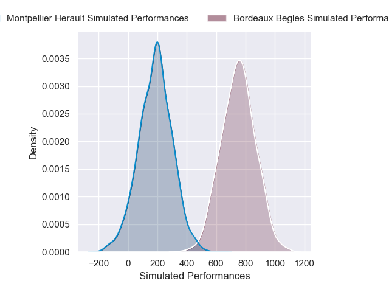
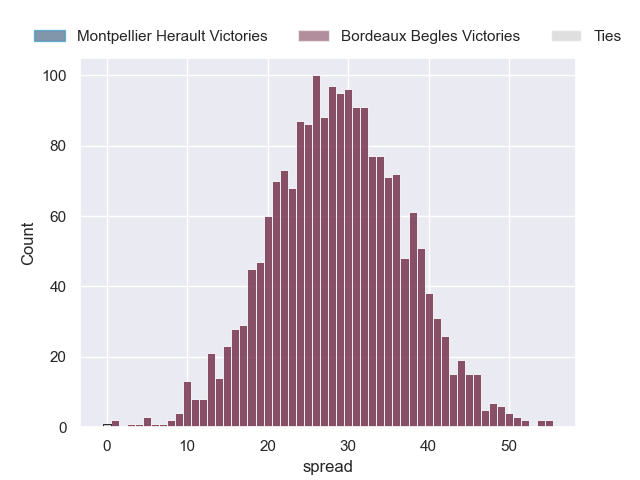

---  
layout: page  
title: Montpellier Herault at Bordeaux Begles  
date: 2024-11-30 18:00:00 -0500  
categories: "Top 14 2024" match projection  
---
# Montpellier Herault at Bordeaux Begles

# Club Level Predictions

The first set of predictions treats a club as the smallest object, as the club develops its members, organizes a gameplan, and deploys its players as needed for each match. This club model has a prediction of 0.628, which translates to predicting Bordeaux Begles to win by 9.1.

Our Over/Under is 53.5 - and combined with the spread above, we have a predicted scoreline of 22 to 31

Each club has a rating and a rating deviation (similar to a Glicko rating), and expected performances can be generated. This allows for simulated matches and spreads like the ones below.
## Projected Performances - Club Model

## Projected Spreads - Club Model

## Projected Results - Club Model

# Player Level Predictions

Treating teams instead as an entity made up of the currently active players, I have ratings for each player in an altogether different system. These can be combined to form team ratings once teamsheets are announced, weighting starters a bit higher than the reserves. After the match is played, players can be weighted by their minutes on the field, allowing for an accurate measure of the team's composition. With these compiled team ratings, we can make predictions, measure inaccuracy, and update the individual player ratings.
## Prediction without Player Minutes: Bordeaux Begles by 28.8

Bordeaux Begles by 16.8 on a neutral pitch

## Projected Performances - Player Model

## Projected Spreads - Player Model

## Projected Results - Player Model

| Away Player         |   Away Percentile |   Number |   Home Percentile | Home Player               |
|:--------------------|------------------:|---------:|------------------:|:--------------------------|
| Baptiste Erdocio    |              3.46 |        1 |             81.16 | Jefferson Poirot          |
| Jordan Uelese       |             15.6  |        2 |             51.83 | Maxime Lamothe            |
| Wilfrid Hounkpatin  |             46.36 |        3 |             96.17 | Ben Tameifuna             |
| Florian Verhaeghe   |             58.81 |        4 |             93    | Cyril Cazeaux             |
| Bastien Chalureau   |             73.87 |        5 |             98.58 | Adam Coleman              |
| Yacouba Camara      |             89.81 |        6 |             82.6  | Bastien Vergnes Taillefer |
| Alexandre Becognee  |             56.33 |        7 |             90.95 | Pierre Bochaton           |
| Billy Vunipola      |             98.86 |        8 |             70.39 | Marko Gazzotti            |
| Leo Coly            |             26.8  |        9 |             98.72 | Maxime Lucu               |
| Thomas Vincent      |              5.8  |       10 |             97.2  | Matthieu Jalibert         |
| Gabriel Ngandebe    |             11.85 |       11 |             77.72 | Louis Bielle-Biarrey      |
| Jan Serfontein      |             71.94 |       12 |             81.73 | Rohan Janse van Rensburg  |
| Auguste Cadot       |             18.17 |       13 |             80.13 | Nicolas Depoortere        |
| Mael Moustin        |             18.93 |       14 |              3.67 | Pablo Uberti              |
| Julien Tisseron     |             79.49 |       15 |             79.8  | Joey Carbery              |
| Christopher Tolofua |             86.85 |       16 |             40.21 | Connor Sa                 |
| Enzo Forletta       |             68.58 |       17 |             15.01 | Matis Perchaud            |
| Tyler Duguid        |             67.76 |       18 |             93.27 | Guido Petti               |
| Lenni Nouchi        |             88.58 |       19 |             10.11 | Lachlan Swinton           |
| Ryan Louwrens       |             95.06 |       20 |             90.07 | Tevita Tatafu             |
| Arthur Vincent      |              8.38 |       21 |             97.45 | Arthur Retiere            |
| Joshua Moorby       |             78.91 |       22 |             71.2  | Enzo Reybier              |
| Luka Japaridze      |             80.79 |       23 |             41.21 | Toma'akino Taufa          |

