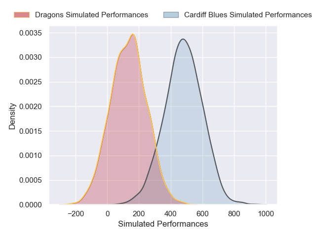
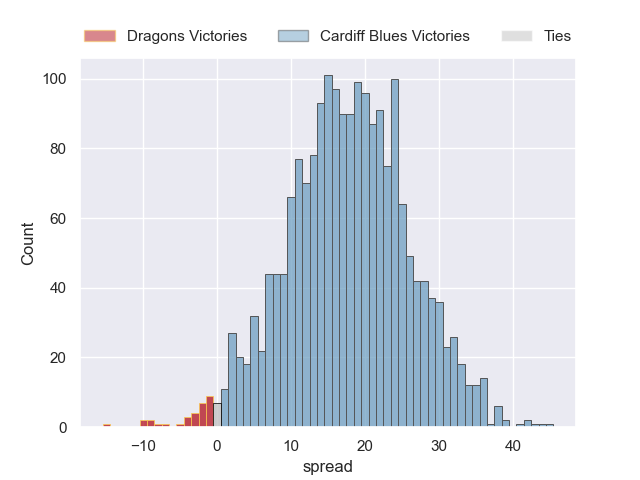
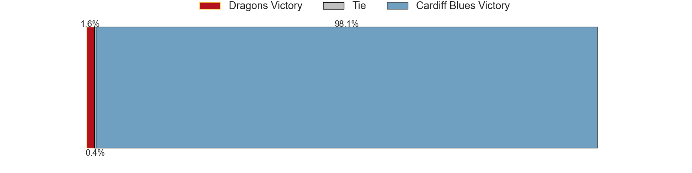

---  
layout: page  
title: Dragons at Cardiff Blues  
date: 2024-11-30 18:00:00 -0500  
categories: "United Rugby Championship 2024" match projection  
---
# Dragons at Cardiff Blues

# Club Level Predictions

The first set of predictions treats a club as the smallest object, as the club develops its members, organizes a gameplan, and deploys its players as needed for each match. This club model has a prediction of 0.635, which translates to predicting Cardiff Blues to win by 9.8.

Our Over/Under is 53.5 - and combined with the spread above, we have a predicted scoreline of 22 to 32

Each club has a rating and a rating deviation (similar to a Glicko rating), and expected performances can be generated. This allows for simulated matches and spreads like the ones below.
## Projected Performances - Club Model

## Projected Spreads - Club Model

## Projected Results - Club Model

# Player Level Predictions

Treating teams instead as an entity made up of the currently active players, I have ratings for each player in an altogether different system. These can be combined to form team ratings once teamsheets are announced, weighting starters a bit higher than the reserves. After the match is played, players can be weighted by their minutes on the field, allowing for an accurate measure of the team's composition. With these compiled team ratings, we can make predictions, measure inaccuracy, and update the individual player ratings.
## Prediction without Player Minutes: Cardiff Blues by 17.5

Cardiff Blues by 5.2 on a neutral pitch

## Projected Performances - Player Model

## Projected Spreads - Player Model

## Projected Results - Player Model

| Away Player        |   Away Percentile |   Number |   Home Percentile | Home Player        |
|:-------------------|------------------:|---------:|------------------:|:-------------------|
| Rodrigo Martinez   |             66.74 |        1 |             84.11 | Ed Byrne           |
| Brodie Coghlan     |             56.12 |        2 |             21.25 | Dafydd Hughes      |
| Chris Coleman      |             22.37 |        3 |              1.91 | Keiron Assiratti   |
| Matthew Screech    |              1.59 |        4 |             82.11 | Josh McNally       |
| George Nott        |             13.11 |        5 |             11.07 | Teddy Williams     |
| Shane Lewis-Hughes |             19.95 |        6 |             90.51 | Ben Donnell        |
| Taine Basham       |             32.01 |        7 |             90.42 | Thomas Young       |
| Aaron Wainwright   |             40.34 |        8 |             82.58 | Alun Lawrence      |
| Rhodri Williams    |             88.36 |        9 |             76.71 | Aled Davies        |
| Lloyd Evans        |             72.8  |       10 |             90.8  | Callum Sheedy      |
| Jared Rosser       |             11.77 |       11 |             12.09 | Harri Millard      |
| Aneurin Owen       |             76.08 |       12 |             44.82 | Ben Thomas         |
| Joe Westwood       |             60.26 |       13 |             84.84 | Rey Lee-Lo         |
| Rio Dyer           |             31.26 |       14 |             87.91 | Josh Adams         |
| Angus O'Brien      |             20    |       15 |              9.96 | Cameron Winnett    |
| James Benjamin     |             14.22 |       16 |              9.63 | Evan Lloyd         |
| Aki Seiuli         |             40.4  |       17 |             81.53 | Corey Domachowski  |
| Dmitri Arhip       |            nan    |       18 |             19.06 | Rhys Litterick     |
| Joseph Davies      |             11.34 |       19 |             13.99 | Seb Davies         |
| Ryan Woodman       |             62.39 |       20 |             13.01 | Alex Mann          |
| Morgan Lloyd       |            nan    |       21 |             36.2  | Ellis Bevan        |
| Harry Wilson       |             57.34 |       22 |             40.87 | Rory Jennings      |
| Huw Anderson       |            nan    |       23 |             85.28 | Gabriel Hamer-Webb |

