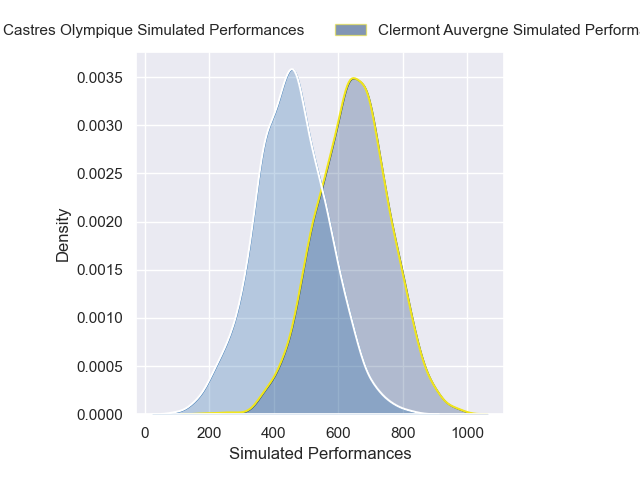
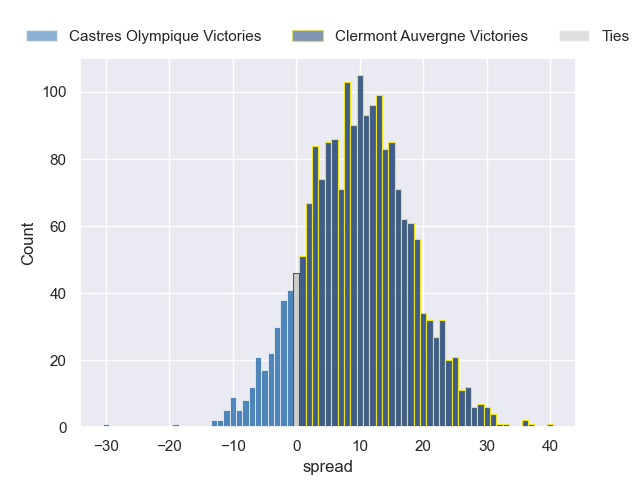
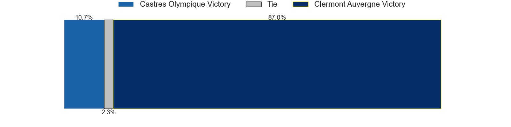

---  
layout: page  
title: Castres Olympique at Clermont Auvergne  
date: 2024-11-30 18:00:00 -0500  
categories: "Top 14 2024" match projection  
---
# Castres Olympique at Clermont Auvergne

# Club Level Predictions

The first set of predictions treats a club as the smallest object, as the club develops its members, organizes a gameplan, and deploys its players as needed for each match. This club model has a prediction of 0.494, which translates to predicting Castres Olympique to win by -3.6.

Our Over/Under is 48.5 - and combined with the spread above, we have a predicted scoreline of 22 to 26

Each club has a rating and a rating deviation (similar to a Glicko rating), and expected performances can be generated. This allows for simulated matches and spreads like the ones below.
## Projected Performances - Club Model

## Projected Spreads - Club Model

## Projected Results - Club Model

# Player Level Predictions

Treating teams instead as an entity made up of the currently active players, I have ratings for each player in an altogether different system. These can be combined to form team ratings once teamsheets are announced, weighting starters a bit higher than the reserves. After the match is played, players can be weighted by their minutes on the field, allowing for an accurate measure of the team's composition. With these compiled team ratings, we can make predictions, measure inaccuracy, and update the individual player ratings.
## Prediction without Player Minutes: Clermont Auvergne by 9.6

Castres Olympique by 3.3 on a neutral pitch

## Projected Performances - Player Model

## Projected Spreads - Player Model

## Projected Results - Player Model

| Away Player           |   Away Percentile |   Number |   Home Percentile | Home Player          |
|:----------------------|------------------:|---------:|------------------:|:---------------------|
| Lois Guerois-Galisson |             93.16 |        1 |             24.36 | Sacha Lotrian        |
| Gaetan Barlot         |             91.28 |        2 |             71.71 | Barnabe Massa        |
| Will Collier          |             87.86 |        3 |             74.47 | Regis Montagne       |
| Paul Jedrasiak        |             54.74 |        4 |             36.2  | Peceli Yato          |
| Florent Vanverberghe  |             88.22 |        5 |             46.06 | Thomas Ceyte         |
| Mathieu Babillot      |             22.76 |        6 |             74.87 | Alexandre Fischer    |
| Tyler Ardron          |             80.49 |        7 |             94.02 | Marcos Kremer        |
| Feibyan Tukino        |            nan    |        8 |             88.45 | Fritz Lee            |
| Jeremy Fernandez      |             69.7  |        9 |             74.64 | Sebastien Bezy       |
| Vilimoni Botitu       |             45.48 |       10 |             73.6  | Benjamin Urdapilleta |
| Remy Baget            |             92.12 |       11 |             86.87 | Joris Jurand         |
| Jack Goodhue          |             95.01 |       12 |             89.92 | George Moala         |
| Adrea Cocagi          |             84.65 |       13 |             80.23 | Leon Darricarrere    |
| Nathanael Hulleu      |             84.41 |       14 |             80.04 | Lucas Tauzin         |
| Geoffrey Palis        |             98.41 |       15 |             62.11 | Alex Newsome         |
| Loris Zarantonello    |             26.45 |       16 |             73.24 | Etienne Fourcade     |
| Antoine Tichit        |             82.27 |       17 |             79.54 | Etienne Falgoux      |
| Gauthier Maravat      |              7.35 |       18 |             80.14 | Anthime Hemery       |
| Abraham Papali'i      |             26.89 |       19 |             78.12 | Killian Tixeront     |
| Gauthier Doubrere     |             36.04 |       20 |             73.05 | Baptiste Jauneau     |
| Adrien Seguret        |             10.92 |       21 |             95.6  | Anthony Belleau      |
| Theo Chabouni         |             58.98 |       22 |             10.17 | Pierre Fouyssac      |
| Levan Chilachava      |             83.96 |       23 |             38.04 | Cristian Ojovan      |

