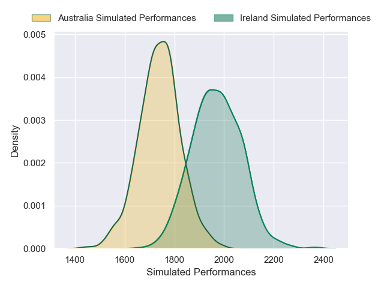
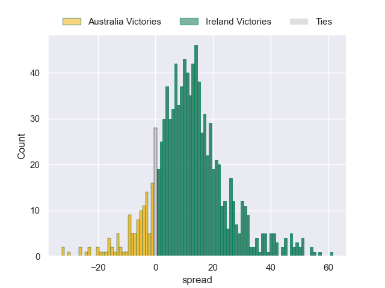
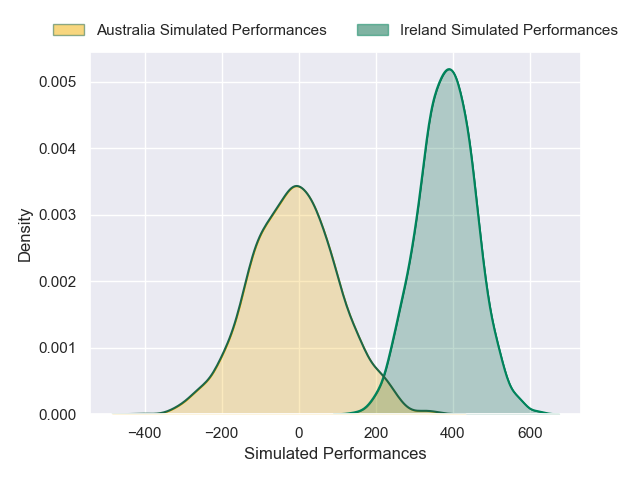
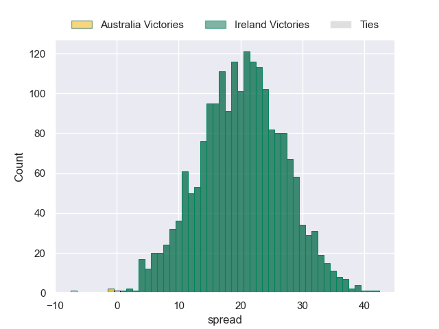

---  
layout: page  
title: Australia at Ireland  
date: 2024-11-30 18:00:00 -0500  
categories: "Autumn Nations Series 2024" match projection  
---
# Australia at Ireland

# Club Level Predictions

The first set of predictions treats a club as the smallest object, as the club develops its members, organizes a gameplan, and deploys its players as needed for each match. This club model has a prediction of 0.722, which translates to predicting Ireland to win by 12.2.

Our Over/Under is 58.5 - and combined with the spread above, we have a predicted scoreline of 23 to 35

Each club has a rating and a rating deviation (similar to a Glicko rating), and expected performances can be generated. This allows for simulated matches and spreads like the ones below.
## Projected Performances - Club Model

## Projected Spreads - Club Model

## Projected Results - Club Model

# Player Level Predictions

Treating teams instead as an entity made up of the currently active players, I have ratings for each player in an altogether different system. These can be combined to form team ratings once teamsheets are announced, weighting starters a bit higher than the reserves. After the match is played, players can be weighted by their minutes on the field, allowing for an accurate measure of the team's composition. With these compiled team ratings, we can make predictions, measure inaccuracy, and update the individual player ratings.
## Prediction without Player Minutes: Ireland by 19.8

Ireland by 14.2 on a neutral pitch

## Projected Performances - Player Model

## Projected Spreads - Player Model

## Projected Results - Player Model

| Away Player           |   Away Percentile |   Number |   Home Percentile | Home Player    |
|:----------------------|------------------:|---------:|------------------:|:---------------|
| James Slipper         |             95.72 |        1 |             91.81 | Andrew Porter  |
| Brandon Paenga-Amosa  |             72.7  |        2 |             86.2  | Ronan Kelleher |
| Taniela Tupou         |             91    |        3 |             55.75 | Finlay Bealham |
| Nick Frost            |             79.04 |        4 |            nan    | nan            |
| Jeremy Williams       |             17.32 |        5 |             97.6  | James Ryan     |
| Rob Valetini          |             97.53 |        6 |            nan    | nan            |
| Fraser McReight       |             93.49 |        7 |            nan    | nan            |
| Harry Wilson          |             14.42 |        8 |            nan    | nan            |
| Jake Gordon           |             44.73 |        9 |            nan    | nan            |
| Noah Lolesio          |             87.58 |       10 |            nan    | nan            |
| Max Jorgensen         |             72.09 |       11 |            nan    | nan            |
| Len Ikitau            |             65.94 |       12 |            nan    | nan            |
| Joseph-Aukuso Suaalii |             54.15 |       13 |            nan    | nan            |
| Andrew Kellaway       |             40.03 |       14 |            nan    | nan            |
| Tom Wright            |             89.26 |       15 |            nan    | nan            |
| Billy Pollard         |             81.44 |       16 |            nan    | nan            |
| Angus Bell            |              0.37 |       17 |            nan    | nan            |
| Allan Alaalatoa       |             96.39 |       18 |             47.49 | Tom O'Toole    |
| Lukhan Salakaia-Loto  |             11.9  |       19 |            nan    | nan            |
| Langi Gleeson         |             63.76 |       20 |             96.75 | Peter O'Mahony |
| Tate McDermott        |             81.31 |       21 |              5.91 | Craig Casey    |
| Tane Edmed            |              8.62 |       22 |              2    | Jack Crowley   |
| Harry Potter          |             52.34 |       23 |             97.83 | Garry Ringrose |

