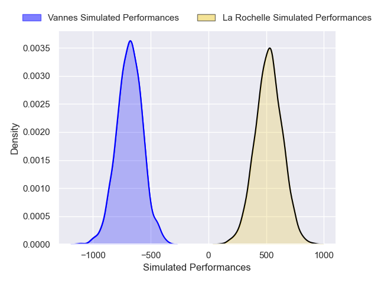
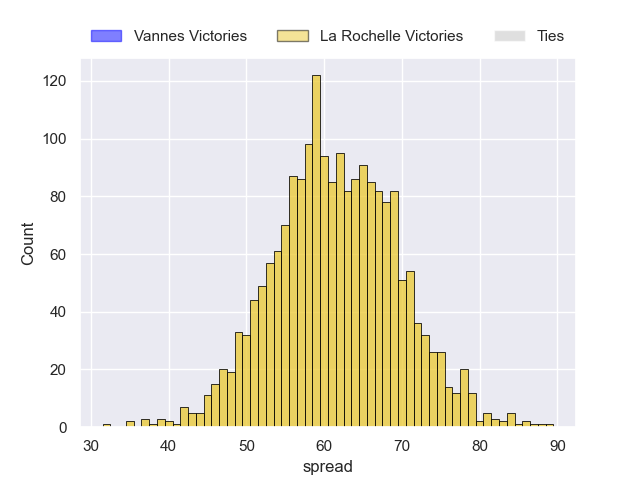
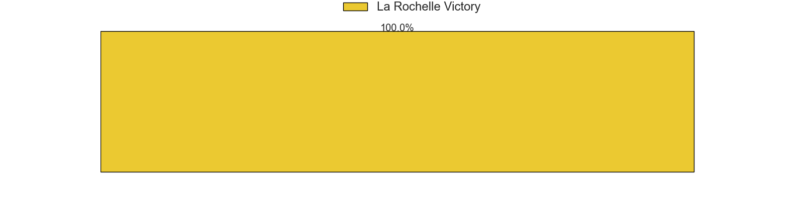

---  
layout: page  
title: Vannes at La Rochelle  
date: 2024-11-30 18:00:00 -0500  
categories: "Top 14 2024" match projection  
---
# Vannes at La Rochelle

# Club Level Predictions

The first set of predictions treats a club as the smallest object, as the club develops its members, organizes a gameplan, and deploys its players as needed for each match. This club model has a prediction of 0.773, which translates to predicting La Rochelle to win by 14.5.

Our Over/Under is 70.5 - and combined with the spread above, we have a predicted scoreline of 28 to 43

Each club has a rating and a rating deviation (similar to a Glicko rating), and expected performances can be generated. This allows for simulated matches and spreads like the ones below.
## Projected Performances - Club Model

## Projected Spreads - Club Model

## Projected Results - Club Model

# Player Level Predictions

Treating teams instead as an entity made up of the currently active players, I have ratings for each player in an altogether different system. These can be combined to form team ratings once teamsheets are announced, weighting starters a bit higher than the reserves. After the match is played, players can be weighted by their minutes on the field, allowing for an accurate measure of the team's composition. With these compiled team ratings, we can make predictions, measure inaccuracy, and update the individual player ratings.
## Prediction without Player Minutes: La Rochelle by 61.7

La Rochelle by 50.0 on a neutral pitch

## Projected Performances - Player Model

## Projected Spreads - Player Model

## Projected Results - Player Model

| Away Player             |   Away Percentile |   Number |   Home Percentile | Home Player            |
|:------------------------|------------------:|---------:|------------------:|:-----------------------|
| Mako Vunipola           |             98.23 |        1 |             88.74 | Reda Wardi             |
| Cyril Blanchard         |             31.8  |        2 |             62.84 | Quentin Lespiaucq      |
| Santiago Medrano        |              0.29 |        3 |             97.35 | Uini Atonio            |
| Eric Marks              |              6.55 |        4 |             71.3  | Kane Douglas           |
| Fabrice Metz            |             59.96 |        5 |              0.09 | Will Skelton           |
| Juan Bautista Pedemonte |             18.54 |        6 |             71.44 | Oscar Jegou            |
| Francisco Gorrissen     |             94.9  |        7 |             97.45 | Levani Botia           |
| Sione Kalamafoni        |              8.9  |        8 |             61.74 | Matthias Haddad        |
| Michael Ruru            |             93.46 |        9 |             92.03 | Teddy Iribaren         |
| Maxime Lafage           |             88.6  |       10 |             13.8  | Ihaia West             |
| Salesi Rayasi           |             85.92 |       11 |             51.71 | Suliasi Vunivalu       |
| Francis Saili           |              1.04 |       12 |             75.52 | Jonathan Danty         |
| Theo Costosseque        |             43.88 |       13 |             80.79 | Ulupano Seuteni        |
| Romaric Camou           |             79.32 |       14 |             98.97 | Jack Nowell            |
| Paul Surano             |             24.22 |       15 |             98.63 | Brice Dulin            |
| Theo Beziat             |             18.81 |       16 |             65.6  | Tolu Latu              |
| Hugo Djehi              |            nan    |       17 |             65.49 | Alexandre Kaddouri     |
| Anton Bresler           |             75.29 |       18 |             79.45 | Thomas Lavault         |
| Timothe Mezou           |             50.04 |       19 |            nan    | Lucas Andjisseramatchi |
| Leon Boulier            |             31.9  |       20 |             47.1  | Hoani Bosmorin         |
| Jules Le Bail           |             10.53 |       21 |             68.8  | Hugo Reus              |
| Alex Arrate             |              1.98 |       22 |             72.5  | Teddy Thomas           |
| Pagakalasio Tafili      |             89.18 |       23 |             95.58 | Joel Sclavi            |

