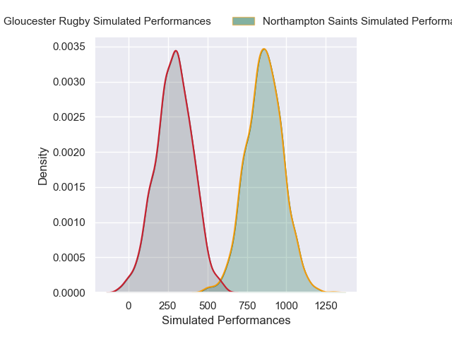
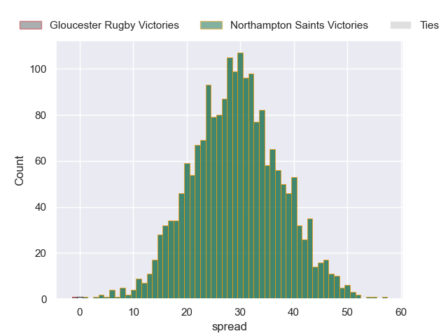
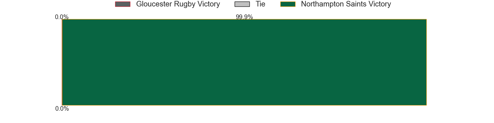

---  
layout: page  
title: Gloucester Rugby at Northampton Saints  
date: 2024-11-30 18:00:00 -0500  
categories: "Premiership 2024" match projection  
---
# Gloucester Rugby at Northampton Saints

# Club Level Predictions

The first set of predictions treats a club as the smallest object, as the club develops its members, organizes a gameplan, and deploys its players as needed for each match. This club model has a prediction of 0.66, which translates to predicting Northampton Saints to win by 10.4.

Our Over/Under is 52.5 - and combined with the spread above, we have a predicted scoreline of 21 to 31

Each club has a rating and a rating deviation (similar to a Glicko rating), and expected performances can be generated. This allows for simulated matches and spreads like the ones below.
## Projected Performances - Club Model

## Projected Spreads - Club Model

## Projected Results - Club Model

# Player Level Predictions

Treating teams instead as an entity made up of the currently active players, I have ratings for each player in an altogether different system. These can be combined to form team ratings once teamsheets are announced, weighting starters a bit higher than the reserves. After the match is played, players can be weighted by their minutes on the field, allowing for an accurate measure of the team's composition. With these compiled team ratings, we can make predictions, measure inaccuracy, and update the individual player ratings.
## Prediction without Player Minutes: Northampton Saints by 29.2

Northampton Saints by 14.2 on a neutral pitch

## Projected Performances - Player Model

## Projected Spreads - Player Model

## Projected Results - Player Model

| Away Player       |   Away Percentile |   Number |   Home Percentile | Home Player        |
|:------------------|------------------:|---------:|------------------:|:-------------------|
| Val Rapava-Ruskin |             86.17 |        1 |             72.55 | Tom West           |
| Jack Singleton    |             89.14 |        2 |             93.43 | Curtis Langdon     |
| Afolabi Fasogban  |             86.39 |        3 |             98.75 | Trevor Davison     |
| Arthur Clark      |             26.4  |        4 |             85.47 | Chunya Munga       |
| Freddie Thomas    |             26.22 |        5 |             24.09 | Alex Coles         |
| Jack Clement      |             19.24 |        6 |             60.63 | Angus Scott-Young  |
| Lewis Ludlow      |             19.86 |        7 |             97.63 | Tom Pearson        |
| Zach Mercer       |              9.28 |        8 |             67.23 | Juarno Augustus    |
| Caolan Englefield |             80.06 |        9 |              7.02 | Tom James          |
| Gareth Anscombe   |             74.6  |       10 |             82.2  | Fin Smith          |
| Ollie Thorley     |             24.5  |       11 |             92.84 | Ollie Sleightholme |
| Seb Atkinson      |             51.88 |       12 |             85.31 | Rory Hutchinson    |
| Max Llewellyn     |             75.99 |       13 |             78.81 | Tom Litchfield     |
| Christian Wade    |             95.78 |       14 |             94.34 | George Hendy       |
| Santiago Carreras |             78.12 |       15 |             97.66 | George Furbank     |
| Seb Blake         |             67.43 |       16 |             32.72 | Craig Wright       |
| Ciaran Knight     |             11.48 |       17 |             50.85 | Emmanuel Iyogun    |
| Kirill Gotovtsev  |             82.49 |       18 |             69.32 | Luke Green         |
| Matias Alemanno   |             82.64 |       19 |             19.04 | Tom Lockett        |
| Ruan Ackermann    |             69.07 |       20 |             95.69 | Henry Pollock      |
| Charlie Chapman   |            nan    |       21 |             97.45 | Alex Mitchell      |
| Chris Harris      |             32.2  |       22 |             83.05 | Fraser Dingwall    |
| Josh Hathaway     |             79.71 |       23 |             84.33 | James Ramm         |

