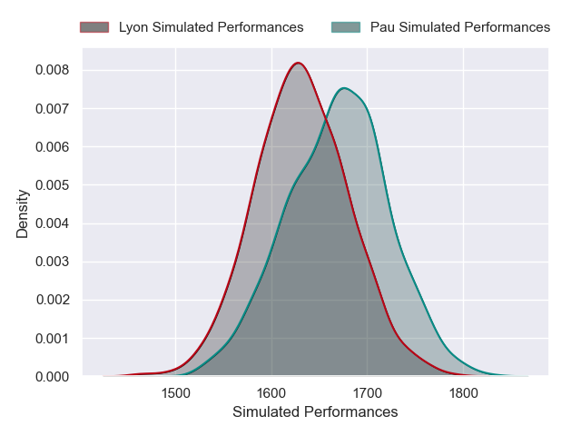
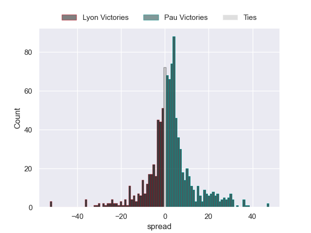
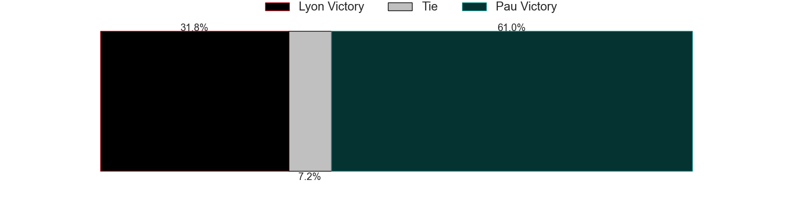
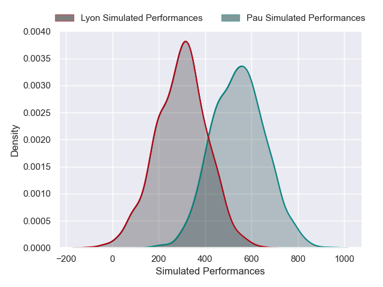
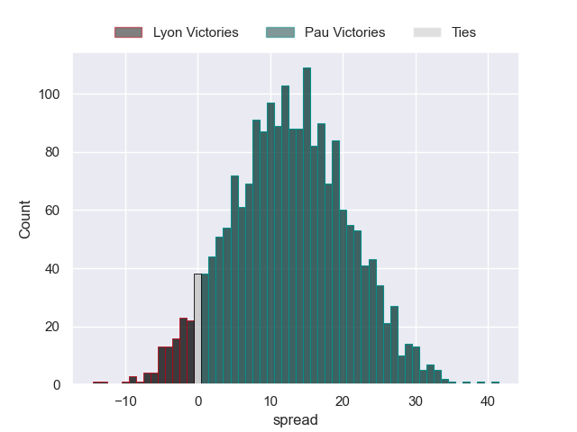
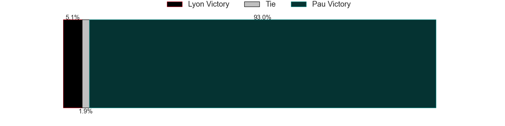

---  
layout: page  
title: Lyon at Pau  
date: 2024-11-30 18:00:00 -0500  
categories: "Top 14 2024" match projection  
---
# Lyon at Pau

# Club Level Predictions

The first set of predictions treats a club as the smallest object, as the club develops its members, organizes a gameplan, and deploys its players as needed for each match. This club model has a prediction of 0.459, which translates to predicting Lyon to win by -2.5.

Our Over/Under is 52.5 - and combined with the spread above, we have a predicted scoreline of 25 to 28

Each club has a rating and a rating deviation (similar to a Glicko rating), and expected performances can be generated. This allows for simulated matches and spreads like the ones below.
## Projected Performances - Club Model

## Projected Spreads - Club Model

## Projected Results - Club Model

# Player Level Predictions

Treating teams instead as an entity made up of the currently active players, I have ratings for each player in an altogether different system. These can be combined to form team ratings once teamsheets are announced, weighting starters a bit higher than the reserves. After the match is played, players can be weighted by their minutes on the field, allowing for an accurate measure of the team's composition. With these compiled team ratings, we can make predictions, measure inaccuracy, and update the individual player ratings.
## Prediction without Player Minutes: Pau by 12.5

Lyon by 0.9 on a neutral pitch

## Projected Performances - Player Model

## Projected Spreads - Player Model

## Projected Results - Player Model

| Away Player          |   Away Percentile |   Number |   Home Percentile | Home Player        |
|:---------------------|------------------:|---------:|------------------:|:-------------------|
| Hamza Kaabeche       |             15.6  |        1 |             40.54 | Ignacio Calles     |
| Yanis Charcosset     |             50.15 |        2 |             64.22 | Youri Delhommel    |
| Irakli Aptsiauri     |             61.88 |        3 |             59.01 | Jon Zabala         |
| Theo William         |             10.81 |        4 |             33.83 | Hugo Auradou       |
| Mickael Guillard     |             75.11 |        5 |             35.61 | Jimi Maximin       |
| Steeve Blanc-Mappaz  |             20.21 |        6 |             61.86 | Joel Kpoku         |
| Beka Saghinadze      |             88.14 |        7 |             80.4  | Reece Hewat        |
| Liam Allen           |             79    |        8 |             25.19 | Sacha Zegueur      |
| Baptiste Couilloud   |             91.71 |        9 |             88.04 | Thibault Daubagna  |
| Leo Berdeu           |             81.2  |       10 |             67    | Joe Simmonds       |
| Davit Niniashvili    |             71.88 |       11 |             88.42 | Tumua Manu         |
| Josiah Maraku        |              3.95 |       12 |             47.27 | Fabien Brau-Boirie |
| Semi Radradra        |             98.65 |       13 |             64.22 | Emilien Gailleton  |
| Monty Ioane          |             94.75 |       14 |             72.87 | Aaron Grandidier   |
| Alexandre Tchaptchet |             54.49 |       15 |             25.78 | Aymeric Luc        |
| Baptiste Narmand     |            nan    |       16 |             69.88 | Romain Ruffenach   |
| Jerome Rey           |             15.82 |       17 |             68.06 | Remi Seneca        |
| Tomas Lavanini       |             93.8  |       18 |             16.65 | Thomas Jolmes      |
| Marvin Okuya         |             43.06 |       19 |             16.08 | Loic Credoz        |
| Charlie Cassang      |             84.69 |       20 |             59.93 | Mehdi Tlili        |
| Martin Meliande      |              7.81 |       21 |            nan    | Thomas Souverbie   |
| Ethan Dumortier      |             40.81 |       22 |             90    | Axel Desperes      |
| Cedate Gomes Sa      |             69.98 |       23 |             17.66 | Guram Papidze      |

