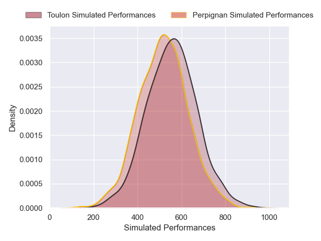
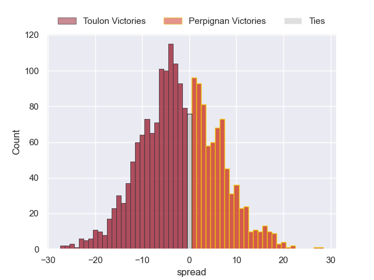

---  
layout: page  
title: Toulon at Perpignan  
date: 2024-11-30 18:00:00 -0500  
categories: "Top 14 2024" match projection  
---
# Toulon at Perpignan

# Club Level Predictions

The first set of predictions treats a club as the smallest object, as the club develops its members, organizes a gameplan, and deploys its players as needed for each match. This club model has a prediction of 0.34, which translates to predicting Toulon to win by 2.8.

Our Over/Under is 55.5 - and combined with the spread above, we have a predicted scoreline of 29 to 27

Each club has a rating and a rating deviation (similar to a Glicko rating), and expected performances can be generated. This allows for simulated matches and spreads like the ones below.
## Projected Performances - Club Model

## Projected Spreads - Club Model

## Projected Results - Club Model

# Player Level Predictions

Treating teams instead as an entity made up of the currently active players, I have ratings for each player in an altogether different system. These can be combined to form team ratings once teamsheets are announced, weighting starters a bit higher than the reserves. After the match is played, players can be weighted by their minutes on the field, allowing for an accurate measure of the team's composition. With these compiled team ratings, we can make predictions, measure inaccuracy, and update the individual player ratings.
## Prediction without Player Minutes: Toulon by 1.9

Toulon by 16.8 on a neutral pitch

## Projected Performances - Player Model

## Projected Spreads - Player Model

## Projected Results - Player Model

| Away Player       |   Away Percentile |   Number |   Home Percentile | Home Player             |
|:------------------|------------------:|---------:|------------------:|:------------------------|
| Dany Priso        |             92.05 |        1 |              4.05 | Giorgi Tetrashvili      |
| Teddy Baubigny    |             88.07 |        2 |             92.51 | Ignacio Ruiz            |
| Kyle Sinckler     |             95.36 |        3 |             13.25 | Kieran Brookes          |
| David Ribbans     |             82.29 |        4 |             10.27 | Tristan Labouteley      |
| Brian Alainu'uese |             78.39 |        5 |             89.02 | So'otala Fa'aso'o       |
| Matteo Le Corvec  |             78.56 |        6 |             26.89 | Lucas Velarte           |
| Esteban Abadie    |             82.34 |        7 |             56.59 | Max Hicks               |
| Charles Ollivon   |             99.47 |        8 |             92.05 | Joaquin Oviedo          |
| Baptiste Serin    |             99.2  |        9 |             59.33 | Tom Ecochard            |
| Enzo Herve        |             86.6  |       10 |            nan    | Gabin Kretchmann        |
| Seta Tuicuvu      |             84.01 |       11 |             13.05 | Ali Crossdale           |
| Jeremy Sinzelle   |             54.05 |       12 |             96.61 | Jeronimo de la Fuente   |
| Antoine Frisch    |             95.39 |       13 |              5.56 | Alivereti Duguivalu     |
| Gael Drean        |             34.92 |       14 |             73.75 | Tavite Veredamu         |
| Marius Domon      |             55.08 |       15 |             68.75 | Louis Dupichot          |
| Mickael Ivaldi    |             88.23 |       16 |             68.04 | Seilala Lam             |
| Daniel Brennan    |            nan    |       17 |             66.59 | Lorencio Boyer Gallardo |
| Matthias Halagahu |             51.02 |       18 |             74.58 | Mathieu Tanguy          |
| Lewis Ludlam      |             55.71 |       19 |             92.44 | Patrick Sobela          |
| Dan Biggar        |             98.6  |       20 |             83.57 | Lucas Bachelier         |
| Jules Danglot     |             71.45 |       21 |            nan    | James Hall              |
| Rayan Rebbadj     |             33.02 |       22 |             13.28 | Antoine Aucagne         |
| Emerick Setiano   |             95.22 |       23 |             43.19 | Pietro Ceccarelli       |

