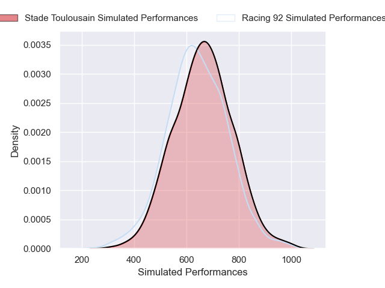
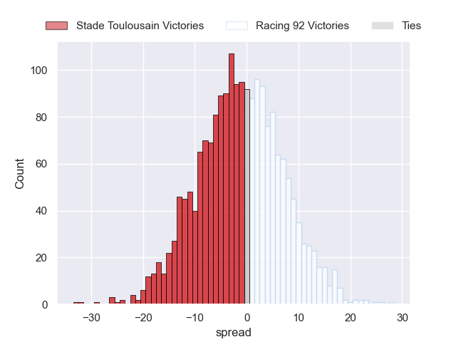

---  
layout: page  
title: Stade Toulousain at Racing 92  
date: 2024-11-30 18:00:00 -0500  
categories: "Top 14 2024" match projection  
---
# Stade Toulousain at Racing 92

# Club Level Predictions

The first set of predictions treats a club as the smallest object, as the club develops its members, organizes a gameplan, and deploys its players as needed for each match. This club model has a prediction of 0.3, which translates to predicting Stade Toulousain to win by 4.0.

Our Over/Under is 59.5 - and combined with the spread above, we have a predicted scoreline of 32 to 28

Each club has a rating and a rating deviation (similar to a Glicko rating), and expected performances can be generated. This allows for simulated matches and spreads like the ones below.
## Projected Performances - Club Model

## Projected Spreads - Club Model

## Projected Results - Club Model

# Player Level Predictions

Treating teams instead as an entity made up of the currently active players, I have ratings for each player in an altogether different system. These can be combined to form team ratings once teamsheets are announced, weighting starters a bit higher than the reserves. After the match is played, players can be weighted by their minutes on the field, allowing for an accurate measure of the team's composition. With these compiled team ratings, we can make predictions, measure inaccuracy, and update the individual player ratings.
## Prediction without Player Minutes: Stade Toulousain by 1.1

Stade Toulousain by 12.2 on a neutral pitch

## Projected Performances - Player Model

## Projected Spreads - Player Model

## Projected Results - Player Model

| Away Player          |   Away Percentile |   Number |   Home Percentile | Home Player         |
|:---------------------|------------------:|---------:|------------------:|:--------------------|
| David Ainu'u         |             90.58 |        1 |             75.35 | Guram Gogichashvili |
| Julien Marchand      |             96.18 |        2 |             30.58 | Feleti Kaitu'u      |
| Dorian Aldegheri     |             90.43 |        3 |             96.62 | Lucio Sordoni       |
| Anthony Jelonch      |             99.05 |        4 |             88.84 | Junior Kpoku        |
| Clement Verge        |             82.46 |        5 |             26.93 | Will Rowlands       |
| Francois Cros        |             95.17 |        6 |             95.96 | Cameron Woki        |
| Leo Banos            |             78.73 |        7 |            nan    | Noa Zinzen          |
| Jack Willis          |             98.33 |        8 |             92.8  | Hacjivah Dayimani   |
| Paul Graou           |             35.73 |        9 |             83.09 | Nolann Le Garrec    |
| Romain Ntamack       |             93.8  |       10 |              5.84 | Dan Lancaster       |
| Matthis Lebel        |             99.05 |       11 |             65.63 | Vinaya Habosi       |
| Santiago Chocobares  |             51.69 |       12 |             95.48 | Josua Tuisova       |
| Pierre-Louis Barassi |             92.75 |       13 |             96.42 | Gael Fickou         |
| Dimitri Delibes      |             87.38 |       14 |             79.16 | Donovan Taofifenua  |
| Thomas Ramos         |             96.2  |       15 |             48.63 | Tristan Tedder      |
| Guillaume Cramont    |             87.46 |       16 |             57.03 | Janick Tarrit       |
| Rodrigue Neti        |             66.45 |       17 |             94.63 | Eddy Ben Arous      |
| Joshua Brennan       |             90.52 |       18 |             91.59 | Boris Palu          |
| Theo Ntamack         |             62.12 |       19 |             85.98 | Jordan Joseph       |
| Mathis Castro        |             83.71 |       20 |             94.2  | Antoine Gibert      |
| Ange Capuozzo        |             98.24 |       21 |             85.84 | Wame Naituvi        |
| Paul Costes          |             83.33 |       22 |             27.21 | Henry Arundell      |
| Joel Merkler         |             88.96 |       23 |             82.41 | Thomas Laclayat     |

