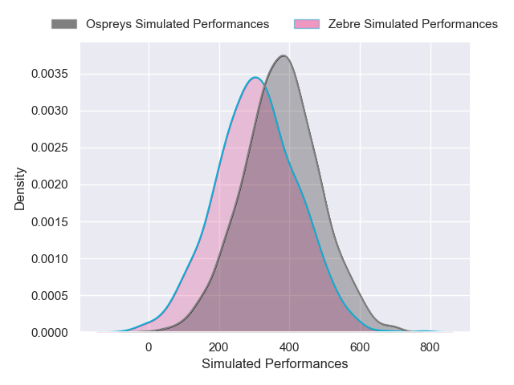
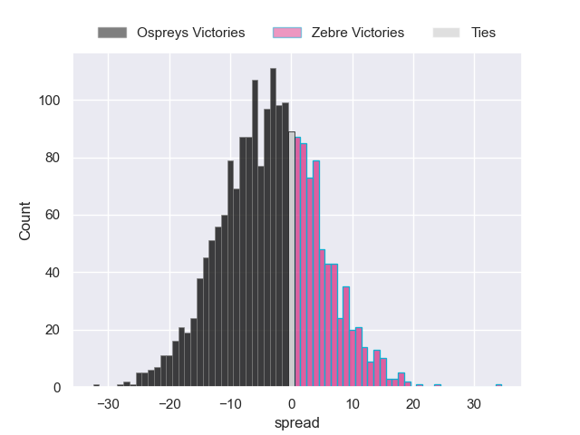
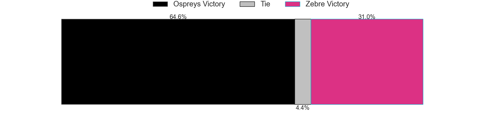

---  
layout: page  
title: Ospreys at Zebre  
date: 2024-11-30 18:00:00 -0500  
categories: "United Rugby Championship 2024" match projection  
---
# Ospreys at Zebre

# Club Level Predictions

The first set of predictions treats a club as the smallest object, as the club develops its members, organizes a gameplan, and deploys its players as needed for each match. This club model has a prediction of 0.237, which translates to predicting Ospreys to win by 7.6.

Our Over/Under is 61.5 - and combined with the spread above, we have a predicted scoreline of 35 to 27

Each club has a rating and a rating deviation (similar to a Glicko rating), and expected performances can be generated. This allows for simulated matches and spreads like the ones below.
## Projected Performances - Club Model

## Projected Spreads - Club Model

## Projected Results - Club Model

# Player Level Predictions

Treating teams instead as an entity made up of the currently active players, I have ratings for each player in an altogether different system. These can be combined to form team ratings once teamsheets are announced, weighting starters a bit higher than the reserves. After the match is played, players can be weighted by their minutes on the field, allowing for an accurate measure of the team's composition. With these compiled team ratings, we can make predictions, measure inaccuracy, and update the individual player ratings.
## Prediction without Player Minutes: Ospreys by 3.6

Ospreys by 9.8 on a neutral pitch

## Projected Performances - Player Model

## Projected Spreads - Player Model

## Projected Results - Player Model

| Away Player        |   Away Percentile |   Number |   Home Percentile | Home Player            |
|:-------------------|------------------:|---------:|------------------:|:-----------------------|
| Garyn Phillips     |            nan    |        1 |             51.51 | Luca Rizzoli           |
| Sam Parry          |             38.07 |        2 |             53.52 | Tommaso Di Bartolomeo  |
| Tom Botha          |             58.87 |        3 |            nan    | Ion Neculai            |
| James Fender       |            nan    |        4 |             39.77 | Andrea Zambonin        |
| William Greatbanks |             64.13 |        5 |              8.59 | Leonard Krumov         |
| Harri Deaves       |             91.56 |        6 |            nan    | Rusiate Nasove         |
| Justin Tipuric     |             97.98 |        7 |             29.61 | Bautista Stavile       |
| Morgan Morris      |              5.3  |        8 |             36.56 | Giacomo Ferrari        |
| Kieran Hardy       |             53.59 |        9 |              9.57 | Alessandro Fusco       |
| Owen Williams      |             94.8  |       10 |             19.8  | Giacomo Da Re          |
| Keelan Giles       |             22.04 |       11 |             26.73 | Simone Gesi            |
| Keiran Williams    |             87.1  |       12 |             62.24 | Enrico Lucchin         |
| Owen Watkin        |             95.76 |       13 |             70.72 | Giulio Bertaccini      |
| Daniel Kasende     |             95.54 |       14 |             18.22 | Jacopo Trulla          |
| Jack Walsh         |             26.76 |       15 |             94.53 | Geronimo Prisciantelli |
| Lewis Lloyd        |             63.71 |       16 |             76.45 | Luca Bigi              |
| Steffan Thomas     |             15.31 |       17 |             19.65 | Muhamed Hasa           |
| Ben Warren         |             63.58 |       18 |             10.15 | Matteo Nocera          |
| Lewis Jones        |              9.65 |       19 |             94.95 | Matteo Canali          |
| Tristan Davies     |            nan    |       20 |             14.39 | Giovanni Licata        |
| Luke Davies        |             66.51 |       21 |             68.74 | Gonzalo Garcia         |
| Iestyn Hopkins     |             68.42 |       22 |              4.8  | Giovanni Montemauri    |
| Max Nagy           |             83.4  |       23 |             90.58 | Luca Morisi            |

