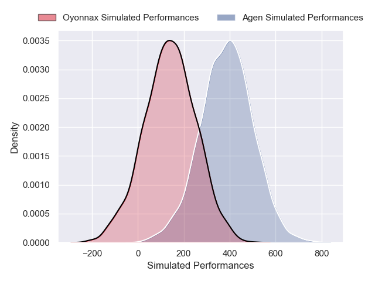
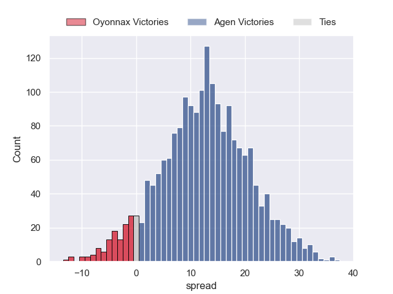
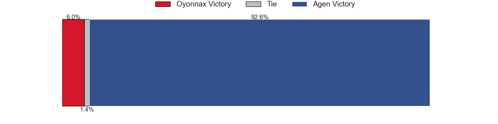

---  
layout: page  
title: Oyonnax at Agen  
date: 2024-12-06 18:00:00 -0500  
categories: "Pro D2 2024" match projection  
---
# Oyonnax at Agen

# Club Level Predictions

The first set of predictions treats a club as the smallest object, as the club develops its members, organizes a gameplan, and deploys its players as needed for each match. This club model has a prediction of 0.399, which translates to predicting Oyonnax to win by -0.1.

Our Over/Under is 45.5 - and combined with the spread above, we have a predicted scoreline of 23 to 23

Each club has a rating and a rating deviation (similar to a Glicko rating), and expected performances can be generated. This allows for simulated matches and spreads like the ones below.
## Projected Performances - Club Model

## Projected Spreads - Club Model

## Projected Results - Club Model

# Player Level Predictions

Treating teams instead as an entity made up of the currently active players, I have ratings for each player in an altogether different system. These can be combined to form team ratings once teamsheets are announced, weighting starters a bit higher than the reserves. After the match is played, players can be weighted by their minutes on the field, allowing for an accurate measure of the team's composition. With these compiled team ratings, we can make predictions, measure inaccuracy, and update the individual player ratings.
## Prediction without Player Minutes: Agen by 12.6

Oyonnax by 1.7 on a neutral pitch

## Projected Performances - Player Model

## Projected Spreads - Player Model

## Projected Results - Player Model

| Away Player               |   Away Percentile |   Number |   Home Percentile | Home Player             |
|:--------------------------|------------------:|---------:|------------------:|:------------------------|
| Adrien Bordenave          |             21.59 |        1 |             26.38 | Hans Lombard-Buret      |
| Peniami Narisia           |             87.91 |        2 |             88.53 | Santiago Socino         |
| Ali Oz                    |             19.95 |        3 |            nan    | Alex Burin              |
| Ewan Johnson              |             47.19 |        4 |            nan    | Evan Olmstead           |
| Hugo Fabregue             |             25.35 |        5 |              4.12 | Javier Eissmann         |
| Wandrille Picault         |             75.6  |        6 |             35.22 | Julien Lebian           |
| Antoine Miquel            |             54.22 |        7 |            nan    | Tomasi Fineanganofo (2) |
| Veresa Tuqovu Ramototabua |            nan    |        8 |             35.22 | Valentin Gayraud        |
| Vasil Lobzhanidze         |             12.97 |        9 |            nan    | Dorian Bellot           |
| Chris William Smith       |             30.6  |       10 |             24.4  | Billy Searle            |
| Daniel Ikpefan            |             68.96 |       11 |             35.5  | Iban Etcheverry         |
| Lucas Mensa               |             16.39 |       12 |             22.21 | Clément Garrigues       |
| Maelan Rabut              |             52.57 |       13 |            nan    | Peyo Muscarditz         |
| Darren Sweetnam           |             46.15 |       14 |             30.65 | Loris Tolot             |
| Martin Bogado             |             43.65 |       15 |            nan    | Franck Pourteau         |
| Benjamin Geledan          |             25.43 |       16 |            nan    | Pierre Jouvin           |
| Antoine Abraham           |             56.46 |       17 |            nan    | Florent Guion           |
| Victor Lebas              |            nan    |       18 |             40.53 | Vincent Farré           |
| Kevin Lebreton            |             18.45 |       19 |              2.53 | Fotu Lokotui            |
| Zack Holmes               |             75    |       20 |             77.67 | Jack Maunder            |
| Loic Godener              |              2.71 |       21 |            nan    | Théo Belan              |
| Eddie Sawailau            |             43.94 |       22 |            nan    | Lucas Martins           |
| Paulo Tafili              |             72.53 |       23 |            nan    | Beau Farrance           |

