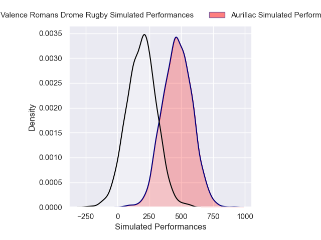
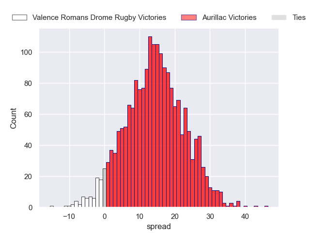
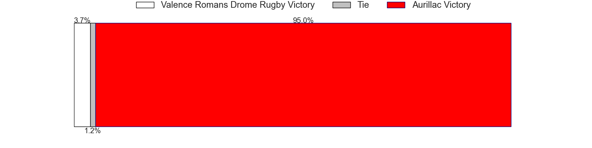

---  
layout: page  
title: Valence Romans Drome Rugby at Aurillac  
date: 2024-12-06 18:00:00 -0500  
categories: "Pro D2 2024" match projection  
---
# Valence Romans Drome Rugby at Aurillac

# Club Level Predictions

The first set of predictions treats a club as the smallest object, as the club develops its members, organizes a gameplan, and deploys its players as needed for each match. This club model has a prediction of 0.47, which translates to predicting Valence Romans Drome Rugby to win by -3.1.

Our Over/Under is 52.5 - and combined with the spread above, we have a predicted scoreline of 25 to 28

Each club has a rating and a rating deviation (similar to a Glicko rating), and expected performances can be generated. This allows for simulated matches and spreads like the ones below.
## Projected Performances - Club Model

## Projected Spreads - Club Model

## Projected Results - Club Model

# Player Level Predictions

Treating teams instead as an entity made up of the currently active players, I have ratings for each player in an altogether different system. These can be combined to form team ratings once teamsheets are announced, weighting starters a bit higher than the reserves. After the match is played, players can be weighted by their minutes on the field, allowing for an accurate measure of the team's composition. With these compiled team ratings, we can make predictions, measure inaccuracy, and update the individual player ratings.
## Prediction without Player Minutes: Aurillac by 14.1

Aurillac by 1.0 on a neutral pitch

## Projected Performances - Player Model

## Projected Spreads - Player Model

## Projected Results - Player Model

| Away Player         |   Away Percentile |   Number |   Home Percentile | Home Player             |
|:--------------------|------------------:|---------:|------------------:|:------------------------|
| Anthony Aléo        |             40.27 |        1 |             52.7  | Irakli Mtchedlidze      |
| Dorian Marco-Pena   |            nan    |        2 |            nan    | Luka Nioradze           |
| Gareth Milasinovich |            nan    |        3 |             57.49 | Giorgi Kartvelishvili   |
| Ryan Mccauley       |             43.95 |        4 |             54.57 | Eoghan Masterson        |
| Nathan Huguen       |            nan    |        5 |             55.79 | Martial Rolland         |
| Adrien Roux         |            nan    |        6 |             29.48 | Tim De Jong             |
| Loan Réal           |            nan    |        7 |             49.55 | Didier Tison            |
| Matthieu Vachon     |             31.46 |        8 |             46.84 | Mael Perrin             |
| Thomas Lhuséro      |             40.89 |        9 |             44.5  | Mikheil Alania          |
| Lucas Méret         |             37.8  |       10 |             46.4  | Ugo Seunes              |
| Mosese Mawalu       |             44.45 |       11 |             56.84 | Aj Coertzen             |
| Louis Marrou        |             37.34 |       12 |             50.97 | Elijah Niko             |
| Anatole Pauvert     |            nan    |       13 |             50.97 | Karl Martin             |
| Gauthier Minguillon |             53.24 |       14 |             57    | Juun Pieters            |
| Joris De Moura      |             88.4  |       15 |            nan    | Dachi Papunashvili      |
| Brice Humbert       |            nan    |       16 |             53.8  | Basa Khonelidze         |
| Julien Royer        |            nan    |       17 |            nan    | Robbie Rodgers          |
| Thembelani Bholi    |            nan    |       18 |             68.95 | Koen Bloemen            |
| Ilia Spanderashvili |             13.62 |       19 |            nan    | Abongile Nonkontwana    |
| Tim Menzel          |            nan    |       20 |            nan    | Théo Cambon             |
| Ben Neiceru         |            nan    |       21 |             55.5  | David Delarue           |
| Éloi Massot         |            nan    |       22 |             46.2  | Tedo Abzhandadze        |
| Vincent Vial        |             42.57 |       23 |             37.05 | Dominic Robertson-McCoy |

