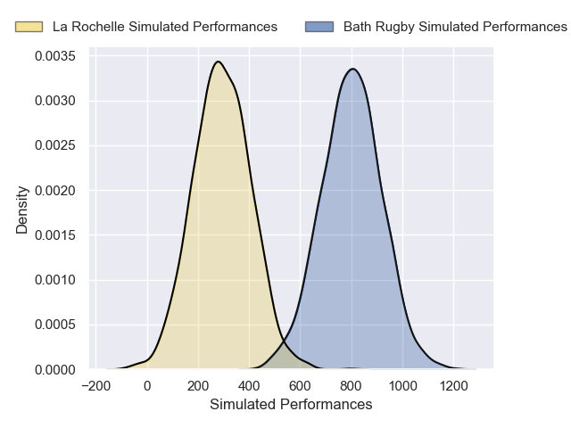
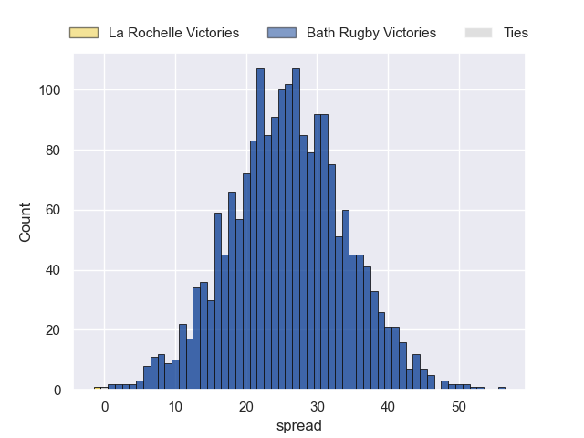
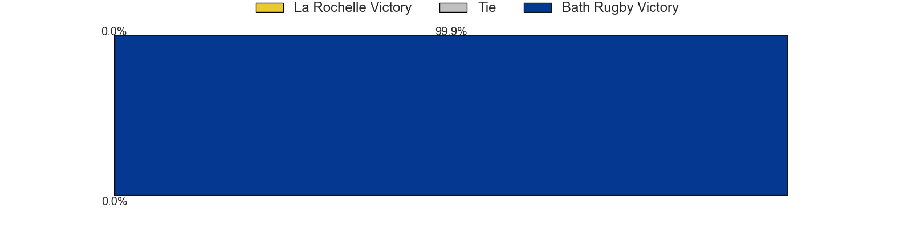

---  
layout: page  
title: La Rochelle at Bath Rugby  
date: 2024-12-06 18:00:00 -0500  
categories: "European Rugby Champions Cup 2024" match projection  
---
# La Rochelle at Bath Rugby

# Club Level Predictions

The first set of predictions treats a club as the smallest object, as the club develops its members, organizes a gameplan, and deploys its players as needed for each match. This club model has a prediction of 0.564, which translates to predicting Bath Rugby to win by 6.1.

Our Over/Under is 59.5 - and combined with the spread above, we have a predicted scoreline of 27 to 33

Each club has a rating and a rating deviation (similar to a Glicko rating), and expected performances can be generated. This allows for simulated matches and spreads like the ones below.
## Projected Performances - Club Model

## Projected Spreads - Club Model

## Projected Results - Club Model

# Player Level Predictions

Treating teams instead as an entity made up of the currently active players, I have ratings for each player in an altogether different system. These can be combined to form team ratings once teamsheets are announced, weighting starters a bit higher than the reserves. After the match is played, players can be weighted by their minutes on the field, allowing for an accurate measure of the team's composition. With these compiled team ratings, we can make predictions, measure inaccuracy, and update the individual player ratings.
## Prediction without Player Minutes: Bath Rugby by 26.3

Bath Rugby by 12.2 on a neutral pitch

## Projected Performances - Player Model

## Projected Spreads - Player Model

## Projected Results - Player Model

| Away Player           |   Away Percentile |   Number |   Home Percentile | Home Player      |
|:----------------------|------------------:|---------:|------------------:|:-----------------|
| Reda Wardi            |             72.89 |        1 |             87.51 | Thomas du Toit   |
| Tolu Latu             |             77.21 |        2 |             96.28 | Tom Dunn         |
| Uini Atonio           |             88.3  |        3 |             41.24 | Will Stuart      |
| Thomas Lavault        |             89.47 |        4 |             97.89 | Quinn Roux       |
| Will Skelton          |              1.4  |        5 |             83.95 | Charlie Ewels    |
| Oscar Jegou           |             65.43 |        6 |             94.31 | Ted Hill         |
| Matthias Haddad       |             62.75 |        7 |             19.31 | Guy Pepper       |
| Gregory Alldritt      |             97.47 |        8 |             95.66 | Miles Reid       |
| Tawera Kerr-Barlow    |             97.37 |        9 |             87.03 | Ben Spencer      |
| Ihaia West            |             10.4  |       10 |             99.8  | Finn Russell     |
| Dillyn Leyds          |             96.35 |       11 |             34.01 | Will Muir        |
| Jonathan Danty        |             83.32 |       12 |             78.18 | Will Butt        |
| Ulupano Seuteni       |             78.08 |       13 |              9.31 | Cameron Redpath  |
| Jack Nowell           |             98.12 |       14 |             96.56 | Joe Cokanasiga   |
| Brice Dulin           |             94.04 |       15 |             48.27 | Tom de Glanville |
| Quentin Lespiaucq     |             32.09 |       16 |             63.41 | Niall Annett     |
| Louis Penverne        |             35.17 |       17 |             81.87 | Francois van Wyk |
| Georges-Henri Colombe |             16.25 |       18 |             44.15 | Archie Griffin   |
| Kane Douglas          |             64.12 |       19 |             94.12 | Ross Molony      |
| Levani Botia          |             90.43 |       20 |             54.43 | Josh Bayliss     |
| Thomas Berjon         |             87.57 |       21 |             80.95 | Louis Schreuder  |
| Hugo Reus             |             66.6  |       22 |             94.28 | Max Ojomoh       |
| Teddy Thomas          |             78.56 |       23 |             56.78 | Jaco Coetzee     |

