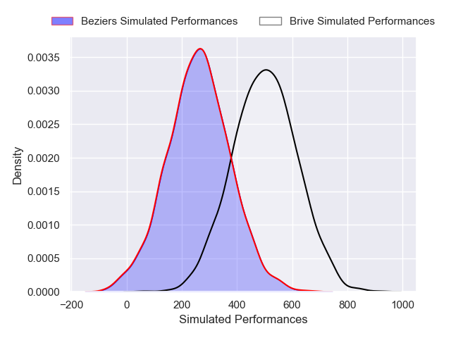
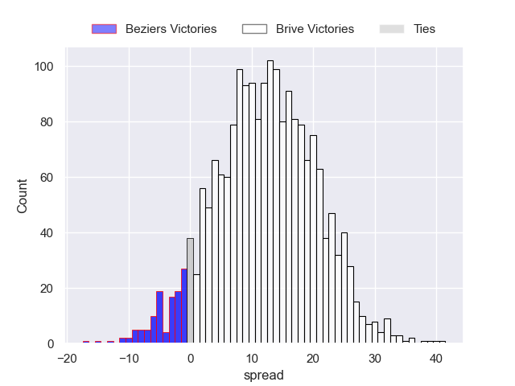
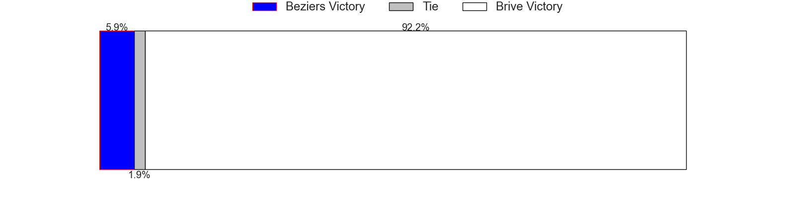

---  
layout: page  
title: Beziers at Brive  
date: 2024-12-06 18:00:00 -0500  
categories: "Pro D2 2024" match projection  
---
# Beziers at Brive

# Club Level Predictions

The first set of predictions treats a club as the smallest object, as the club develops its members, organizes a gameplan, and deploys its players as needed for each match. This club model has a prediction of 0.54, which translates to predicting Brive to win by 5.6.

Our Over/Under is 47.5 - and combined with the spread above, we have a predicted scoreline of 21 to 27

Each club has a rating and a rating deviation (similar to a Glicko rating), and expected performances can be generated. This allows for simulated matches and spreads like the ones below.
## Projected Performances - Club Model

## Projected Spreads - Club Model

## Projected Results - Club Model

# Player Level Predictions

Treating teams instead as an entity made up of the currently active players, I have ratings for each player in an altogether different system. These can be combined to form team ratings once teamsheets are announced, weighting starters a bit higher than the reserves. After the match is played, players can be weighted by their minutes on the field, allowing for an accurate measure of the team's composition. With these compiled team ratings, we can make predictions, measure inaccuracy, and update the individual player ratings.
## Prediction without Player Minutes: Brive by 12.2

Beziers by 0.8 on a neutral pitch

## Projected Performances - Player Model

## Projected Spreads - Player Model

## Projected Results - Player Model

| Away Player         |   Away Percentile |   Number |   Home Percentile | Home Player             |
|:--------------------|------------------:|---------:|------------------:|:------------------------|
| Marco Trauth        |             64.83 |        1 |             21.04 | Simon-Pierre Chauvac    |
| Jose Luis Gonzalez  |            nan    |        2 |            nan    | Lucas Da Silva          |
| Yannick Arroyo      |            nan    |        3 |             57.76 | Marcel Van Der Merwe    |
| Cam Dodson          |             56.32 |        4 |             58.42 | Asier Usarraga Latierro |
| Pierre Gayraud      |             66.14 |        5 |            nan    | Sitaleki Timani         |
| Clement Doumenc     |             80.09 |        6 |            nan    | Retief Marais           |
| Gillian Benoy       |             19.74 |        7 |             95.69 | Courtney Lawes          |
| Sias Koen           |            nan    |        8 |             37.88 | Taniela Sadrugu         |
| Samuel Marques      |             76.19 |        9 |             52.22 | Léo Carbonneau          |
| Charly Malié        |             47.6  |       10 |             76.8  | Curwin Bosch            |
| Aminiasi Tuimaba    |             84.83 |       11 |             58.72 | Erwan Dridi             |
| Taleta Tupuola      |            nan    |       12 |             51.41 | Sam Johnson             |
| Taylor Gontineac    |             81.47 |       13 |            nan    | Georges Shvelidze       |
| Watisoni Votu       |            nan    |       14 |            nan    | Thomas Zénon            |
| Victor Dreuille     |            nan    |       15 |             57.31 | Mathis Ferté            |
| Yanis Boulassel     |            nan    |       16 |            nan    | Benjamin Boudou         |
| Francisco Fernandes |            nan    |       17 |            nan    | Nathan Fraissenon       |
| Shahn Eru           |            nan    |       18 |              7.54 | Konstantin Mikautadze   |
| Otunuku Pauta       |            nan    |       19 |            nan    | Samuel Maximin          |
| Damien Añon         |             55.01 |       20 |            nan    | Loan Lavergne           |
| Gabin Lorre         |             54.81 |       21 |             52.05 | Hugo Verdu              |
| Baptiste Abescat    |             48.46 |       22 |            nan    | Timilai Rokoduru        |
| Christian Judge     |             49.61 |       23 |            nan    | Henzo Kiteau            |

