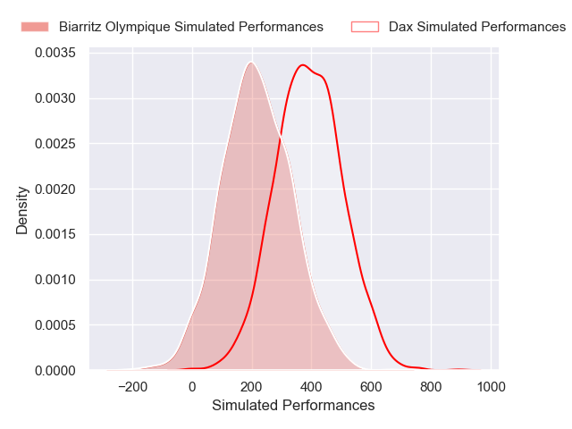
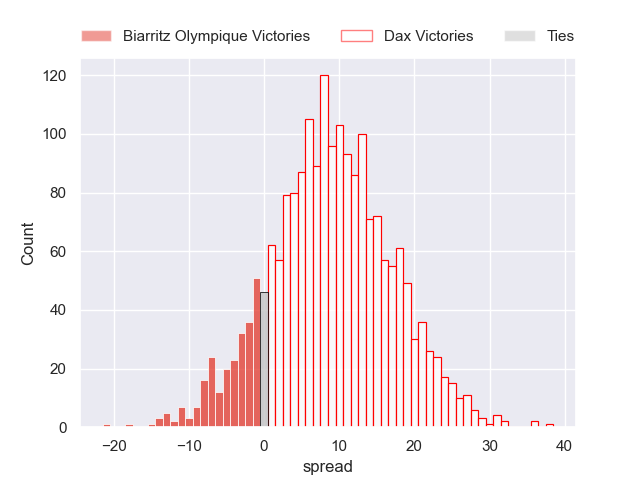
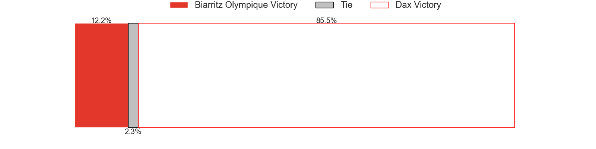

---  
layout: page  
title: Biarritz Olympique at Dax  
date: 2024-12-06 18:00:00 -0500  
categories: "Pro D2 2024" match projection  
---
# Biarritz Olympique at Dax

# Club Level Predictions

The first set of predictions treats a club as the smallest object, as the club develops its members, organizes a gameplan, and deploys its players as needed for each match. This club model has a prediction of 0.511, which translates to predicting Dax to win by 3.7.

Our Over/Under is 52.5 - and combined with the spread above, we have a predicted scoreline of 24 to 28

Each club has a rating and a rating deviation (similar to a Glicko rating), and expected performances can be generated. This allows for simulated matches and spreads like the ones below.
## Projected Performances - Club Model

## Projected Spreads - Club Model

## Projected Results - Club Model

# Player Level Predictions

Treating teams instead as an entity made up of the currently active players, I have ratings for each player in an altogether different system. These can be combined to form team ratings once teamsheets are announced, weighting starters a bit higher than the reserves. After the match is played, players can be weighted by their minutes on the field, allowing for an accurate measure of the team's composition. With these compiled team ratings, we can make predictions, measure inaccuracy, and update the individual player ratings.
## Prediction without Player Minutes: Dax by 9.0

Biarritz Olympique by 3.3 on a neutral pitch

## Projected Performances - Player Model

## Projected Spreads - Player Model

## Projected Results - Player Model

| Away Player         |   Away Percentile |   Number |   Home Percentile | Home Player           |
|:--------------------|------------------:|---------:|------------------:|:----------------------|
| Alexandre Plantier  |            nan    |        1 |            nan    | Louis Mary            |
| Luteru Tolai        |             58.45 |        2 |            nan    | Louis Barrère         |
| Solomone Tukuafu    |             70.89 |        3 |             15.52 | Diogo Hasse Ferreira  |
| Adrian Motoc        |              3.77 |        4 |            nan    | Etienne Loiret        |
| Levi Douglas        |            nan    |        5 |             52.28 | Jean-Baptiste Singer  |
| Jessy Jegerlehner   |             48.97 |        6 |             51.72 | Jean-Baptiste Barrère |
| Ekain Imaz Agirre   |             54.25 |        7 |             51.12 | Paul Arnaud Ausset    |
| Thomas Hébert       |             49.48 |        8 |            nan    | Genesis Mamea Lemalu  |
| Kerman Aurrekoetxea |            nan    |        9 |             54.19 | Sylvère Réteau        |
| Thomas Dolhagaray   |             43.2  |       10 |             48.2  | Romuald Séguy         |
| Mathieu Acebes      |             94.96 |       11 |             57.62 | Théo Gatelier         |
| Yann David          |            nan    |       12 |              0.68 | Jale Vatubua          |
| Ilian Perraux       |            nan    |       13 |             46.27 | Bastien Daguerre      |
| Yohan Tapie         |            nan    |       14 |            nan    | Viliame Tutuvuli (2)  |
| Kylian Jaminet      |             43.85 |       15 |            nan    | Théo Duprat           |
| Yohan Beheregaray   |             55.04 |       16 |            nan    | Kito Falatea          |
| Giorgi Nutsubidze   |             50.33 |       17 |             55    | Dino Casadeï          |
| Piula Fa'asalele    |             80    |       18 |            nan    | Ratu Nacika           |
| Cornell du Preez    |             83.36 |       19 |            nan    | Arnaud Aletti         |
| Edgar Retière       |            nan    |       20 |            nan    | Paul Ravier           |
| Steeve Barry        |            nan    |       21 |            nan    | Hugo Cerisier         |
| François Vergnaud   |             45.88 |       22 |            nan    | Benjamin Puntous      |
| Zakaria El Fakir    |            nan    |       23 |             70.04 | David Lolohea         |

