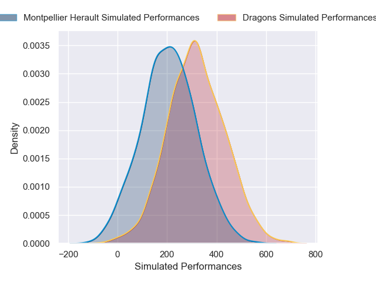
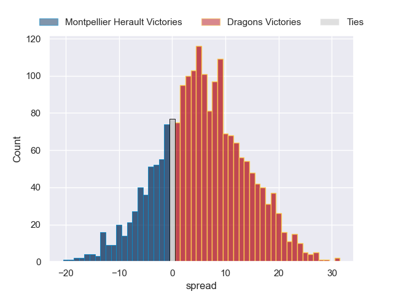
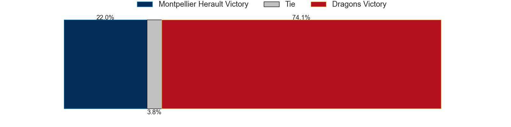

---  
layout: page  
title: Montpellier Herault at Dragons  
date: 2024-12-06 18:00:00 -0500  
categories: "European Rugby Challenge Cup 2024" match projection  
---
# Montpellier Herault at Dragons

# Club Level Predictions

The first set of predictions treats a club as the smallest object, as the club develops its members, organizes a gameplan, and deploys its players as needed for each match. This club model has a prediction of 0.222, which translates to predicting Montpellier Herault to win by 8.2.

Our Over/Under is 42.5 - and combined with the spread above, we have a predicted scoreline of 26 to 17

Each club has a rating and a rating deviation (similar to a Glicko rating), and expected performances can be generated. This allows for simulated matches and spreads like the ones below.
## Projected Performances - Club Model

## Projected Spreads - Club Model

## Projected Results - Club Model

# Player Level Predictions

Treating teams instead as an entity made up of the currently active players, I have ratings for each player in an altogether different system. These can be combined to form team ratings once teamsheets are announced, weighting starters a bit higher than the reserves. After the match is played, players can be weighted by their minutes on the field, allowing for an accurate measure of the team's composition. With these compiled team ratings, we can make predictions, measure inaccuracy, and update the individual player ratings.
## Prediction without Player Minutes: Dragons by 5.8

Montpellier Herault by 4.2 on a neutral pitch

## Projected Performances - Player Model

## Projected Spreads - Player Model

## Projected Results - Player Model

| Away Player        |   Away Percentile |   Number |   Home Percentile | Home Player      |
|:-------------------|------------------:|---------:|------------------:|:-----------------|
| Enzo Forletta      |             62.75 |        1 |            nan    | Josh Reynolds    |
| Lyam Akrab         |            nan    |        2 |             13.99 | James Benjamin   |
| Mohamed Haouas     |            nan    |        3 |            nan    | Dmitri Arhip     |
| Florian Verhaeghe  |             63.57 |        4 |            nan    | Joseph Davies    |
| Tyler Duguid       |             60.43 |        5 |              2.38 | Matthew Screech  |
| Nicolas Martins    |            nan    |        6 |             63.66 | Ryan Woodman     |
| Youssouf Soucouna  |            nan    |        7 |             55.65 | Taine Basham     |
| Marco Tauleigne    |             94.35 |        8 |             40.14 | Aaron Wainwright |
| Alexis Bernadet    |             22.72 |        9 |            nan    | Morgan Lloyd     |
| Aurelien Barreau   |            nan    |       10 |             24.95 | Will Reed        |
| Madosh Tambwe      |             93.33 |       11 |             48.29 | Ewan Rosser      |
| Arthur Vincent     |              8.65 |       12 |             79.63 | Aneurin Owen     |
| Thomas Darmon      |             16.09 |       13 |             57.39 | Harry Wilson     |
| George Bridge      |             93.1  |       14 |             31.61 | Rio Dyer         |
| Julien Tisseron    |             84.28 |       15 |             22.85 | Angus O'Brien    |
| Vano Karkadze      |             68.48 |       16 |            nan    | Sam Scarfe       |
| Luca Tabarot       |             36.98 |       17 |             44.12 | Aki Seiuli       |
| Wilfrid Hounkpatin |             56.54 |       18 |             31.81 | Chris Coleman    |
| Jules Veyrier      |            nan    |       19 |             14.04 | George Nott      |
| Alexandre Becognee |             34.82 |       20 |            nan    | Barny Langton    |
| Ryan Louwrens      |             95.67 |       21 |             18.7  | Dane Blacker     |
| Thomas Vincent     |              5.03 |       22 |             12.07 | Cai Evans        |
| Christa Powell     |              2.14 |       23 |             11.22 | Jared Rosser     |

