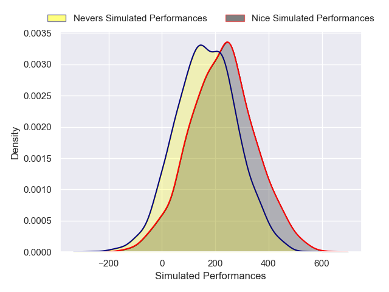
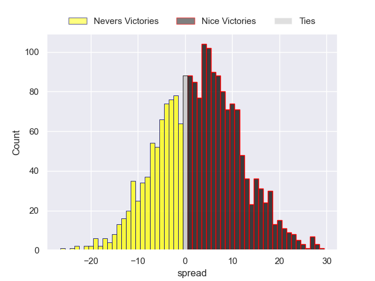
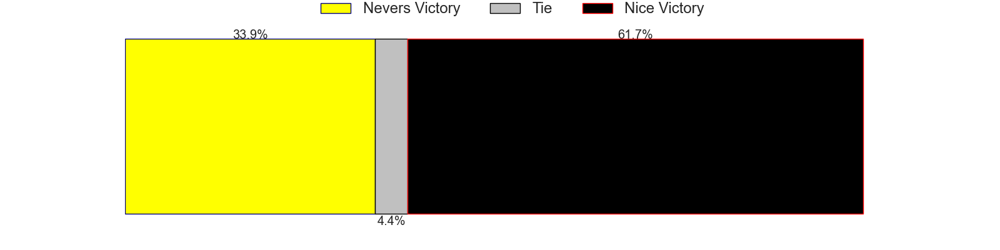

---  
layout: page  
title: Nevers at Nice  
date: 2024-12-06 18:00:00 -0500  
categories: "Pro D2 2024" match projection  
---
# Nevers at Nice

# Club Level Predictions

The first set of predictions treats a club as the smallest object, as the club develops its members, organizes a gameplan, and deploys its players as needed for each match. This club model has a prediction of 0.467, which translates to predicting Nevers to win by -2.8.

Our Over/Under is 39.5 - and combined with the spread above, we have a predicted scoreline of 18 to 21

Each club has a rating and a rating deviation (similar to a Glicko rating), and expected performances can be generated. This allows for simulated matches and spreads like the ones below.
## Projected Performances - Club Model

## Projected Spreads - Club Model

## Projected Results - Club Model

# Player Level Predictions

Treating teams instead as an entity made up of the currently active players, I have ratings for each player in an altogether different system. These can be combined to form team ratings once teamsheets are announced, weighting starters a bit higher than the reserves. After the match is played, players can be weighted by their minutes on the field, allowing for an accurate measure of the team's composition. With these compiled team ratings, we can make predictions, measure inaccuracy, and update the individual player ratings.
## Prediction without Player Minutes: Nice by 3.0

Nevers by 0.4 on a neutral pitch

## Projected Performances - Player Model

## Projected Spreads - Player Model

## Projected Results - Player Model

| Away Player                |   Away Percentile |   Number |   Home Percentile | Home Player        |
|:---------------------------|------------------:|---------:|------------------:|:-------------------|
| Tornike Mataradze          |            nan    |        1 |             18.56 | Facundo Gigena     |
| Efi Ma'Afu                 |             38.76 |        2 |             42.48 | Sione Anga'Aelangi |
| Cleopas Kundiona           |             39.6  |        3 |            nan    | Nicolás Ciancio    |
| Maxence Barjaud            |             47.54 |        4 |            nan    | Thibaud Rey        |
| Kévin Noah                 |            nan    |        5 |            nan    | Martin Freytes     |
| Luka Plataret              |            nan    |        6 |             43.71 | Arthur Vignolles   |
| Julien Kazubek             |            nan    |        7 |             45    | Bastien Berenguel  |
| Jason Fraser               |             29.66 |        8 |            nan    | Ramiha Smiler      |
| Hugo Bouyssou              |             38.59 |        9 |             43.35 | Jules Solinas      |
| Shaun Reynolds             |             33.4  |       10 |            nan    | Romain Riguet      |
| Arthur Mathiron            |             43.28 |       11 |            nan    | Andrzej Charlat    |
| Noa Pommelet               |            nan    |       12 |             19.69 | Tom Daly           |
| Paula Walisoliso           |             36.18 |       13 |             32.59 | Nathan Courtade    |
| Johan Wasserman            |            nan    |       14 |            nan    | Christiaan Erasmus |
| Tom Deleuze                |            nan    |       15 |             32.5  | Paul Auradou       |
| Jean-Maxence Jules-Rosette |            nan    |       16 |             48.99 | Sacha Idoumi       |
| Kamaliele Tufele           |            nan    |       17 |            nan    | Sunia Vola         |
| Ugo Vignolles              |             27.46 |       18 |            nan    | Louis Suaud        |
| Lasha Jaiani               |             77.54 |       19 |             43.77 | Clément Chartier   |
| Steven David               |             39.83 |       20 |             92.59 | Jordan Taufua      |
| Simon Tarel                |            nan    |       21 |            nan    | Matéo Jeune Joly   |
| Rudy Derrieux              |             34.34 |       22 |            nan    | Mathis Viard       |
| Lasha Pkhakadze (2)        |            nan    |       23 |            nan    | Luvuyo Pupuma      |

