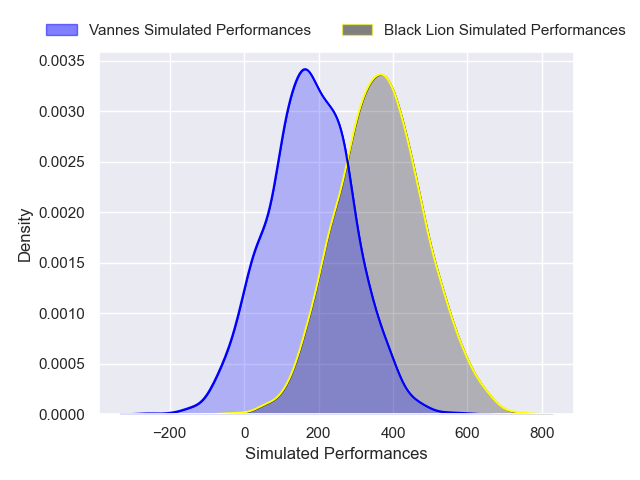
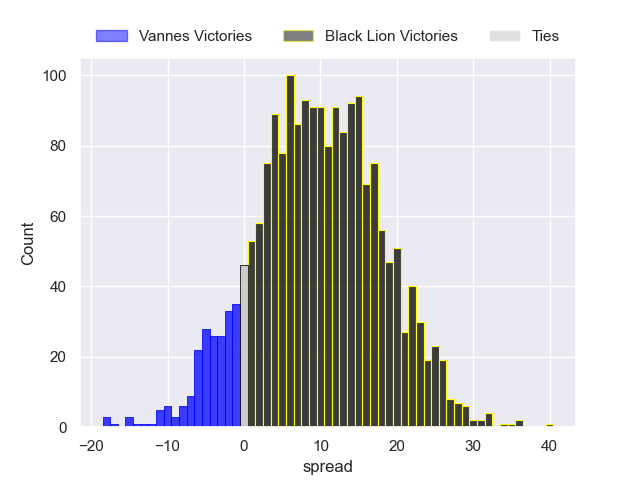
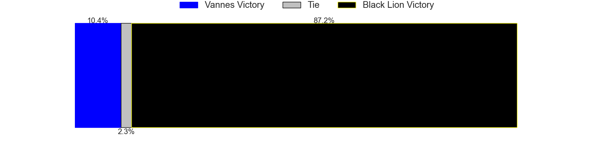

---  
layout: page  
title: Vannes at Black Lion  
date: 2024-12-07 18:00:00 -0500  
categories: "European Rugby Challenge Cup 2024" match projection  
---
# Vannes at Black Lion

# Club Level Predictions

The first set of predictions treats a club as the smallest object, as the club develops its members, organizes a gameplan, and deploys its players as needed for each match. This club model has a prediction of 0.626, which translates to predicting Black Lion to win by 8.6.

Our Over/Under is 42.5 - and combined with the spread above, we have a predicted scoreline of 17 to 26

Each club has a rating and a rating deviation (similar to a Glicko rating), and expected performances can be generated. This allows for simulated matches and spreads like the ones below.
## Projected Performances - Club Model

## Projected Spreads - Club Model

## Projected Results - Club Model

# Player Level Predictions

Treating teams instead as an entity made up of the currently active players, I have ratings for each player in an altogether different system. These can be combined to form team ratings once teamsheets are announced, weighting starters a bit higher than the reserves. After the match is played, players can be weighted by their minutes on the field, allowing for an accurate measure of the team's composition. With these compiled team ratings, we can make predictions, measure inaccuracy, and update the individual player ratings.
## Prediction without Player Minutes: Black Lion by 9.9

Black Lion by 7.4 on a neutral pitch

## Projected Performances - Player Model

## Projected Spreads - Player Model

## Projected Results - Player Model

| Away Player              |   Away Percentile |   Number |   Home Percentile | Home Player             |
|:-------------------------|------------------:|---------:|------------------:|:------------------------|
| Hugo Djehi               |            nan    |        1 |            nan    | Vasil Kakovin           |
| Pat Leafa                |             75.81 |        2 |            nan    | Shalva Mamukashvili     |
| Simon Bourgeois          |             32.2  |        3 |            nan    | Giorgi Chkhartishvili   |
| Christiaan van der Merwe |              8.68 |        4 |             89.39 | Mikheil Babunashvili    |
| Timothe Mezou            |             50.35 |        5 |             52.89 | Lado Chachanidze        |
| Jean-Maurice Decubber    |            nan    |        6 |            nan    | Sandro Mamamtavrishvili |
| Simon Augry              |             16.38 |        7 |             85    | Giorgi Tsutskiridze     |
| Kitione Kamikamica       |             87.93 |        8 |             73.1  | Luka Ivanishvili        |
| Stephen Varney           |              2.96 |        9 |            nan    | Tengiz Peranidze        |
| Thibault Debaes          |             66.4  |       10 |             87.6  | Luka Matkava            |
| Enzo Benmegal            |            nan    |       11 |             94.68 | Sandro Todua            |
| Alex Arrate              |              2.13 |       12 |            nan    | Ioane Metreveli         |
| Robin Taccola            |             82.64 |       13 |             49.08 | Tornike Kakhoidze       |
| Theo Bastardie           |             83.58 |       14 |             91.71 | Aka Tabutsadze          |
| Massimo Ortolan          |            nan    |       15 |            nan    | Luka Tsirekidze         |
| Louis-Marie Suta         |            nan    |       16 |            nan    | Irakli Kvatadze         |
| Thomas Moukoro           |             20.92 |       17 |            nan    | Davit Abdushelishvili   |
| Pagakalasio Tafili       |             81.63 |       18 |            nan    | Bachuki Tchumbadze      |
| Matthieu Uhila           |            nan    |       19 |            nan    | Demur Epremidze         |
| Matteo Desjeux           |             18.33 |       20 |            nan    | Giorgi Sinauridze       |
| Leon Boulier             |             32.16 |       21 |            nan    | Davit Khuroshvili       |
| Jean Cotarmanac'h        |            nan    |       22 |             82.25 | Demur Tapladze          |
| Tani Vili                |             30.07 |       23 |            nan    | Amiran Shvangiradze     |

