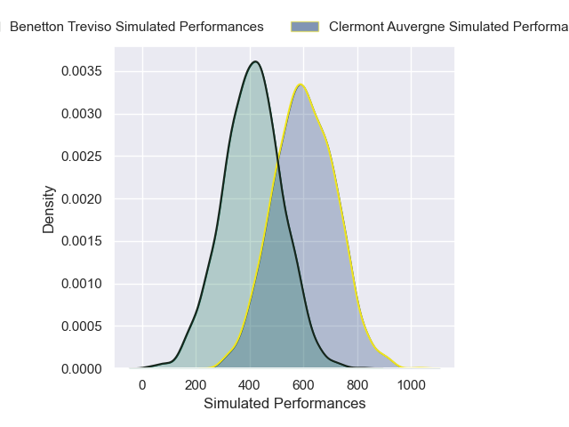
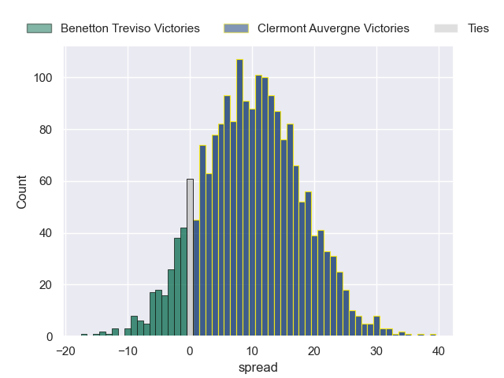
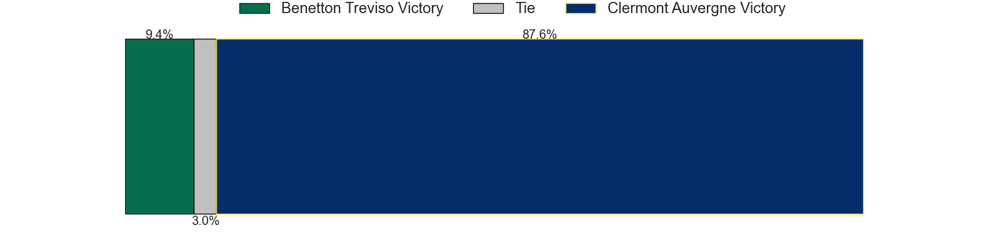

---  
layout: page  
title: Benetton Treviso at Clermont Auvergne  
date: 2024-12-07 18:00:00 -0500  
categories: "European Rugby Champions Cup 2024" match projection  
---
# Benetton Treviso at Clermont Auvergne

# Club Level Predictions

The first set of predictions treats a club as the smallest object, as the club develops its members, organizes a gameplan, and deploys its players as needed for each match. This club model has a prediction of 0.571, which translates to predicting Clermont Auvergne to win by 7.2.

Our Over/Under is 47.5 - and combined with the spread above, we have a predicted scoreline of 20 to 28

Each club has a rating and a rating deviation (similar to a Glicko rating), and expected performances can be generated. This allows for simulated matches and spreads like the ones below.
## Projected Performances - Club Model

## Projected Spreads - Club Model

## Projected Results - Club Model

# Player Level Predictions

Treating teams instead as an entity made up of the currently active players, I have ratings for each player in an altogether different system. These can be combined to form team ratings once teamsheets are announced, weighting starters a bit higher than the reserves. After the match is played, players can be weighted by their minutes on the field, allowing for an accurate measure of the team's composition. With these compiled team ratings, we can make predictions, measure inaccuracy, and update the individual player ratings.
## Prediction without Player Minutes: Clermont Auvergne by 9.8

Benetton Treviso by 3.3 on a neutral pitch

## Projected Performances - Player Model

## Projected Spreads - Player Model

## Projected Results - Player Model

| Away Player         |   Away Percentile |   Number |   Home Percentile | Home Player          |
|:--------------------|------------------:|---------:|------------------:|:---------------------|
| Thomas Gallo        |             86.78 |        1 |             73.62 | Etienne Falgoux      |
| Agustin Creevy      |             90.39 |        2 |             78.29 | Barnabe Massa        |
| Simone Ferrari      |             84.23 |        3 |             73.68 | Regis Montagne       |
| Niccolo Cannone     |             67.81 |        4 |             44.39 | Peceli Yato          |
| Federico Ruzza      |             95.7  |        5 |             65    | Thomas Ceyte         |
| Sebastian Negri     |             85.34 |        6 |             77.24 | Killian Tixeront     |
| Manuel Zuliani      |             69.66 |        7 |             92.24 | Marcos Kremer        |
| Simon Koroiyadi     |            nan    |        8 |             91.68 | Fritz Lee            |
| Alessandro Garbisi  |             52.71 |        9 |             82.27 | Sebastien Bezy       |
| Tomas Albornoz      |             85.6  |       10 |             78    | Benjamin Urdapilleta |
| Onisi Ratave        |             60.28 |       11 |             12.98 | Alivereti Raka       |
| Tommaso Menoncello  |             89.33 |       12 |             15.52 | Pierre Fouyssac      |
| Juan Ignacio Brex   |             93.5  |       13 |            nan    | Mathys Belaubre      |
| Louis Lynagh        |             53.71 |       14 |             91.32 | Lucas Tauzin         |
| Leonardo Marin      |             72.2  |       15 |             75.19 | Alex Newsome         |
| Bautista Bernasconi |             57.05 |       16 |             80.78 | Etienne Fourcade     |
| Mirco Spagnolo      |             41.6  |       17 |             36.93 | Giorgi Akhaladze     |
| Tiziano Pasquali    |             77.8  |       18 |             81.38 | Michael Ala'alatoa   |
| Riccardo Favretto   |             18.26 |       19 |             78.97 | Anthime Hemery       |
| Alessandro Izekor   |             47.84 |       20 |             78.53 | Alexandre Fischer    |
| Toa Halafihi        |             79.74 |       21 |             78.16 | Baptiste Jauneau     |
| Lautaro Bazan Velez |             65.85 |       22 |            nan    | Theo Giral           |
| Jacob Umaga         |             63.8  |       23 |            nan    | Irae Simone          |

