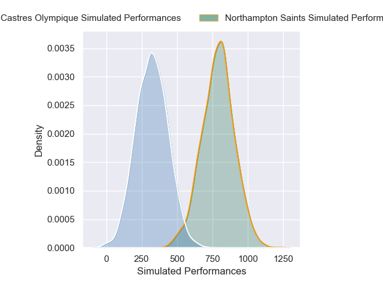
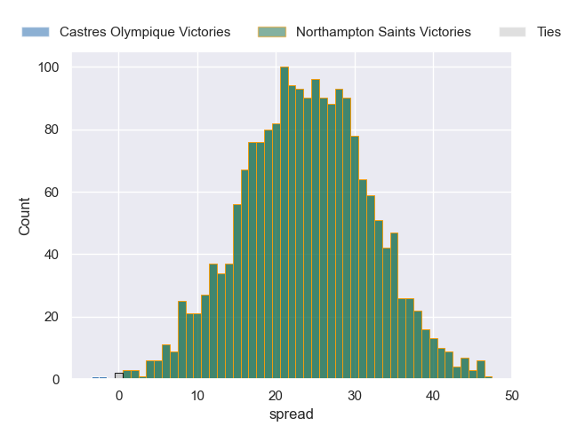
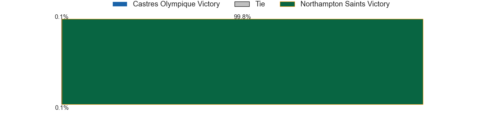

---  
layout: page  
title: Castres Olympique at Northampton Saints  
date: 2024-12-07 18:00:00 -0500  
categories: "European Rugby Champions Cup 2024" match projection  
---
# Castres Olympique at Northampton Saints

# Club Level Predictions

The first set of predictions treats a club as the smallest object, as the club develops its members, organizes a gameplan, and deploys its players as needed for each match. This club model has a prediction of 0.577, which translates to predicting Northampton Saints to win by 7.2.

Our Over/Under is 53.5 - and combined with the spread above, we have a predicted scoreline of 23 to 30

Each club has a rating and a rating deviation (similar to a Glicko rating), and expected performances can be generated. This allows for simulated matches and spreads like the ones below.
## Projected Performances - Club Model

## Projected Spreads - Club Model

## Projected Results - Club Model

# Player Level Predictions

Treating teams instead as an entity made up of the currently active players, I have ratings for each player in an altogether different system. These can be combined to form team ratings once teamsheets are announced, weighting starters a bit higher than the reserves. After the match is played, players can be weighted by their minutes on the field, allowing for an accurate measure of the team's composition. With these compiled team ratings, we can make predictions, measure inaccuracy, and update the individual player ratings.
## Prediction without Player Minutes: Northampton Saints by 23.7

Northampton Saints by 8.6 on a neutral pitch

## Projected Performances - Player Model

## Projected Spreads - Player Model

## Projected Results - Player Model

| Away Player           |   Away Percentile |   Number |   Home Percentile | Home Player         |
|:----------------------|------------------:|---------:|------------------:|:--------------------|
| Lois Guerois-Galisson |             83.57 |        1 |             50.03 | Emmanuel Iyogun     |
| Loris Zarantonello    |             27.44 |        2 |             91.94 | Curtis Langdon      |
| Aurelien Azar         |             58.76 |        3 |             85.32 | Elliot Millar Mills |
| Guillaume Ducat       |             19.12 |        4 |             98.6  | Temo Mayanavanua    |
| Leone Nakarawa        |             95.96 |        5 |             29.56 | Tom Lockett         |
| Yann Peysson          |             86.62 |        6 |             45.6  | Angus Scott-Young   |
| Tyler Ardron          |             76.47 |        7 |             95.43 | Henry Pollock       |
| Feibyan Tukino        |             44.85 |        8 |             39.96 | Juarno Augustus     |
| Santiago Arata        |             69.95 |        9 |             97.87 | Alex Mitchell       |
| Louis Le Brun         |             85    |       10 |             75.8  | Fin Smith           |
| Nathanael Hulleu      |             83.19 |       11 |             90.77 | Ollie Sleightholme  |
| Joris Dupont          |             66.05 |       12 |             84.77 | Fraser Dingwall     |
| Adrien Seguret        |             12.03 |       13 |             72.26 | Tom Litchfield      |
| Josaia Raisuqe        |             89.37 |       14 |             98.36 | Tommy Freeman       |
| Theo Chabouni         |             57.12 |       15 |             87.41 | James Ramm          |
| Pierre Colonna        |             39.53 |       16 |            nan    | Craig Wright        |
| Wayan de Benedittis   |             59.25 |       17 |             55.43 | Tom West            |
| Nicolas Corato        |             31.47 |       18 |            nan    | Luke Green          |
| Mathieu Babillot      |             18.79 |       19 |             76.49 | Chunya Munga        |
| Abraham Papali'i      |             19.53 |       20 |             16.32 | Alex Coles          |
| Jeremy Fernandez      |             57.14 |       21 |            nan    | Iakopo Petelo-Mapu  |
| Vilimoni Botitu       |             36    |       22 |             92.45 | Archie McParland    |
| Remy Baget            |             90.46 |       23 |             80.02 | Rory Hutchinson     |

