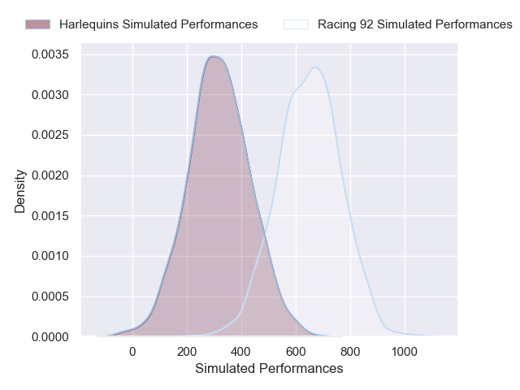
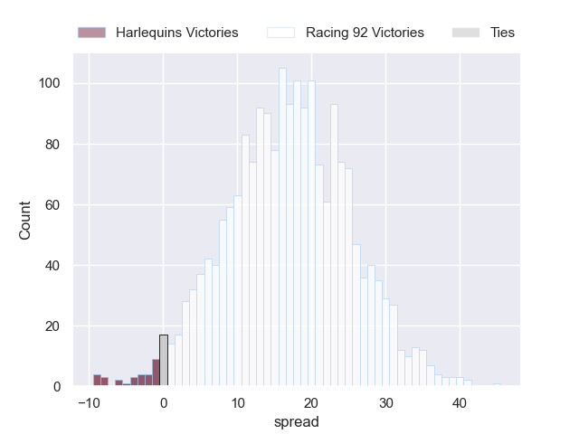
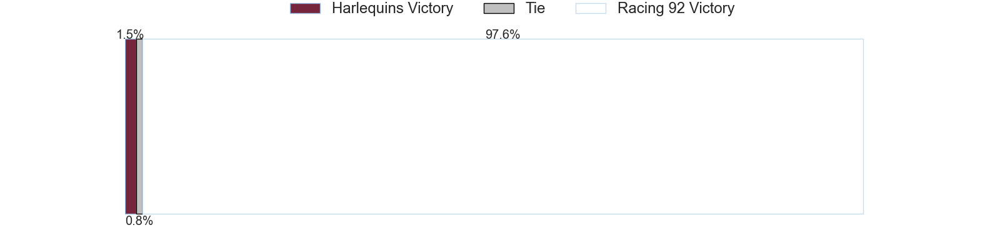

---  
layout: page  
title: Harlequins at Racing 92  
date: 2024-12-07 18:00:00 -0500  
categories: "European Rugby Champions Cup 2024" match projection  
---
# Harlequins at Racing 92

# Club Level Predictions

The first set of predictions treats a club as the smallest object, as the club develops its members, organizes a gameplan, and deploys its players as needed for each match. This club model has a prediction of 0.463, which translates to predicting Harlequins to win by -2.6.

Our Over/Under is 52.5 - and combined with the spread above, we have a predicted scoreline of 25 to 28

Each club has a rating and a rating deviation (similar to a Glicko rating), and expected performances can be generated. This allows for simulated matches and spreads like the ones below.
## Projected Performances - Club Model

## Projected Spreads - Club Model

## Projected Results - Club Model

# Player Level Predictions

Treating teams instead as an entity made up of the currently active players, I have ratings for each player in an altogether different system. These can be combined to form team ratings once teamsheets are announced, weighting starters a bit higher than the reserves. After the match is played, players can be weighted by their minutes on the field, allowing for an accurate measure of the team's composition. With these compiled team ratings, we can make predictions, measure inaccuracy, and update the individual player ratings.
## Prediction without Player Minutes: Racing 92 by 16.8

Racing 92 by 5.6 on a neutral pitch

## Projected Performances - Player Model

## Projected Spreads - Player Model

## Projected Results - Player Model

| Away Player               |   Away Percentile |   Number |   Home Percentile | Home Player         |
|:--------------------------|------------------:|---------:|------------------:|:--------------------|
| Wyn Jones                 |             80.65 |        1 |             66.89 | Guram Gogichashvili |
| Jack Walker               |             11.78 |        2 |             57.36 | Janick Tarrit       |
| Simon Kerrod              |             61.49 |        3 |            nan    | Lee-Marvin Mazibuko |
| Dino Lamb                 |             67.46 |        4 |             91.49 | Boris Palu          |
| Stephan Lewies            |             79.21 |        5 |             55.61 | Fabien Sanconnie    |
| Chandler Cunningham-South |             43.28 |        6 |             95.52 | Cameron Woki        |
| Jack Kenningham           |             89.74 |        7 |             42.24 | Ibrahim Diallo      |
| Alex Dombrandt            |             77.76 |        8 |             85.71 | Jordan Joseph       |
| Will Porter               |             10.18 |        9 |             78.82 | Nolann Le Garrec    |
| Marcus Smith              |             55.2  |       10 |             94    | Antoine Gibert      |
| Nick David                |             89.91 |       11 |             85.54 | Wame Naituvi        |
| Lennox Anyanwu            |             85.16 |       12 |             96.12 | Josua Tuisova       |
| Luke Northmore            |             75.46 |       13 |             96.99 | Gael Fickou         |
| Cadan Murley              |             38.78 |       14 |             59.03 | Vinaya Habosi       |
| Leigh Halfpenny           |             72.31 |       15 |             13.46 | Max Spring          |
| Sam Riley                 |             76.12 |       16 |             91.47 | Camille Chat        |
| Jordan Els                |             55.49 |       17 |            nan    | Lino Julien         |
| Titi Lamositele           |             62.1  |       18 |             63.01 | Gia Kharaishvili    |
| James Chisholm            |             94.76 |       19 |             78.3  | Maxime Baudonne     |
| Will Evans                |             56.55 |       20 |             48.53 | Noa Zinzen          |
| Danny Care                |             98.52 |       21 |             57.96 | Clovis Le Bail      |
| Jarrod Evans              |             58.8  |       22 |              5    | Dan Lancaster       |
| Oscar Beard               |             16.49 |       23 |             30.96 | Tristan Tedder      |

