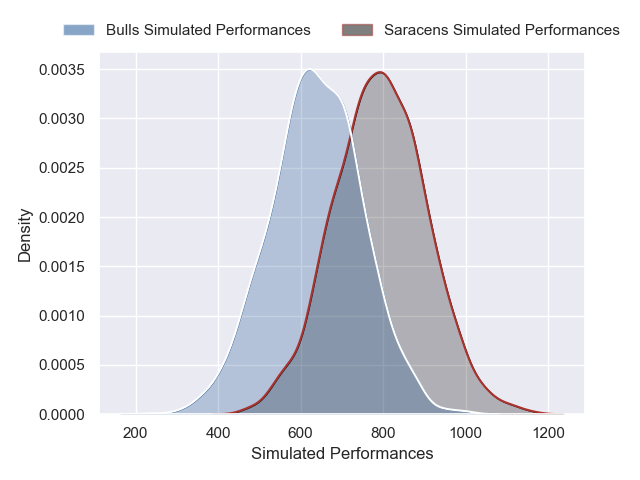
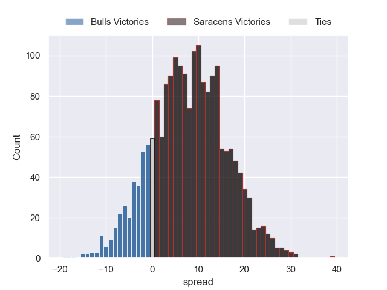
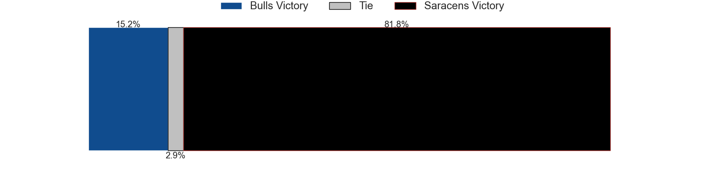

---  
layout: page  
title: Bulls at Saracens  
date: 2024-12-07 18:00:00 -0500  
categories: "European Rugby Champions Cup 2024" match projection  
---
# Bulls at Saracens

# Club Level Predictions

The first set of predictions treats a club as the smallest object, as the club develops its members, organizes a gameplan, and deploys its players as needed for each match. This club model has a prediction of 0.417, which translates to predicting Bulls to win by -0.6.

Our Over/Under is 55.5 - and combined with the spread above, we have a predicted scoreline of 27 to 28

Each club has a rating and a rating deviation (similar to a Glicko rating), and expected performances can be generated. This allows for simulated matches and spreads like the ones below.
## Projected Performances - Club Model

## Projected Spreads - Club Model

## Projected Results - Club Model

# Player Level Predictions

Treating teams instead as an entity made up of the currently active players, I have ratings for each player in an altogether different system. These can be combined to form team ratings once teamsheets are announced, weighting starters a bit higher than the reserves. After the match is played, players can be weighted by their minutes on the field, allowing for an accurate measure of the team's composition. With these compiled team ratings, we can make predictions, measure inaccuracy, and update the individual player ratings.
## Prediction without Player Minutes: Saracens by 8.1

Bulls by 3.1 on a neutral pitch

## Projected Performances - Player Model

## Projected Spreads - Player Model

## Projected Results - Player Model

| Away Player         |   Away Percentile |   Number |   Home Percentile | Home Player          |
|:--------------------|------------------:|---------:|------------------:|:---------------------|
| Gerhard Steenekamp  |             85.2  |        1 |             49.55 | Rhys Carre           |
| Johan Grobbelaar    |             91.63 |        2 |             97.21 | Jamie George         |
| Francois Klopper    |             60.52 |        3 |             75.2  | Marco Riccioni       |
| Ruan Vermaak        |             14.82 |        4 |             99.12 | Maro Itoje           |
| JF van Heerden      |             32.28 |        5 |             95.35 | Nick Isiekwe         |
| Marco van Staden    |             95.78 |        6 |             37.98 | Theo McFarland       |
| Cobus Wiese         |             96.38 |        7 |             96.03 | Juan Martin Gonzalez |
| Cameron Hanekom     |             70.16 |        8 |             64.56 | Tom Willis           |
| Embrose Papier      |             93.76 |        9 |             88.01 | Ivan van Zyl         |
| Johan Goosen        |             70.6  |       10 |             74.6  | Fergus Burke         |
| Devon Williams      |             89.81 |       11 |             74.59 | Rotimi Segun         |
| David Kriel         |             94.18 |       12 |             97.96 | Nick Tompkins        |
| Canan Moodie        |             99.92 |       13 |             72.94 | Lucio Cinti          |
| Sebastian de Klerk  |             96.17 |       14 |             77.33 | Tobias Elliott       |
| Willie le Roux      |             98.46 |       15 |             90.58 | Elliot Daly          |
| Akker van der Merwe |             96.12 |       16 |             86.36 | Theo Dan             |
| Alulutho Tshakweni  |             73.92 |       17 |             85.81 | Eroni Mawi           |
| Mornay Smith        |             78.71 |       18 |             73.2  | Alec Clarey          |
| Jannes Kirsten      |             93.79 |       19 |             69.98 | Harry Wilson         |
| Marcell Coetzee     |             96.12 |       20 |             98.92 | Ben Earl             |
| Keagan Johannes     |             56.8  |       21 |             28.08 | Gareth Simpson       |
| Aphiwe Dyantyi      |             28.69 |       22 |             11    | Tiff Eden            |
| Harold Vorster      |             94.08 |       23 |             85.38 | Tom Parton           |

