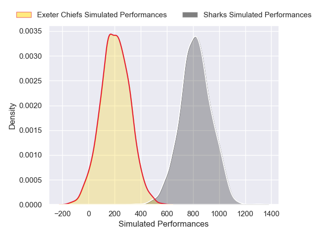
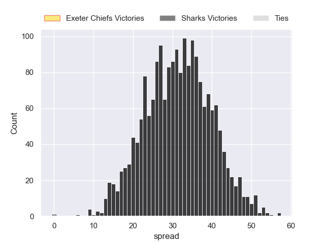

---  
layout: page  
title: Exeter Chiefs at Sharks  
date: 2024-12-07 18:00:00 -0500  
categories: "European Rugby Champions Cup 2024" match projection  
---
# Exeter Chiefs at Sharks

# Club Level Predictions

The first set of predictions treats a club as the smallest object, as the club develops its members, organizes a gameplan, and deploys its players as needed for each match. This club model has a prediction of 0.451, which translates to predicting Exeter Chiefs to win by -1.8.

Our Over/Under is 53.5 - and combined with the spread above, we have a predicted scoreline of 26 to 28

Each club has a rating and a rating deviation (similar to a Glicko rating), and expected performances can be generated. This allows for simulated matches and spreads like the ones below.
## Projected Performances - Club Model

## Projected Spreads - Club Model

## Projected Results - Club Model

# Player Level Predictions

Treating teams instead as an entity made up of the currently active players, I have ratings for each player in an altogether different system. These can be combined to form team ratings once teamsheets are announced, weighting starters a bit higher than the reserves. After the match is played, players can be weighted by their minutes on the field, allowing for an accurate measure of the team's composition. With these compiled team ratings, we can make predictions, measure inaccuracy, and update the individual player ratings.
## Prediction without Player Minutes: Sharks by 31.5

Sharks by 23.3 on a neutral pitch

## Projected Performances - Player Model

## Projected Spreads - Player Model

## Projected Results - Player Model

| Away Player          |   Away Percentile |   Number |   Home Percentile | Home Player       |
|:---------------------|------------------:|---------:|------------------:|:------------------|
| Scott Sio            |             85.93 |        1 |             90.18 | Ox Nche           |
| Dan Frost            |             86.05 |        2 |             96.9  | Bongi Mbonambi    |
| Marcus Street        |             16.13 |        3 |             82.05 | Trevor Nyakane    |
| Richard Capstick     |              8.42 |        4 |             99.82 | Eben Etzebeth     |
| Franco Molina        |              9.39 |        5 |             66.23 | Emile van Heerden |
| Ethan Roots          |              6.9  |        6 |             66.12 | James Venter      |
| Jacques Vermeulen    |             91.29 |        7 |             87.59 | Vincent Tshituka  |
| Greg Fisilau         |             89.33 |        8 |             92.22 | Siya Kolisi       |
| Stu Townsend         |             93.1  |        9 |             84.73 | Grant Williams    |
| Will Haydon-Wood     |             15.8  |       10 |             83.6  | Jordan Hendrikse  |
| Tom Wyatt            |             65.75 |       11 |            100    | Makazole Mapimpi  |
| Tamati Tua           |             84.48 |       12 |             97.77 | Andre Esterhuizen |
| Ben Hammersley       |             49.88 |       13 |             62.39 | Ethan Hooker      |
| Immanuel Feyi-Waboso |             23.38 |       14 |             20.02 | Eduan Keyter      |
| Josh Hodge           |              2.12 |       15 |             94.62 | Aphelele Fassi    |
| Jack Innard          |            nan    |       16 |             37.67 | Dylan Richardson  |
| Will Goodrick-Clarke |             60.82 |       17 |             36.75 | Ntuthuko Mchunu   |
| Jimmy Roots          |            nan    |       18 |            nan    | Hanro Jacobs      |
| Christ Tshiunza      |             62.54 |       19 |             71.05 | Jason Jenkins     |
| Ross Vintcent        |             21.16 |       20 |             30.38 | Phepsi Buthelezi  |
| Will Becconsall      |            nan    |       21 |             94.58 | Jaden Hendrikse   |
| Harvey Skinner       |             15.2  |       22 |             69.4  | Siya Masuku       |
| Will Rigg            |             95.64 |       23 |             54.03 | Francois Venter   |

