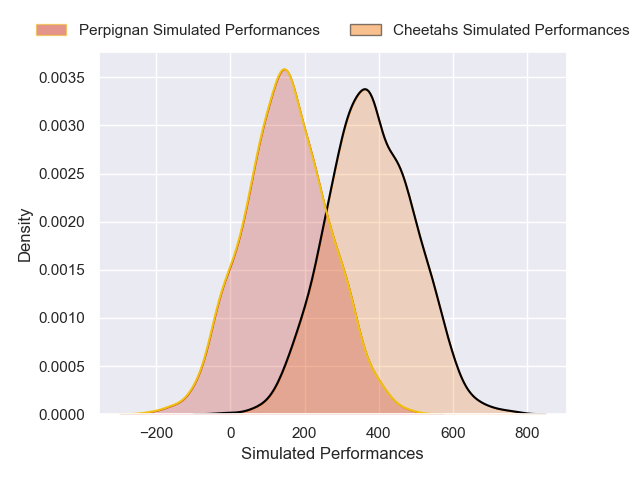
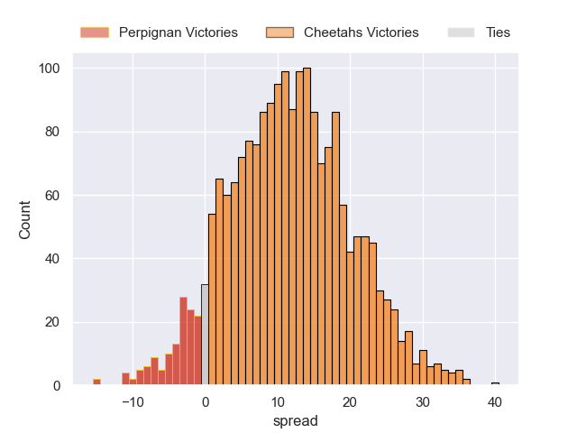
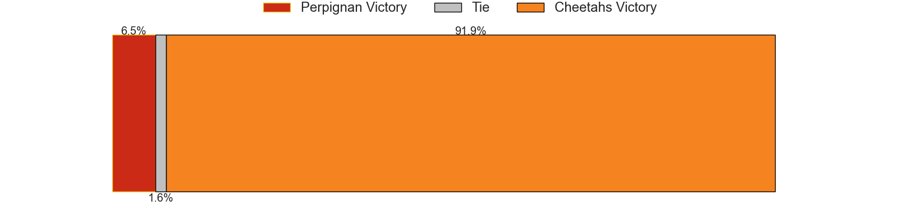

---  
layout: page  
title: Perpignan at Cheetahs  
date: 2024-12-08 18:00:00 -0500  
categories: "European Rugby Challenge Cup 2024" match projection  
---
# Perpignan at Cheetahs

# Club Level Predictions

The first set of predictions treats a club as the smallest object, as the club develops its members, organizes a gameplan, and deploys its players as needed for each match. This club model has a prediction of 0.481, which translates to predicting Perpignan to win by -3.1.

Our Over/Under is 39.5 - and combined with the spread above, we have a predicted scoreline of 18 to 21

Each club has a rating and a rating deviation (similar to a Glicko rating), and expected performances can be generated. This allows for simulated matches and spreads like the ones below.
## Projected Performances - Club Model

## Projected Spreads - Club Model

## Projected Results - Club Model

# Player Level Predictions

Treating teams instead as an entity made up of the currently active players, I have ratings for each player in an altogether different system. These can be combined to form team ratings once teamsheets are announced, weighting starters a bit higher than the reserves. After the match is played, players can be weighted by their minutes on the field, allowing for an accurate measure of the team's composition. With these compiled team ratings, we can make predictions, measure inaccuracy, and update the individual player ratings.
## Prediction without Player Minutes: Cheetahs by 11.7

Cheetahs by 5.9 on a neutral pitch

## Projected Performances - Player Model

## Projected Spreads - Player Model

## Projected Results - Player Model

| Away Player              |   Away Percentile |   Number |   Home Percentile | Home Player              |
|:-------------------------|------------------:|---------:|------------------:|:-------------------------|
| Lorencio Boyer Gallardo  |             63.31 |        1 |            nan    | Schalk Ferreira          |
| Victor Montgaillard      |              4.5  |        2 |            nan    | Louis van der Westhuizen |
| Nemo Roelofse            |             69.44 |        3 |            nan    | Aranos Coetzee           |
| Bastien Chinarro         |            nan    |        4 |            nan    | Carl Wegner              |
| Mathieu Tanguy           |             74.56 |        5 |             88.33 | Victor Sekekete          |
| Noe Della Schiava        |             24.74 |        6 |            nan    | Gideon van der Merwe     |
| Alessandro Ortombina     |            nan    |        7 |             95.12 | Friedle Olivier          |
| So'otala Fa'aso'o        |             91.4  |        8 |             70.89 | Jeandre Rudolph          |
| Sadek Deghmache          |             12.32 |        9 |             38.75 | Ruben de Haas            |
| Antoine Aucagne          |             10.6  |       10 |            nan    | Ethan Wentzel            |
| Setareki Toganiyadrava   |            nan    |       11 |            nan    | Prince Nkabinde          |
| Apisai Naqalevu          |             25.9  |       12 |            nan    | Ali Mgijima              |
| Job Poulet               |            nan    |       13 |            nan    | Carel-Jan Coetzee        |
| Jefferson Joseph         |             29.62 |       14 |             83.8  | Munier Hartzenberg       |
| Louis Dupichot           |             64.62 |       15 |            nan    | Michael Annies           |
| Vakhtang Jincharadze     |            nan    |       16 |            nan    | Vernon Paulo             |
| Joan Barcenilla D Onghia |            nan    |       17 |            nan    | Hencus van Wyk           |
| Pietro Ceccarelli        |             42.94 |       18 |            nan    | Robert Hunt              |
| Max Hicks                |             67.33 |       19 |            nan    | Pierre-Raymond Uys       |
| Lucas Velarte            |             20.78 |       20 |            nan    | Oupa Mohoje              |
| James Hall               |            nan    |       21 |            nan    | Daniel Maartens          |
| Gabin Kretchmann         |             26.4  |       22 |            nan    | Rewan Kruger             |
| Eneriko Buliruarua       |              6.21 |       23 |             24.2  | George Lourens           |

