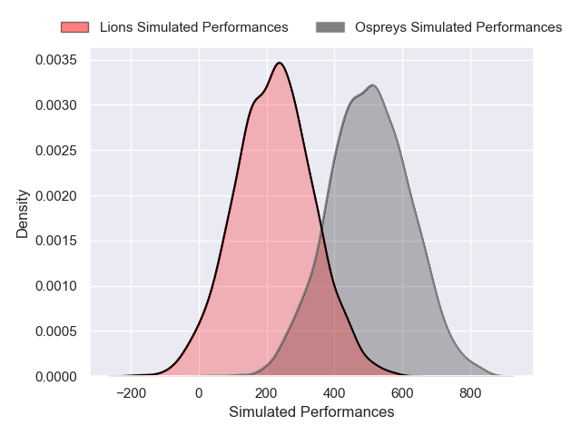
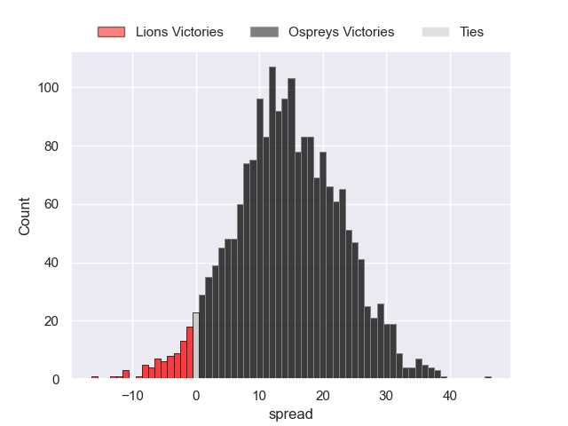
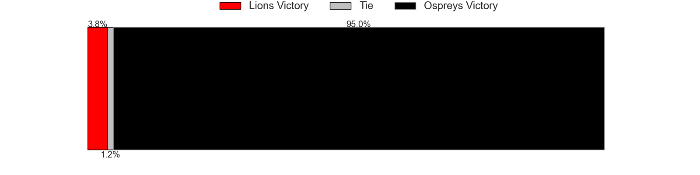

---  
layout: page  
title: Lions at Ospreys  
date: 2024-12-08 18:00:00 -0500  
categories: "European Rugby Challenge Cup 2024" match projection  
---
# Lions at Ospreys

# Club Level Predictions

The first set of predictions treats a club as the smallest object, as the club develops its members, organizes a gameplan, and deploys its players as needed for each match. This club model has a prediction of 0.372, which translates to predicting Lions to win by 1.2.

Our Over/Under is 52.5 - and combined with the spread above, we have a predicted scoreline of 27 to 26

Each club has a rating and a rating deviation (similar to a Glicko rating), and expected performances can be generated. This allows for simulated matches and spreads like the ones below.
## Projected Performances - Club Model

## Projected Spreads - Club Model

## Projected Results - Club Model

# Player Level Predictions

Treating teams instead as an entity made up of the currently active players, I have ratings for each player in an altogether different system. These can be combined to form team ratings once teamsheets are announced, weighting starters a bit higher than the reserves. After the match is played, players can be weighted by their minutes on the field, allowing for an accurate measure of the team's composition. With these compiled team ratings, we can make predictions, measure inaccuracy, and update the individual player ratings.
## Prediction without Player Minutes: Ospreys by 14.3

Ospreys by 4.7 on a neutral pitch

## Projected Performances - Player Model

## Projected Spreads - Player Model

## Projected Results - Player Model

| Away Player            |   Away Percentile |   Number |   Home Percentile | Home Player        |
|:-----------------------|------------------:|---------:|------------------:|:-------------------|
| Morgan Naude           |             68.34 |        1 |             24.98 | Gareth Thomas      |
| Franco Marais          |            nan    |        2 |             18.45 | Dewi Lake          |
| Conraad van Vuuren     |             25.47 |        3 |             61.31 | Ben Warren         |
| Etienne Oosthuizen     |             90.79 |        4 |             53.77 | William Greatbanks |
| Darrien-Lane Landsberg |             76.4  |        5 |            nan    | James Fender       |
| JC Pretorius           |             80.43 |        6 |            nan    | Tristan Davies     |
| Izan Esterhuizen       |            nan    |        7 |             88.19 | Harri Deaves       |
| WJ Steenkamp           |             39.01 |        8 |             83.62 | Jac Morgan         |
| Nico Steyn             |             72.8  |        9 |             34.15 | Kieran Hardy       |
| Sam Francis            |            nan    |       10 |             93.8  | Owen Williams      |
| Rabz Maxwane           |             79.83 |       11 |             19.39 | Keelan Giles       |
| Rynhardt Jonker        |             88.07 |       12 |             87.49 | Keiran Williams    |
| Erich Cronje           |             27.35 |       13 |             95.83 | Owen Watkin        |
| Richard Kriel          |             26.11 |       14 |             94.37 | Daniel Kasende     |
| Tapiwa Mafura          |             88.51 |       15 |             20    | Jack Walsh         |
| Jaco Visagie           |             86.2  |       16 |             26.2  | Sam Parry          |
| SJ Kotze               |            nan    |       17 |             22.38 | Steffan Thomas     |
| RF Schoeman            |            nan    |       18 |             47.48 | Tom Botha          |
| Ruan Delport           |             21.4  |       19 |            nan    | Lewis Jones        |
| Renzo Du Plessis       |            nan    |       20 |              3.44 | Morgan Morris      |
| Ruhan Straeuli         |            nan    |       21 |             66.17 | Luke Davies        |
| Sanele Nohamba         |             91.8  |       22 |             62.4  | Dan Edwards        |
| Marius Louw            |             83.41 |       23 |             68.88 | Iestyn Hopkins     |

