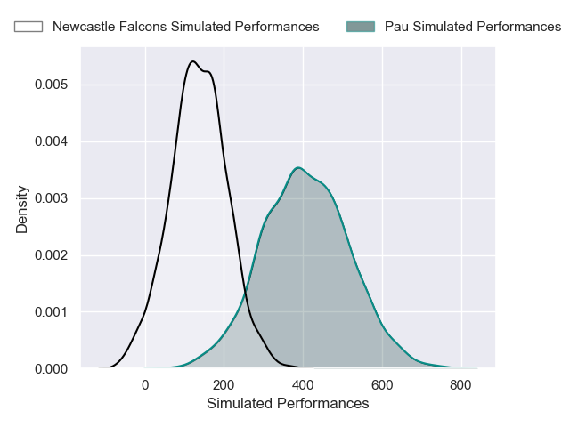
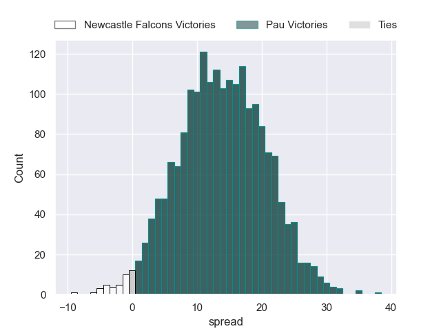
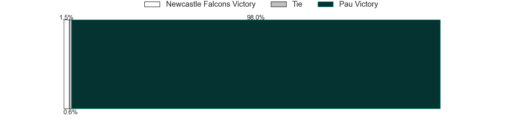

---  
layout: page  
title: Newcastle Falcons at Pau  
date: 2024-12-08 18:00:00 -0500  
categories: "Challenge Cup 2024" match projection  
---
# Newcastle Falcons at Pau

# Club Level Predictions

The first set of predictions treats a club as the smallest object, as the club develops its members, organizes a gameplan, and deploys its players as needed for each match. This club model has a prediction of 0.697, which translates to predicting Pau to win by 11.4.

Our Over/Under is 45.5 - and combined with the spread above, we have a predicted scoreline of 17 to 29

Each club has a rating and a rating deviation (similar to a Glicko rating), and expected performances can be generated. This allows for simulated matches and spreads like the ones below.
## Projected Performances - Club Model

## Projected Spreads - Club Model

## Projected Results - Club Model

# Player Level Predictions

Treating teams instead as an entity made up of the currently active players, I have ratings for each player in an altogether different system. These can be combined to form team ratings once teamsheets are announced, weighting starters a bit higher than the reserves. After the match is played, players can be weighted by their minutes on the field, allowing for an accurate measure of the team's composition. With these compiled team ratings, we can make predictions, measure inaccuracy, and update the individual player ratings.
## Prediction without Player Minutes: Pau by 13.8

Pau by 0.3 on a neutral pitch

## Projected Performances - Player Model

## Projected Spreads - Player Model

## Projected Results - Player Model

| Away Player         |   Away Percentile |   Number |   Home Percentile | Home Player         |
|:--------------------|------------------:|---------:|------------------:|:--------------------|
| nan                 |            nan    |        3 |             58.16 | Jon Zabala          |
| nan                 |            nan    |        4 |             18.86 | Thomas Jolmes       |
| nan                 |            nan    |        5 |             36.75 | Jimi Maximin        |
| nan                 |            nan    |        6 |             59.74 | Mehdi Tlili         |
| nan                 |            nan    |        7 |             76.72 | Reece Hewat         |
| nan                 |            nan    |        8 |             11.81 | Thibaut Hamonou     |
| nan                 |            nan    |        9 |            nan    | Thomas Souverbie    |
| nan                 |            nan    |       10 |             88.8  | Axel Desperes       |
| Ben Stevenson       |             51.68 |       11 |            nan    | Grégoire Arfeuil    |
| Cameron Hutchison   |             68.48 |       12 |             32.84 | Elliot Roudil       |
| Alex Hearle         |             59.81 |       13 |              2.81 | Olivier Klemenczak  |
| Adam Radwan         |             26.27 |       14 |             75.37 | Aaron Grandidier    |
| Ben Redshaw         |             85.58 |       15 |            nan    | Clément Mondinat    |
| Bryan Byrne         |             71.47 |       16 |             56.9  | Youri Delhommel     |
| Mike Rewcastle      |            nan    |       17 |             13.58 | Daniel Bibi Biziwu  |
| Callum Hancock      |            nan    |       18 |            nan    | nan                 |
| Finn Baker          |            nan    |       19 |             36.05 | Hugo Auradou        |
| Ollie Leatherbarrow |            nan    |       20 |             61.03 | Lekima Tagitagivalu |
| Hugh O'Sullivan     |             47.13 |       21 |             86.7  | Thibault Daubagna   |
| Brett Connon        |              2.2  |       22 |             57.9  | Nathan Decron       |
| Oli Spencer         |            nan    |       23 |            nan    | nan                 |

