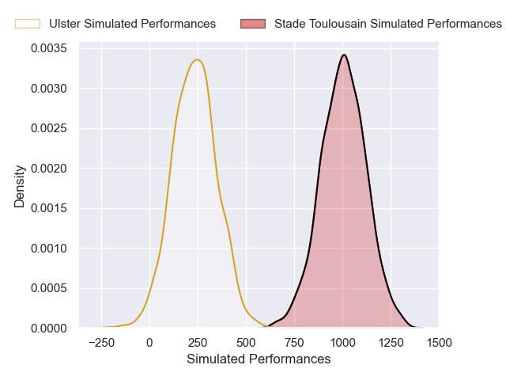
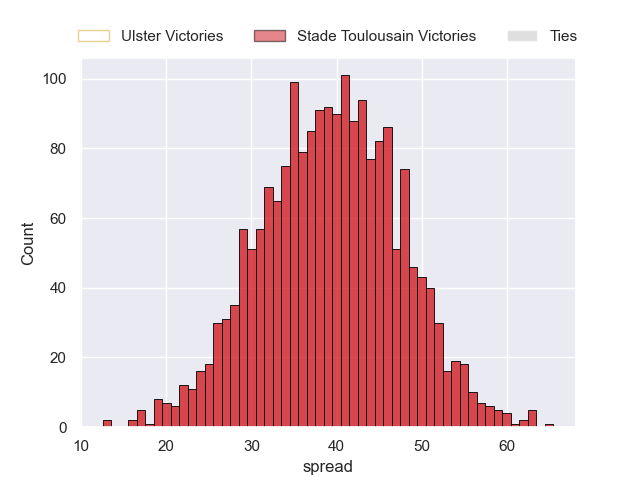

---  
layout: page  
title: Ulster at Stade Toulousain  
date: 2024-12-08 18:00:00 -0500  
categories: "European Rugby Champions Cup 2024" match projection  
---
# Ulster at Stade Toulousain

# Club Level Predictions

The first set of predictions treats a club as the smallest object, as the club develops its members, organizes a gameplan, and deploys its players as needed for each match. This club model has a prediction of 0.692, which translates to predicting Stade Toulousain to win by 10.8.

Our Over/Under is 44.5 - and combined with the spread above, we have a predicted scoreline of 17 to 28

Each club has a rating and a rating deviation (similar to a Glicko rating), and expected performances can be generated. This allows for simulated matches and spreads like the ones below.
## Projected Performances - Club Model

## Projected Spreads - Club Model

## Projected Results - Club Model

# Player Level Predictions

Treating teams instead as an entity made up of the currently active players, I have ratings for each player in an altogether different system. These can be combined to form team ratings once teamsheets are announced, weighting starters a bit higher than the reserves. After the match is played, players can be weighted by their minutes on the field, allowing for an accurate measure of the team's composition. With these compiled team ratings, we can make predictions, measure inaccuracy, and update the individual player ratings.
## Prediction without Player Minutes: Stade Toulousain by 39.5

Stade Toulousain by 26.7 on a neutral pitch

## Projected Performances - Player Model

## Projected Spreads - Player Model

## Projected Results - Player Model

| Away Player        |   Away Percentile |   Number |   Home Percentile | Home Player          |
|:-------------------|------------------:|---------:|------------------:|:---------------------|
| Andrew Warwick     |             62.28 |        1 |             83.2  | David Ainu'u         |
| James McCormick    |             26.98 |        2 |             89.77 | Peato Mauvaka        |
| Scott Wilson       |             37.96 |        3 |             85.08 | Dorian Aldegheri     |
| Alan O'Connor      |             79.3  |        4 |             93.42 | Thibaud Flament      |
| Harry Sheridan     |             83.07 |        5 |             85.35 | Emmanuel Meafou      |
| Matty Rea          |             77.67 |        6 |             97.29 | Jack Willis          |
| Marcus Rea         |             94.22 |        7 |             79.05 | Leo Banos            |
| James McNabney     |              8.1  |        8 |             96.81 | Alexandre Roumat     |
| Nathan Doak        |             21.51 |        9 |             99.67 | Antoine Dupont       |
| Aidan Morgan       |             58.4  |       10 |             94.4  | Romain Ntamack       |
| Mike Lowry         |             31.74 |       11 |             98.91 | Matthis Lebel        |
| Stuart McCloskey   |             87.1  |       12 |             52.96 | Santiago Chocobares  |
| Ben Carson         |             57.81 |       13 |             93.89 | Pierre-Louis Barassi |
| Werner Kok         |             54.57 |       14 |             96.73 | Ange Capuozzo        |
| Stewart Moore      |             99.62 |       15 |             95.58 | Thomas Ramos         |
| Rob Herring        |             96.74 |       16 |             95.81 | Julien Marchand      |
| Eric O'Sullivan    |             73.14 |       17 |             63.8  | Rodrigue Neti        |
| Tom O'Toole        |             50.58 |       18 |             81.56 | Joel Merkler         |
| Iain Henderson     |             94.3  |       19 |             90.09 | Joshua Brennan       |
| Cormac Izuchukwu   |             74.22 |       20 |             66.37 | Theo Ntamack         |
| Dave Shanahan      |            nan    |       21 |             38.92 | Paul Graou           |
| Jude Postlethwaite |            100    |       22 |             84.38 | Paul Costes          |
| Nick Timoney       |             81.03 |       23 |             99.81 | Juan Cruz Mallia     |

