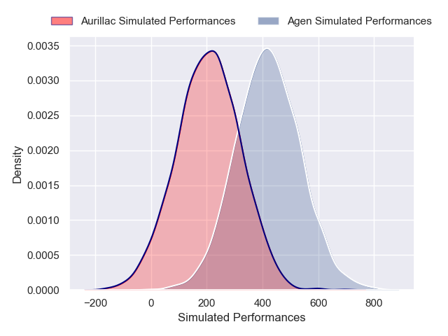
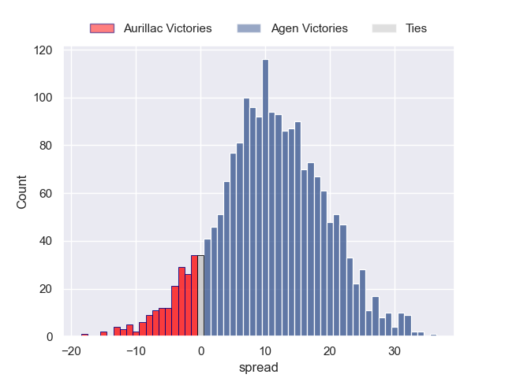
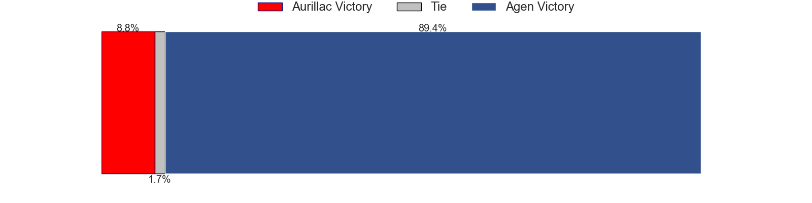

---  
layout: page  
title: Aurillac at Agen  
date: 2024-12-13 18:00:00 -0500  
categories: "Pro D2 2024" match projection  
---
# Aurillac at Agen

# Club Level Predictions

The first set of predictions treats a club as the smallest object, as the club develops its members, organizes a gameplan, and deploys its players as needed for each match. This club model has a prediction of 0.54, which translates to predicting Agen to win by 5.0.

Our Over/Under is 45.5 - and combined with the spread above, we have a predicted scoreline of 20 to 25

Each club has a rating and a rating deviation (similar to a Glicko rating), and expected performances can be generated. This allows for simulated matches and spreads like the ones below.
## Projected Performances - Club Model

## Projected Spreads - Club Model

## Projected Results - Club Model

# Player Level Predictions

Treating teams instead as an entity made up of the currently active players, I have ratings for each player in an altogether different system. These can be combined to form team ratings once teamsheets are announced, weighting starters a bit higher than the reserves. After the match is played, players can be weighted by their minutes on the field, allowing for an accurate measure of the team's composition. With these compiled team ratings, we can make predictions, measure inaccuracy, and update the individual player ratings.
## Prediction without Player Minutes: Agen by 11.0

Aurillac by 3.3 on a neutral pitch

## Projected Performances - Player Model

## Projected Spreads - Player Model

## Projected Results - Player Model

| Away Player             |   Away Percentile |   Number |   Home Percentile | Home Player             |
|:------------------------|------------------:|---------:|------------------:|:------------------------|
| Gymaël Jean-Jacques     |            nan    |        1 |             27.35 | Hans Lombard-Buret      |
| Luka Nioradze           |            nan    |        2 |             87.86 | Santiago Socino         |
| Giorgi Kartvelishvili   |             57.49 |        3 |             36.68 | Lasha Macharashvili     |
| Koen Bloemen            |             67.25 |        4 |             41.18 | Vincent Farré           |
| Abongile Nonkontwana    |            nan    |        5 |             41.36 | William Demotte         |
| Tim De Jong             |             28.63 |        6 |             36.97 | Julien Lebian           |
| Lucas Oudard            |             56.58 |        7 |            nan    | Tomasi Fineanganofo (2) |
| Didier Tison            |             48.99 |        8 |             36.97 | Valentin Gayraud        |
| David Delarue           |             55.61 |        9 |            nan    | Dorian Bellot           |
| Tedo Abzhandadze        |             55.51 |       10 |             23.45 | Billy Searle            |
| Simeli Yabaki           |            nan    |       11 |             33.33 | Iban Etcheverry         |
| Ofa Manuofetoa          |            nan    |       12 |             29.94 | Kolinio Ramoka          |
| Karl Martin             |             51.74 |       13 |            nan    | Peyo Muscarditz         |
| Juun Pieters            |             54.34 |       14 |             28.6  | Loris Tolot             |
| Ugo Seunes              |             46.69 |       15 |            nan    | Franck Pourteau         |
| Ronan Loughnane         |            nan    |       16 |            nan    | Pierre Jouvin           |
| Robbie Rodgers          |            nan    |       17 |            nan    | Florent Guion           |
| Mosa'Ati Moala          |            nan    |       18 |            nan    | Evan Olmstead           |
| Heath Backhouse         |            nan    |       19 |              2.39 | Fotu Lokotui            |
| Théo Cambon             |            nan    |       20 |             78.53 | Jack Maunder            |
| Mikheil Alania          |             53.53 |       21 |             22.88 | Clément Garrigues       |
| Hugo Bastard            |            nan    |       22 |            nan    | Lucas Martins           |
| Dominic Robertson-McCoy |             37.99 |       23 |            nan    | Beau Farrance           |

