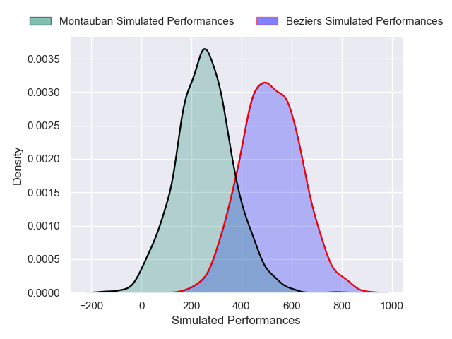
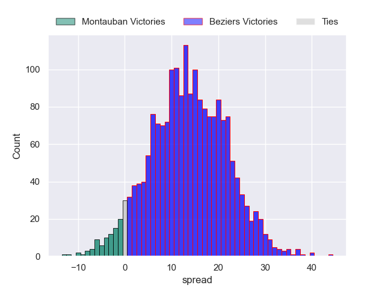
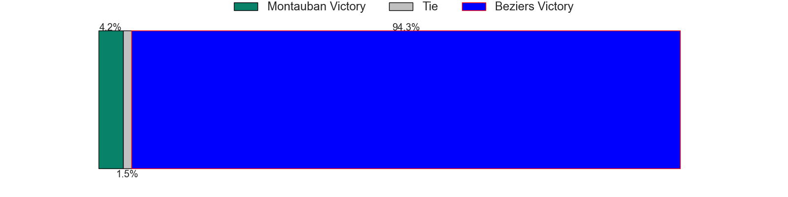

---  
layout: page  
title: Montauban at Beziers  
date: 2024-12-13 18:00:00 -0500  
categories: "Pro D2 2024" match projection  
---
# Montauban at Beziers

# Club Level Predictions

The first set of predictions treats a club as the smallest object, as the club develops its members, organizes a gameplan, and deploys its players as needed for each match. This club model has a prediction of 0.622, which translates to predicting Beziers to win by 8.4.

Our Over/Under is 43.5 - and combined with the spread above, we have a predicted scoreline of 17 to 26

Each club has a rating and a rating deviation (similar to a Glicko rating), and expected performances can be generated. This allows for simulated matches and spreads like the ones below.
## Projected Performances - Club Model

## Projected Spreads - Club Model

## Projected Results - Club Model

# Player Level Predictions

Treating teams instead as an entity made up of the currently active players, I have ratings for each player in an altogether different system. These can be combined to form team ratings once teamsheets are announced, weighting starters a bit higher than the reserves. After the match is played, players can be weighted by their minutes on the field, allowing for an accurate measure of the team's composition. With these compiled team ratings, we can make predictions, measure inaccuracy, and update the individual player ratings.
## Prediction without Player Minutes: Beziers by 13.8

Montauban by 0.8 on a neutral pitch

## Projected Performances - Player Model

## Projected Spreads - Player Model

## Projected Results - Player Model

| Away Player       |   Away Percentile |   Number |   Home Percentile | Home Player        |
|:------------------|------------------:|---------:|------------------:|:-------------------|
| Thomas Bué        |            nan    |        1 |             77.52 | Marco Trauth       |
| Jérémie Maurouard |             70.11 |        2 |            nan    | Yanis Boulassel    |
| Tietie Tuimauga   |             61.98 |        3 |            nan    | Yannick Arroyo     |
| Frank Bradshaw    |             57.67 |        4 |             56.08 | Cam Dodson         |
| Victor Moreaux    |             70.19 |        5 |            nan    | Shahn Eru          |
| Sikhumbuzo Notshe |             80.93 |        6 |            nan    | Sias Koen          |
| Kyllian Ringuet   |            nan    |        7 |             21.12 | Gillian Benoy      |
| Tyrone Viiga      |            nan    |        8 |             53.12 | Baptiste Abescat   |
| Joe Powell        |             62.24 |        9 |             82.01 | Samuel Marques     |
| Thomas Fortunel   |            nan    |       10 |             46.99 | Charly Malié       |
| Josua Vici        |             62.53 |       11 |             83.22 | Aminiasi Tuimaba   |
| Simon Renda       |             50.44 |       12 |            nan    | Taleta Tupuola     |
| Jt Jackson        |             64.63 |       13 |             47.81 | Paul Recor         |
| Romain Fonnicola  |            nan    |       14 |             55.25 | Pierre Courtaud    |
| Thomas Larregain  |            nan    |       15 |             53.07 | Gabin Lorre        |
| Ru-Hann Greyling  |            nan    |       16 |            nan    | Jose Luis Gonzalez |
| Malino Vanaï      |            nan    |       17 |             54.51 | Yahnis El Maslouhi |
| Dimitri Vaotoa    |            nan    |       18 |            nan    | Otunuku Pauta      |
| Clément Bitz      |            nan    |       19 |            nan    | Clément Ancely     |
| Fred Quercy       |             64.4  |       20 |             54.78 | Damien Añon        |
| Maël Castel       |            nan    |       21 |             85.13 | Taylor Gontineac   |
| Baptiste Mouchous |             57.36 |       22 |             67.46 | William Van Bost   |
| Lucas Seyrolle    |             52.85 |       23 |             55.4  | Christian Judge    |

