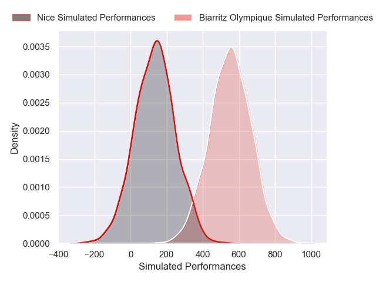
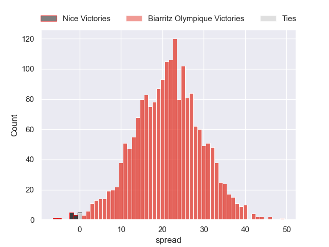
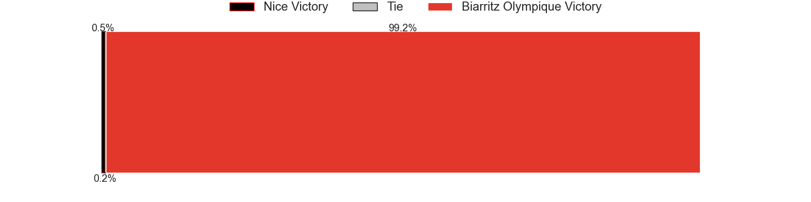

---  
layout: page  
title: Nice at Biarritz Olympique  
date: 2024-12-13 18:00:00 -0500  
categories: "Pro D2 2024" match projection  
---
# Nice at Biarritz Olympique

# Club Level Predictions

The first set of predictions treats a club as the smallest object, as the club develops its members, organizes a gameplan, and deploys its players as needed for each match. This club model has a prediction of 0.57, which translates to predicting Biarritz Olympique to win by 6.4.

Our Over/Under is 53.5 - and combined with the spread above, we have a predicted scoreline of 24 to 30

Each club has a rating and a rating deviation (similar to a Glicko rating), and expected performances can be generated. This allows for simulated matches and spreads like the ones below.
## Projected Performances - Club Model

## Projected Spreads - Club Model

## Projected Results - Club Model

# Player Level Predictions

Treating teams instead as an entity made up of the currently active players, I have ratings for each player in an altogether different system. These can be combined to form team ratings once teamsheets are announced, weighting starters a bit higher than the reserves. After the match is played, players can be weighted by their minutes on the field, allowing for an accurate measure of the team's composition. With these compiled team ratings, we can make predictions, measure inaccuracy, and update the individual player ratings.
## Prediction without Player Minutes: Biarritz Olympique by 21.2

Biarritz Olympique by 5.6 on a neutral pitch

## Projected Performances - Player Model

## Projected Spreads - Player Model

## Projected Results - Player Model

| Away Player      |   Away Percentile |   Number |   Home Percentile | Home Player         |
|:-----------------|------------------:|---------:|------------------:|:--------------------|
| Facundo Gigena   |             17.54 |        1 |             51.72 | Giorgi Nutsubidze   |
| Sacha Idoumi     |             54.53 |        2 |             73.73 | Luteru Tolai        |
| Luvuyo Pupuma    |            nan    |        3 |             75.33 | Solomone Tukuafu    |
| Thibaud Rey      |            nan    |        4 |              3.3  | Adrian Motoc        |
| Clément Chartier |             44.57 |        5 |             80.02 | Piula Fa'asalele    |
| Louis Suaud      |            nan    |        6 |             83.76 | Cornell du Preez    |
| Joris Simon      |            nan    |        7 |             50.51 | Thomas Hébert       |
| Ramiha Smiler    |            nan    |        8 |             59.85 | Masivesi Dakuwaqa   |
| Jules Gimbert    |             14.74 |        9 |             50    | Imanol Biscay       |
| Mathis Viard     |            nan    |       10 |             45.69 | Thomas Dolhagaray   |
| Andrzej Charlat  |            nan    |       11 |             94.5  | Mathieu Acebes      |
| Tom Daly         |             16.2  |       12 |             46.61 | François Vergnaud   |
| Nathan Courtade  |             33.62 |       13 |            nan    | Ilian Perraux       |
| Simon Delas      |             41.16 |       14 |             48.76 | Zach Kibirige       |
| Paul Auradou     |             32.78 |       15 |             44.51 | Kylian Jaminet      |
| Pierre Strippoli |            nan    |       16 |            nan    | Brendan Lebrun      |
| Sunia Vola       |            nan    |       17 |            nan    | Killian Taofifenua  |
| Martin Freytes   |            nan    |       18 |            nan    | Levi Douglas        |
| Hugo Sarrasin    |            nan    |       19 |            nan    | Aitor Hourcade      |
| Yann Tivoli      |            nan    |       20 |            nan    | Kerman Aurrekoetxea |
| Jules Solinas    |             43.75 |       21 |            nan    | Edgar Retière       |
| Luca Cutayar     |            nan    |       22 |            nan    | Steeve Barry        |
| Tom Ross         |             23.31 |       23 |            nan    | Zakaria El Fakir    |

