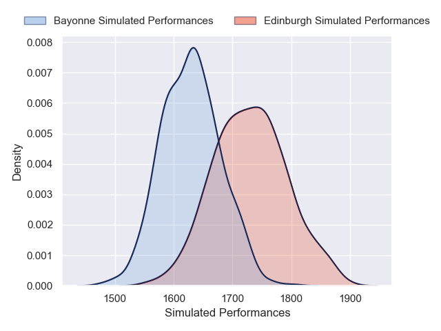
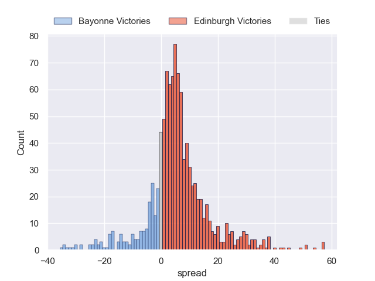
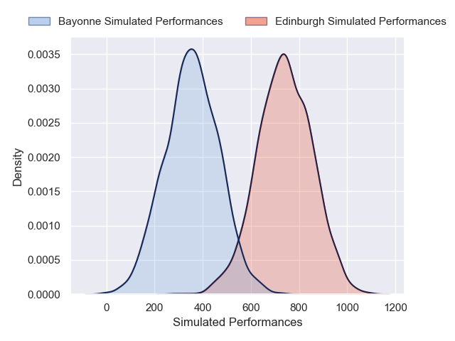
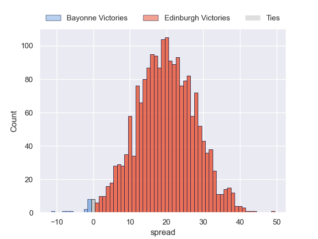
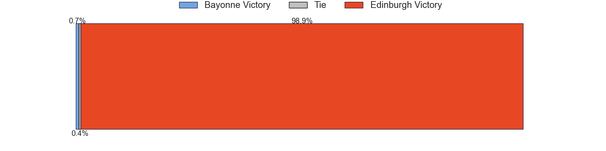

---  
layout: page  
title: Bayonne at Edinburgh  
date: 2024-12-13 18:00:00 -0500  
categories: "European Rugby Challenge Cup 2024" match projection  
---
# Bayonne at Edinburgh

# Club Level Predictions

The first set of predictions treats a club as the smallest object, as the club develops its members, organizes a gameplan, and deploys its players as needed for each match. This club model has a prediction of 0.554, which translates to predicting Edinburgh to win by 6.0.

Our Over/Under is 51.5 - and combined with the spread above, we have a predicted scoreline of 23 to 29

Each club has a rating and a rating deviation (similar to a Glicko rating), and expected performances can be generated. This allows for simulated matches and spreads like the ones below.
## Projected Performances - Club Model

## Projected Spreads - Club Model

## Projected Results - Club Model

# Player Level Predictions

Treating teams instead as an entity made up of the currently active players, I have ratings for each player in an altogether different system. These can be combined to form team ratings once teamsheets are announced, weighting starters a bit higher than the reserves. After the match is played, players can be weighted by their minutes on the field, allowing for an accurate measure of the team's composition. With these compiled team ratings, we can make predictions, measure inaccuracy, and update the individual player ratings.
## Prediction without Player Minutes: Edinburgh by 19.4

Edinburgh by 8.8 on a neutral pitch

## Projected Performances - Player Model

## Projected Spreads - Player Model

## Projected Results - Player Model

| Away Player           |   Away Percentile |   Number |   Home Percentile | Home Player         |
|:----------------------|------------------:|---------:|------------------:|:--------------------|
| Andy Bordelai         |             85.55 |        1 |             80.68 | Pierre Schoeman     |
| Lucas Martin          |             92.01 |        2 |             76.96 | Ewan Ashman         |
| Pascal Cotet          |             38.59 |        3 |             89.12 | Paul Hill           |
| Denis Marchois        |             95.48 |        4 |             89.23 | Marshall Sykes      |
| Veikoso Poloniati     |              9.12 |        5 |             93.22 | Grant Gilchrist     |
| Esteban Capilla       |             20.34 |        6 |             99.06 | Jamie Ritchie       |
| Baptiste Heguy        |             75.3  |        7 |             94.44 | Luke Crosbie        |
| Rodrigo Bruni         |             98.46 |        8 |             68.88 | Magnus Bradbury     |
| Baptiste Germain      |             45.83 |        9 |             89.1  | Ali Price           |
| Camille Lopez         |             81.36 |       10 |             85.17 | Ross Thompson       |
| Tom Spring            |             16.74 |       11 |             77.67 | Duhan van der Merwe |
| Guillaume Martocq     |             45.67 |       12 |             25.52 | Mosese Tuipulotu    |
| Arnaud Erbinartegaray |             25.19 |       13 |             87.38 | Matt Currie         |
| Aurelien Callandret   |             85.97 |       14 |             42.48 | Darcy Graham        |
| Cheikh Tiberghien     |             21.98 |       15 |             93.59 | Wes Goosen          |
| Torsten van Jaarsveld |            nan    |       16 |             43.01 | Dave Cherry         |
| Swan Cormenier        |             73.54 |       17 |             34.66 | Boan Venter         |
| Pieter Scholtz        |             14.45 |       18 |             72.83 | Javan Sebastian     |
| Remi Bourdeau         |             95.21 |       19 |             87.66 | Sam Skinner         |
| Noa Traversier        |            nan    |       20 |             62.99 | Tom Dodd            |
| Maxime Machenaud      |             96.63 |       21 |             61.7  | Charlie Shiel       |
| Joris Segonds         |             73.75 |       22 |             80.96 | Ben Healy           |
| Nadir Megdoud         |             61.71 |       23 |             87.18 | James Lang          |

