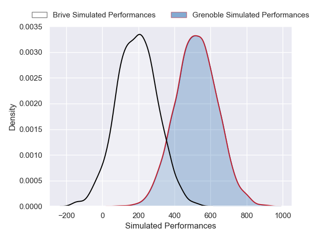
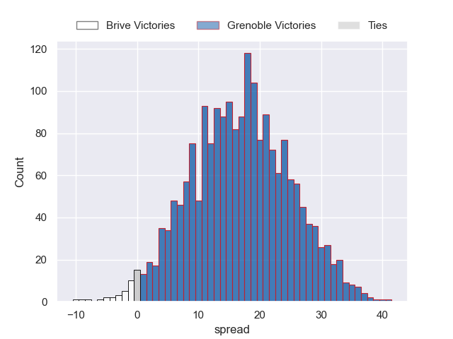
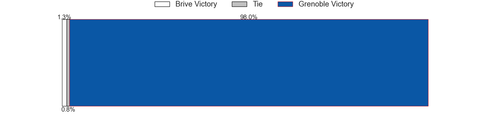

---  
layout: page  
title: Brive at Grenoble  
date: 2024-12-13 18:00:00 -0500  
categories: "Pro D2 2024" match projection  
---
# Brive at Grenoble

# Club Level Predictions

The first set of predictions treats a club as the smallest object, as the club develops its members, organizes a gameplan, and deploys its players as needed for each match. This club model has a prediction of 0.51, which translates to predicting Grenoble to win by 3.8.

Our Over/Under is 50.5 - and combined with the spread above, we have a predicted scoreline of 23 to 27

Each club has a rating and a rating deviation (similar to a Glicko rating), and expected performances can be generated. This allows for simulated matches and spreads like the ones below.
## Projected Performances - Club Model

## Projected Spreads - Club Model

## Projected Results - Club Model

# Player Level Predictions

Treating teams instead as an entity made up of the currently active players, I have ratings for each player in an altogether different system. These can be combined to form team ratings once teamsheets are announced, weighting starters a bit higher than the reserves. After the match is played, players can be weighted by their minutes on the field, allowing for an accurate measure of the team's composition. With these compiled team ratings, we can make predictions, measure inaccuracy, and update the individual player ratings.
## Prediction without Player Minutes: Grenoble by 16.8

Grenoble by 3.5 on a neutral pitch

## Projected Performances - Player Model

## Projected Spreads - Player Model

## Projected Results - Player Model

| Away Player               |   Away Percentile |   Number |   Home Percentile | Home Player        |
|:--------------------------|------------------:|---------:|------------------:|:-------------------|
| Vakh Abdaladze            |             61    |        1 |             49.79 | Zack Gauthier      |
| Lucas Da Silva            |            nan    |        2 |             47.15 | Mathis Sarragallet |
| Henzo Kiteau              |            nan    |        3 |             51.96 | Giorgi Pertaia     |
| Tevita Ratuva             |            nan    |        4 |             59.44 | Thomas Ployet      |
| Konstantin Mikautadze     |              6.61 |        5 |             89.86 | Giorgi Javakhia    |
| Retief Marais             |            nan    |        6 |             71.52 | Ryno Pieterse      |
| Samuel Maximin            |            nan    |        7 |            nan    | Victor Guillaumond |
| Rahboni Warren-Vosayaco   |            nan    |        8 |             89.48 | Hanru Sirgel       |
| Maxime Sidobre            |            nan    |        9 |             54.62 | Eric Escande       |
| Curwin Bosch              |             78.31 |       10 |             46.59 | Sam Davies         |
| Erwan Dridi               |             56.17 |       11 |            nan    | Wilfried Hulleu    |
| Sam Johnson               |             52.58 |       12 |             42.37 | Romain Fusier      |
| Timilai Rokoduru          |            nan    |       13 |             66.28 | Julien Heriteau    |
| Asaeli Tuivuaka           |             53.72 |       14 |             46.97 | Geoffrey Cros      |
| Thomas Zénon              |            nan    |       15 |             45.62 | Julien Farnoux     |
| Issam Hamel               |             60.4  |       16 |            nan    | Lilian Rossi       |
| Simon-Pierre Chauvac      |             23.72 |       17 |             78.59 | Tommy Raynaud      |
| Asier Usarraga Latierro   |             57.58 |       18 |            nan    | Éli Églaine        |
| Matthieu Voisin           |             60.22 |       19 |            nan    | Camille Baz-Marcos |
| Max Lestro                |            nan    |       20 |            nan    | Barnabé Couilloud  |
| Hugo Verdu                |             51.05 |       21 |            nan    | Marc Palmier       |
| Paul Pimienta             |            nan    |       22 |             48.89 | Kaminieli Rasaku   |
| Francisco Coria Marchetti |            nan    |       23 |            nan    | Cody Thomas        |

