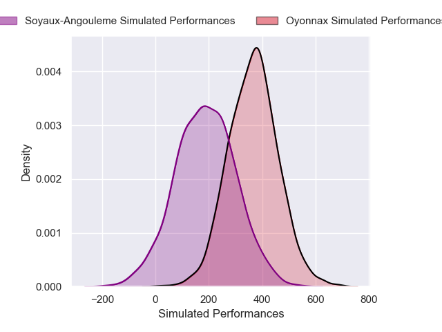
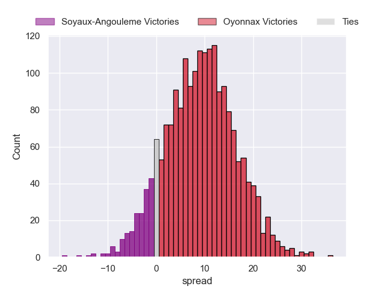
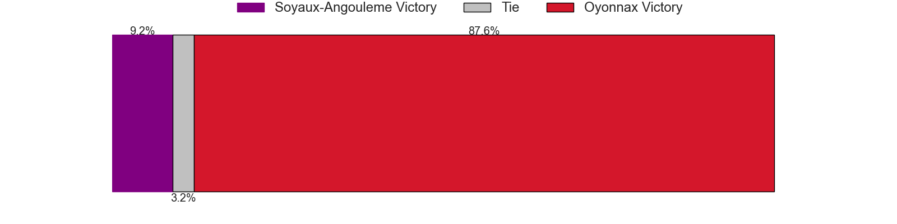

---  
layout: page  
title: Soyaux-Angouleme at Oyonnax  
date: 2024-12-13 18:00:00 -0500  
categories: "Pro D2 2024" match projection  
---
# Soyaux-Angouleme at Oyonnax

# Club Level Predictions

The first set of predictions treats a club as the smallest object, as the club develops its members, organizes a gameplan, and deploys its players as needed for each match. This club model has a prediction of 0.558, which translates to predicting Oyonnax to win by 6.4.

Our Over/Under is 51.5 - and combined with the spread above, we have a predicted scoreline of 23 to 29

Each club has a rating and a rating deviation (similar to a Glicko rating), and expected performances can be generated. This allows for simulated matches and spreads like the ones below.
## Projected Performances - Club Model

## Projected Spreads - Club Model

## Projected Results - Club Model

# Player Level Predictions

Treating teams instead as an entity made up of the currently active players, I have ratings for each player in an altogether different system. These can be combined to form team ratings once teamsheets are announced, weighting starters a bit higher than the reserves. After the match is played, players can be weighted by their minutes on the field, allowing for an accurate measure of the team's composition. With these compiled team ratings, we can make predictions, measure inaccuracy, and update the individual player ratings.
## Prediction without Player Minutes: Oyonnax by 9.1

Soyaux-Angouleme by 4.1 on a neutral pitch

## Projected Performances - Player Model

## Projected Spreads - Player Model

## Projected Results - Player Model

| Away Player        |   Away Percentile |   Number |   Home Percentile | Home Player         |
|:-------------------|------------------:|---------:|------------------:|:--------------------|
| Vivien Devisme     |             76.51 |        1 |            nan    | nan                 |
| Rayne Barka        |            nan    |        2 |            nan    | nan                 |
| Karl Sorin         |             53.68 |        3 |            nan    | nan                 |
| Léo Morand-Bruyat  |            nan    |        4 |            nan    | nan                 |
| Enzo Morand-Bruyat |             47.09 |        5 |            nan    | nan                 |
| Gautier Gibouin    |            nan    |        6 |             18.48 | Kevin Lebreton      |
| Hubert Texier      |             45.95 |        7 |            nan    | nan                 |
| Samuel Nollet      |             43.76 |        8 |              3.74 | Loic Godener        |
| Adrien Bau         |             38.15 |        9 |             93.03 | Jonathan Ruru       |
| Ben Botica         |            nan    |       10 |             75.7  | Zack Holmes         |
| Katende Tumba      |            nan    |       11 |              9.2  | Gavin Stark         |
| George Tilsley     |             35.33 |       12 |             53.84 | Maelan Rabut        |
| Mathis Lafon       |            nan    |       13 |             45.19 | Eddie Sawailau      |
| Eoghan Barrett     |            nan    |       14 |             59.08 | Daniel Ikpefan      |
| Jonny May          |             23.22 |       15 |             42.83 | Martin Bogado       |
| Patxi Bidart       |            nan    |       16 |             25.42 | Benjamin Geledan    |
| Henri Grondin      |            nan    |       17 |             56.35 | Antoine Abraham     |
| Léo Labarthe       |            nan    |       18 |            nan    | Victor Lebas        |
| Germain Burgaud    |            nan    |       19 |             77    | Wandrille Picault   |
| Alex Masibaka (2)  |            nan    |       20 |             11.99 | Vasil Lobzhanidze   |
| Lucas Zamora       |            nan    |       21 |             30.32 | Chris William Smith |
| Arthur Proult      |            nan    |       22 |             22.61 | Maxime Salles       |
| Seydou Diakité     |            nan    |       23 |             75.27 | Paulo Tafili        |

