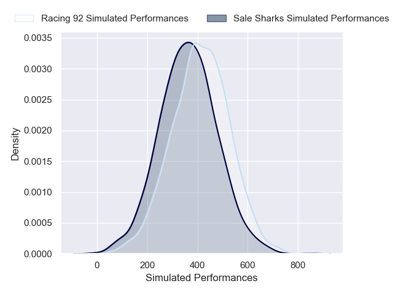
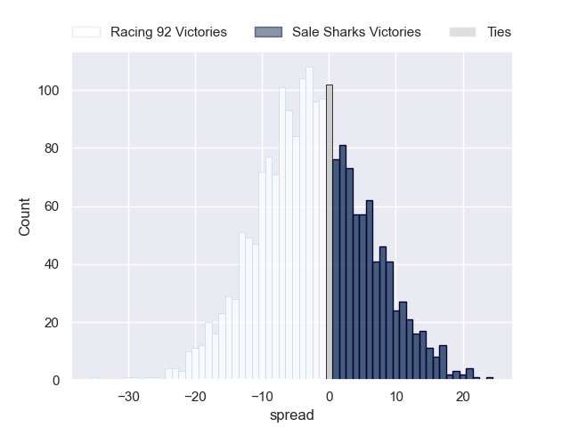

---  
layout: page  
title: Racing 92 at Sale Sharks  
date: 2024-12-13 18:00:00 -0500  
categories: "European Rugby Champions Cup 2024" match projection  
---
# Racing 92 at Sale Sharks

# Club Level Predictions

The first set of predictions treats a club as the smallest object, as the club develops its members, organizes a gameplan, and deploys its players as needed for each match. This club model has a prediction of 0.499, which translates to predicting Racing 92 to win by -3.3.

Our Over/Under is 56.5 - and combined with the spread above, we have a predicted scoreline of 26 to 30

Each club has a rating and a rating deviation (similar to a Glicko rating), and expected performances can be generated. This allows for simulated matches and spreads like the ones below.
## Projected Performances - Club Model

## Projected Spreads - Club Model

## Projected Results - Club Model

# Player Level Predictions

Treating teams instead as an entity made up of the currently active players, I have ratings for each player in an altogether different system. These can be combined to form team ratings once teamsheets are announced, weighting starters a bit higher than the reserves. After the match is played, players can be weighted by their minutes on the field, allowing for an accurate measure of the team's composition. With these compiled team ratings, we can make predictions, measure inaccuracy, and update the individual player ratings.
## Prediction without Player Minutes: Racing 92 by 2.5

Racing 92 by 16.1 on a neutral pitch

## Projected Performances - Player Model

## Projected Spreads - Player Model

## Projected Results - Player Model

| Away Player         |   Away Percentile |   Number |   Home Percentile | Home Player                    |
|:--------------------|------------------:|---------:|------------------:|:-------------------------------|
| Guram Gogichashvili |             73.19 |        1 |             89.21 | Bevan Rodd                     |
| Camille Chat        |             90.91 |        2 |              1.39 | Luke Cowan-Dickie              |
| Lucio Sordoni       |             89.92 |        3 |             20.82 | James Harper                   |
| Junior Kpoku        |             88.18 |        4 |              5.2  | Ben Bamber                     |
| Will Rowlands       |             25.57 |        5 |             13.76 | Jonny Hill                     |
| Cameron Woki        |             94.89 |        6 |             98.72 | Jean-Luc du Preez              |
| Maxime Baudonne     |             79.5  |        7 |             51.28 | Ben Curry                      |
| Hacjivah Dayimani   |             92.87 |        8 |             89.66 | Daniel du Preez                |
| Nolann Le Garrec    |             76.18 |        9 |             70.34 | Gus Warr                       |
| Dan Lancaster       |              4.42 |       10 |             93.17 | George Ford                    |
| Max Spring          |             10.8  |       11 |             95.71 | Tom O'Flaherty                 |
| Henry Chavancy      |             98.64 |       12 |             72.3  | Luke James                     |
| Sam James           |             92.36 |       13 |             51.81 | Robert du Preez                |
| Henry Arundell      |             19.39 |       14 |             36.17 | Tom Roebuck                    |
| Tristan Tedder      |             21.42 |       15 |             97.58 | Joe Carpenter                  |
| Diego Escobar       |            nan    |       16 |             61.33 | Tadgh McElroy                  |
| Lino Julien         |            nan    |       17 |             86.3  | Simon McIntyre                 |
| Gia Kharaishvili    |             66.13 |       18 |            nan    | WillGriff John                 |
| Fabien Sanconnie    |             44.71 |       19 |             82.28 | Josh Beaumont                  |
| Ibrahim Diallo      |             35.69 |       20 |              8.6  | Sam Dugdale                    |
| Clovis Le Bail      |             57.54 |       21 |             75.69 | Raffi Quirke                   |
| Antoine Gibert      |             93.57 |       22 |             85.91 | Waisea Nayacalevu Vuidravuwalu |
| Wame Naituvi        |             78.39 |       23 |             34.33 | Alex Wills                     |

