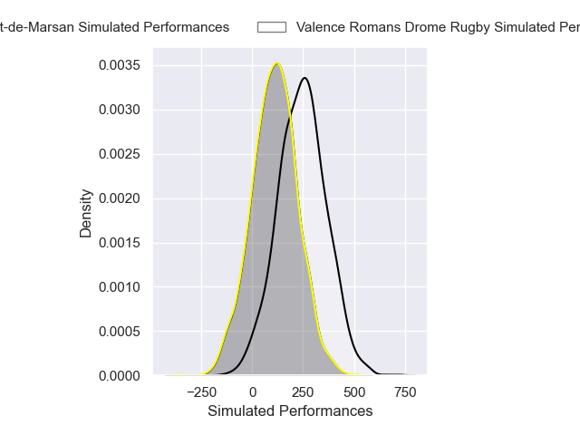
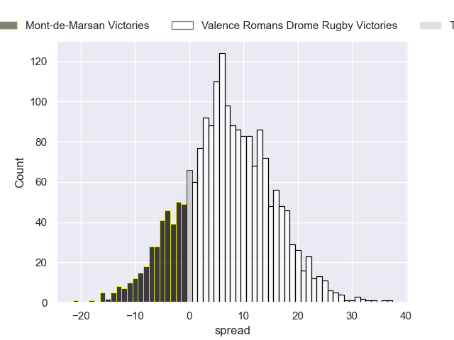
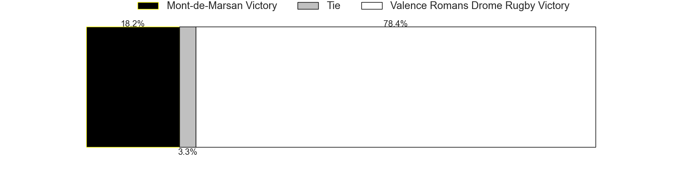

---  
layout: page  
title: Mont-de-Marsan at Valence Romans Drome Rugby  
date: 2024-12-13 18:00:00 -0500  
categories: "Pro D2 2024" match projection  
---
# Mont-de-Marsan at Valence Romans Drome Rugby

# Club Level Predictions

The first set of predictions treats a club as the smallest object, as the club develops its members, organizes a gameplan, and deploys its players as needed for each match. This club model has a prediction of 0.424, which translates to predicting Mont-de-Marsan to win by -1.3.

Our Over/Under is 31.5 - and combined with the spread above, we have a predicted scoreline of 15 to 17

Each club has a rating and a rating deviation (similar to a Glicko rating), and expected performances can be generated. This allows for simulated matches and spreads like the ones below.
## Projected Performances - Club Model

## Projected Spreads - Club Model

## Projected Results - Club Model

# Player Level Predictions

Treating teams instead as an entity made up of the currently active players, I have ratings for each player in an altogether different system. These can be combined to form team ratings once teamsheets are announced, weighting starters a bit higher than the reserves. After the match is played, players can be weighted by their minutes on the field, allowing for an accurate measure of the team's composition. With these compiled team ratings, we can make predictions, measure inaccuracy, and update the individual player ratings.
## Prediction without Player Minutes: Valence Romans Drome Rugby by 6.9

Valence Romans Drome Rugby by 3.1 on a neutral pitch

## Projected Performances - Player Model

## Projected Spreads - Player Model

## Projected Results - Player Model

| Away Player           |   Away Percentile |   Number |   Home Percentile | Home Player         |
|:----------------------|------------------:|---------:|------------------:|:--------------------|
| Luka Goginava         |             38.47 |        1 |             41.2  | Anthony Aléo        |
| Luka Begic            |              5.38 |        2 |            nan    | Dorian Marco-Pena   |
| Anthony Alves         |             13.32 |        3 |             43.28 | Vincent Vial        |
| Jules Dussutour       |            nan    |        4 |             44.66 | Ryan Mccauley       |
| Romain Durand         |             45.79 |        5 |            nan    | Yassine Maamry      |
| Yann Bréthous         |            nan    |        6 |            nan    | Adrien Roux         |
| Raphaël Robic         |             46.84 |        7 |             13.93 | Ilia Spanderashvili |
| Ioane Iashagashvili   |             37.57 |        8 |             32.6  | Matthieu Vachon     |
| Baptiste Canut        |            nan    |        9 |            nan    | Tim Menzel          |
| Willie Du Plessis     |             44.29 |       10 |             38.68 | Lucas Méret         |
| Semi Lagivala (2)     |             34.56 |       11 |             41.98 | Mosese Mawalu       |
| Nacani Wakaya         |             39.45 |       12 |             38.32 | Louis Marrou        |
| Gatien Massé          |            nan    |       13 |             37.48 | Mathieu Guillomot   |
| Simao Bento           |             13.41 |       14 |             41.98 | Adam Vargas         |
| Yoann Laousse Azpiazu |            nan    |       15 |             87.36 | Joris De Moura      |
| Samuel Lagrange       |             44.39 |       16 |             39.48 | Cyril Deligny       |
| Thomas Bultel         |            nan    |       17 |            nan    | Esteban Chouteau    |
| Myles Edwards         |             47.61 |       18 |             42.92 | Florian Goumat      |
| Michael Faleafa       |            nan    |       19 |            nan    | Thembelani Bholi    |
| Nicolas Darquier      |             37.34 |       20 |            nan    | Mattéo Rodor        |
| Alexandre de Nardi    |             48.84 |       21 |             27.47 | Thomas Roziere      |
| Waël Ponpon           |            nan    |       22 |             43.33 | Axel Bruchet        |
| Gheorghe Gajion       |             63.67 |       23 |            nan    | Gareth Milasinovich |

