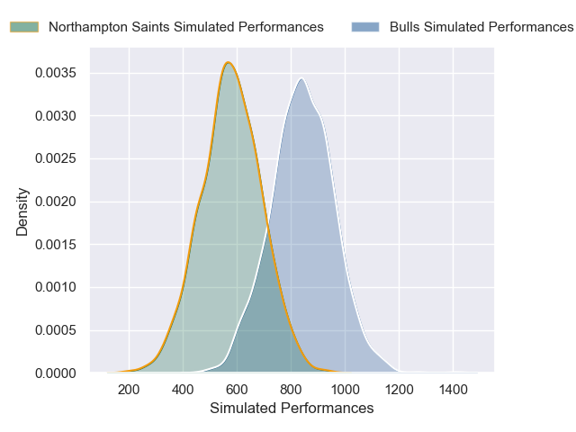
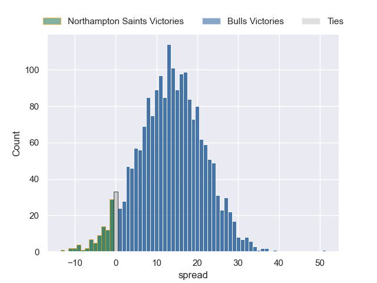

---  
layout: page  
title: Northampton Saints at Bulls  
date: 2024-12-14 18:00:00 -0500  
categories: "European Rugby Champions Cup 2024" match projection  
---
# Northampton Saints at Bulls

# Club Level Predictions

The first set of predictions treats a club as the smallest object, as the club develops its members, organizes a gameplan, and deploys its players as needed for each match. This club model has a prediction of 0.576, which translates to predicting Bulls to win by 6.5.

Our Over/Under is 44.5 - and combined with the spread above, we have a predicted scoreline of 19 to 25

Each club has a rating and a rating deviation (similar to a Glicko rating), and expected performances can be generated. This allows for simulated matches and spreads like the ones below.
## Projected Performances - Club Model

## Projected Spreads - Club Model

## Projected Results - Club Model

# Player Level Predictions

Treating teams instead as an entity made up of the currently active players, I have ratings for each player in an altogether different system. These can be combined to form team ratings once teamsheets are announced, weighting starters a bit higher than the reserves. After the match is played, players can be weighted by their minutes on the field, allowing for an accurate measure of the team's composition. With these compiled team ratings, we can make predictions, measure inaccuracy, and update the individual player ratings.
## Prediction without Player Minutes: Bulls by 13.7

Bulls by 5.4 on a neutral pitch

## Projected Performances - Player Model

## Projected Spreads - Player Model

## Projected Results - Player Model

| Away Player         |   Away Percentile |   Number |   Home Percentile | Home Player         |
|:--------------------|------------------:|---------:|------------------:|:--------------------|
| Emmanuel Iyogun     |             38.11 |        1 |             86.33 | Gerhard Steenekamp  |
| Curtis Langdon      |             91.71 |        2 |             96.31 | Akker van der Merwe |
| Elliot Millar Mills |             84.42 |        3 |             89.42 | Wilco Louw          |
| Temo Mayanavanua    |             98.7  |        4 |             13.81 | Ruan Vermaak        |
| Tom Lockett         |             11.56 |        5 |             32.58 | JF van Heerden      |
| Alex Coles          |             20.85 |        6 |             96.24 | Marcell Coetzee     |
| Henry Pollock       |             92.05 |        7 |             96.75 | Elrigh Louw         |
| Juarno Augustus     |             57.27 |        8 |             78.27 | Cameron Hanekom     |
| Alex Mitchell       |             96.15 |        9 |             94.23 | Embrose Papier      |
| Fin Smith           |             80.76 |       10 |             70.94 | Johan Goosen        |
| Ollie Sleightholme  |             98.29 |       11 |             91.47 | Devon Williams      |
| Rory Hutchinson     |             83.62 |       12 |             93.79 | David Kriel         |
| Fraser Dingwall     |             73.16 |       13 |             98.4  | Canan Moodie        |
| Tommy Freeman       |             96.05 |       14 |             94.03 | Sebastian de Klerk  |
| George Furbank      |             95.24 |       15 |             97.99 | Willie le Roux      |
| Craig Wright        |            nan    |       16 |             69.32 | Jan-Hendrik Wessels |
| Tarek Haffar        |            nan    |       17 |             74.08 | Alulutho Tshakweni  |
| Trevor Davison      |             89.54 |       18 |             61.24 | Francois Klopper    |
| Chunya Munga        |             73.33 |       19 |            nan    | Deon Slabbert       |
| Angus Scott-Young   |             53.5  |       20 |             14.53 | Nama Xaba           |
| Tom Pearson         |             96.58 |       21 |             92.31 | Zak Burger          |
| Archie McParland    |             92.95 |       22 |             81.16 | Boeta Chamberlain   |
| George Hendy        |             91.09 |       23 |             84.37 | Stedman Gans        |

