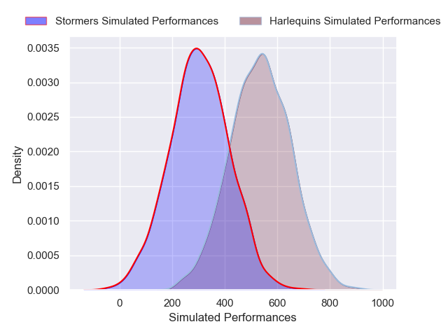
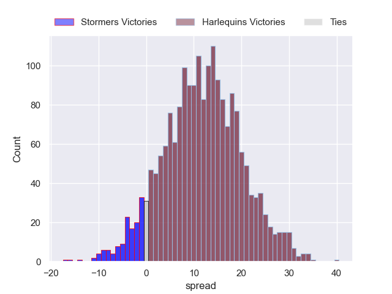

---  
layout: page  
title: Stormers at Harlequins  
date: 2024-12-14 18:00:00 -0500  
categories: "European Rugby Champions Cup 2024" match projection  
---
# Stormers at Harlequins

# Club Level Predictions

The first set of predictions treats a club as the smallest object, as the club develops its members, organizes a gameplan, and deploys its players as needed for each match. This club model has a prediction of 0.501, which translates to predicting Harlequins to win by 3.8.

Our Over/Under is 54.5 - and combined with the spread above, we have a predicted scoreline of 25 to 29

Each club has a rating and a rating deviation (similar to a Glicko rating), and expected performances can be generated. This allows for simulated matches and spreads like the ones below.
## Projected Performances - Club Model

## Projected Spreads - Club Model

## Projected Results - Club Model

# Player Level Predictions

Treating teams instead as an entity made up of the currently active players, I have ratings for each player in an altogether different system. These can be combined to form team ratings once teamsheets are announced, weighting starters a bit higher than the reserves. After the match is played, players can be weighted by their minutes on the field, allowing for an accurate measure of the team's composition. With these compiled team ratings, we can make predictions, measure inaccuracy, and update the individual player ratings.
## Prediction without Player Minutes: Harlequins by 11.7

Stormers by 2.2 on a neutral pitch

## Projected Performances - Player Model

## Projected Spreads - Player Model

## Projected Results - Player Model

| Away Player         |   Away Percentile |   Number |   Home Percentile | Home Player               |
|:--------------------|------------------:|---------:|------------------:|:--------------------------|
| Vernon Matongo      |            nan    |        1 |             22.29 | Fin Baxter                |
| JJ Kotze            |              4.61 |        2 |              4.92 | Jack Walker               |
| Sazi Sandi          |             24.26 |        3 |             33.35 | Simon Kerrod              |
| Salmaan Moerat      |             87.32 |        4 |             33.01 | Irne Herbst               |
| Connor Evans        |            nan    |        5 |             48.05 | George Hammond            |
| Dave Ewers          |             97.61 |        6 |             63.5  | Chandler Cunningham-South |
| Louw Nel            |            nan    |        7 |             94.29 | James Chisholm            |
| Willie Engelbrecht  |             65.56 |        8 |             69.24 | Alex Dombrandt            |
| Stefan Ungerer      |             28.85 |        9 |             99.2  | Danny Care                |
| Jurie Matthee       |             45.89 |       10 |             79.76 | Marcus Smith              |
| Seabelo Senatla     |            nan    |       11 |             26.51 | Cadan Murley              |
| Jean-Luc du Plessis |             48.78 |       12 |             79    | Luke Northmore            |
| Wandisile Simelane  |             72.03 |       13 |             12.24 | Oscar Beard               |
| Angelo Davids       |             93.1  |       14 |             90.62 | Rodrigo Isgro             |
| Clayton Blommetjies |            nan    |       15 |             52.38 | Tyrone Green              |
| Andre-Hugo Venter   |             86.33 |       16 |             75.27 | Sam Riley                 |
| Leon Lyons          |             25.51 |       17 |             82.22 | Wyn Jones                 |
| Corne Weilbach      |            nan    |       18 |             79.55 | Dillon Lewis              |
| Gary Porter         |             22.68 |       19 |            nan    | Harry Browne              |
| Paul De Villiers    |            nan    |       20 |             89.32 | Jack Kenningham           |
| Dewaldt Duvenage    |             86.7  |       21 |             33.42 | Will Evans                |
| Jonathan Roche      |            nan    |       22 |             17.31 | Will Porter               |
| JC Mars             |            nan    |       23 |             45.09 | Jarrod Evans              |

