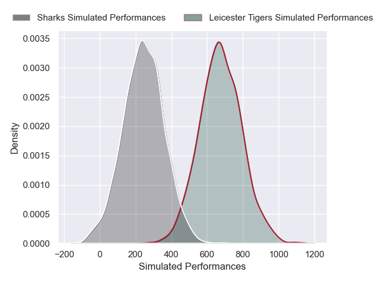
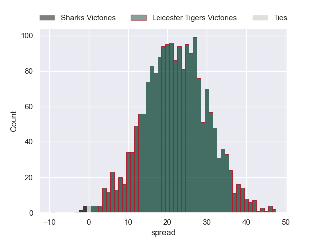
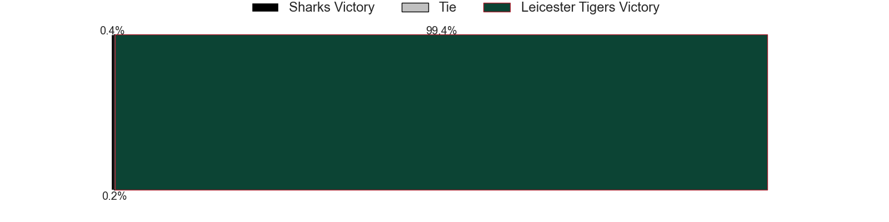

---  
layout: page  
title: Sharks at Leicester Tigers  
date: 2024-12-14 18:00:00 -0500  
categories: "European Rugby Champions Cup 2024" match projection  
---
# Sharks at Leicester Tigers

# Club Level Predictions

The first set of predictions treats a club as the smallest object, as the club develops its members, organizes a gameplan, and deploys its players as needed for each match. This club model has a prediction of 0.544, which translates to predicting Leicester Tigers to win by 5.9.

Our Over/Under is 55.5 - and combined with the spread above, we have a predicted scoreline of 25 to 31

Each club has a rating and a rating deviation (similar to a Glicko rating), and expected performances can be generated. This allows for simulated matches and spreads like the ones below.
## Projected Performances - Club Model

## Projected Spreads - Club Model

## Projected Results - Club Model

# Player Level Predictions

Treating teams instead as an entity made up of the currently active players, I have ratings for each player in an altogether different system. These can be combined to form team ratings once teamsheets are announced, weighting starters a bit higher than the reserves. After the match is played, players can be weighted by their minutes on the field, allowing for an accurate measure of the team's composition. With these compiled team ratings, we can make predictions, measure inaccuracy, and update the individual player ratings.
## Prediction without Player Minutes: Leicester Tigers by 22.1

Leicester Tigers by 6.7 on a neutral pitch

## Projected Performances - Player Model

## Projected Spreads - Player Model

## Projected Results - Player Model

| Away Player         |   Away Percentile |   Number |   Home Percentile | Home Player           |
|:--------------------|------------------:|---------:|------------------:|:----------------------|
| Ntuthuko Mchunu     |             40.07 |        1 |             40.61 | Nicky Smith           |
| Dylan Richardson    |             35.33 |        2 |             90.78 | Julian Montoya        |
| Trevor Nyakane      |             82.82 |        3 |             81.57 | Joe Heyes             |
| Jason Jenkins       |             69.68 |        4 |             88.01 | Harry Wells           |
| Emile van Heerden   |             64.73 |        5 |             94.09 | George Martin         |
| Phepsi Buthelezi    |             34.07 |        6 |             61.45 | Hanro Liebenberg      |
| Jeandre Labuschagne |             38.03 |        7 |             21.11 | Tommy Reffell         |
| Emmanuel Tshituka   |             66.15 |        8 |             17.86 | Olly Cracknell        |
| Jaden Hendrikse     |             94.55 |        9 |             76.44 | Jack van Poortvliet   |
| Siya Masuku         |             69.54 |       10 |             86.57 | Handre Pollard        |
| Yaw Penxe           |            nan    |       11 |             65.27 | Ollie Hassell-Collins |
| Francois Venter     |             55.08 |       12 |             56.59 | Solomone Kata         |
| Ethan Hooker        |             53.39 |       13 |             21.37 | Izaia Perese          |
| Eduan Keyter        |             15.43 |       14 |             84.42 | Josh Bassett          |
| Jordan Hendrikse    |             82.36 |       15 |              8.61 | Freddie Steward       |
| Ethan Bester        |            nan    |       16 |             19.05 | Charlie Clare         |
| Phatu Ganyane       |            nan    |       17 |             70.1  | James Cronin          |
| Hanro Jacobs        |            nan    |       18 |             24.49 | Dan Cole              |
| Corne Rahl          |             16.51 |       19 |            nan    | Cameron Henderson     |
| Tinotenda Mavesere  |             76.67 |       20 |             60.43 | Emeka Ilione          |
| Bradley Davids      |             59.46 |       21 |             84.62 | Ben Youngs            |
| Diego Appollis      |             31.07 |       22 |             70.14 | Jamie Shillcock       |
| Hakeem Kunene       |            nan    |       23 |             61.11 | Joseph Woodward       |

