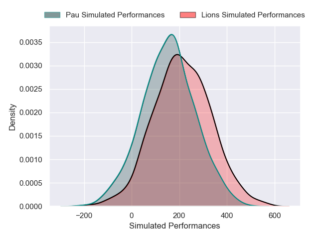
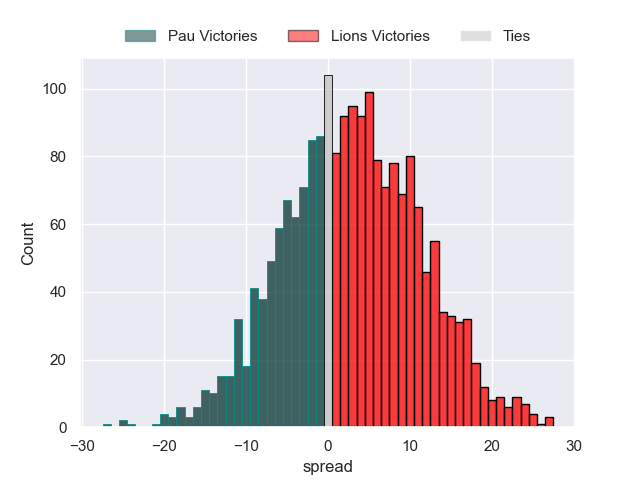
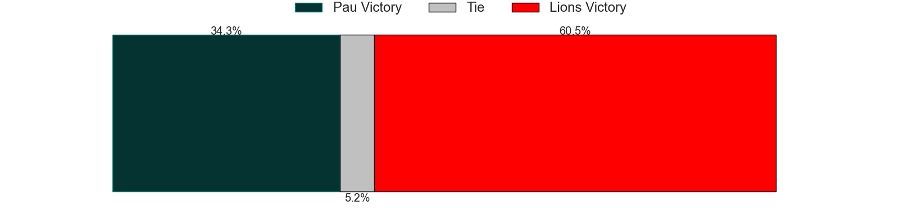

---  
layout: page  
title: Pau at Lions  
date: 2024-12-14 18:00:00 -0500  
categories: "European Rugby Challenge Cup 2024" match projection  
---
# Pau at Lions

# Club Level Predictions

The first set of predictions treats a club as the smallest object, as the club develops its members, organizes a gameplan, and deploys its players as needed for each match. This club model has a prediction of 0.59, which translates to predicting Lions to win by 7.5.

Our Over/Under is 52.5 - and combined with the spread above, we have a predicted scoreline of 23 to 30

Each club has a rating and a rating deviation (similar to a Glicko rating), and expected performances can be generated. This allows for simulated matches and spreads like the ones below.
## Projected Performances - Club Model

## Projected Spreads - Club Model

## Projected Results - Club Model

# Player Level Predictions

Treating teams instead as an entity made up of the currently active players, I have ratings for each player in an altogether different system. These can be combined to form team ratings once teamsheets are announced, weighting starters a bit higher than the reserves. After the match is played, players can be weighted by their minutes on the field, allowing for an accurate measure of the team's composition. With these compiled team ratings, we can make predictions, measure inaccuracy, and update the individual player ratings.
## Prediction without Player Minutes: Lions by 2.7

Pau by 3.6 on a neutral pitch

## Projected Performances - Player Model

## Projected Spreads - Player Model

## Projected Results - Player Model

| Away Player           |   Away Percentile |   Number |   Home Percentile | Home Player          |
|:----------------------|------------------:|---------:|------------------:|:---------------------|
| Remi Seneca           |             53.27 |        1 |             19.38 | Juan Schoeman        |
| Dan Jooste            |             55.76 |        2 |             50.54 | PJ Botha             |
| Guram Papidze         |             22.89 |        3 |             26.69 | Asenathi Ntlabakanye |
| Remi Picquette        |             34.84 |        4 |             38.84 | Ruben Schoeman       |
| Jimi Maximin          |             66.81 |        5 |             93.05 | Reinhard Nothnagel   |
| Lekima Tagitagivalu   |             72.39 |        6 |             24.62 | Jarod Cairns         |
| Mehdi Tlili           |             66.92 |        7 |             15.65 | WJ Steenkamp         |
| Thibaut Hamonou       |              4.05 |        8 |             95.4  | Francke Horn         |
| Thomas Souverbie      |             61.86 |        9 |              7.53 | Morne van den Berg   |
| Axel Desperes         |             89.78 |       10 |             41.28 | Sam Francis          |
| Gregoire Arfeuil      |             55.89 |       11 |             82.79 | Edwill van der Merwe |
| Eliott Roudil         |             46.33 |       12 |             82.77 | Marius Louw          |
| Olivier Klemenczak    |              7.06 |       13 |              9.42 | Erich Cronje         |
| Aaron Grandidier      |             74.26 |       14 |             22.17 | Rabz Maxwane         |
| Clement Mondinat      |             57.14 |       15 |             80.59 | Tapiwa Mafura        |
| Romain Ruffenach      |             61.29 |       16 |             86.02 | Jaco Visagie         |
| Daniel Bibi Biziwu    |             14.86 |       17 |            nan    | SJ Kotze             |
| Alexandre Etchebehere |            nan    |       18 |            nan    | RF Schoeman          |
| Joel Kpoku            |             69.74 |       19 |             17.98 | Ruan Delport         |
| Victor Templier       |            nan    |       20 |             72.82 | JC Pretorius         |
| Josselin Bouhier      |            nan    |       21 |             66.67 | Nico Steyn           |
| Quentin Valentino     |            nan    |       22 |              3.61 | Kade Wolhuter        |
| Aymeric Luc           |             19.41 |       23 |             17.14 | Manuel Rass          |

