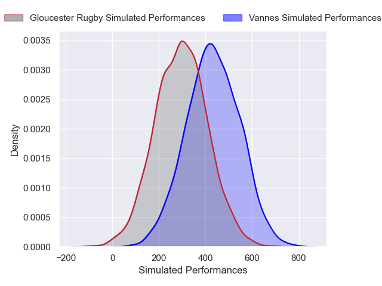
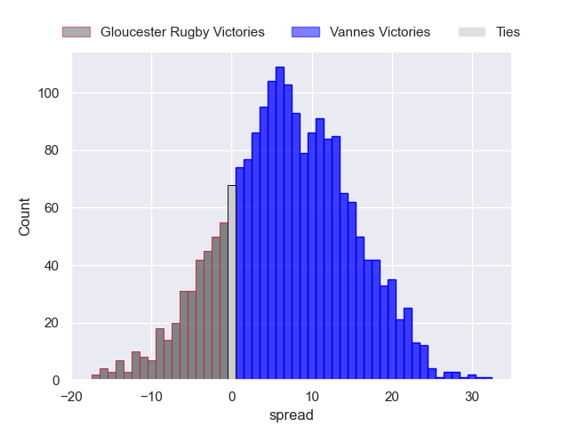
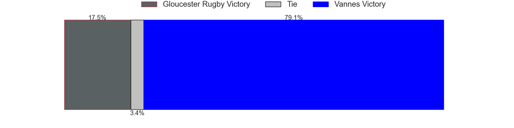

---  
layout: page  
title: Gloucester Rugby at Vannes  
date: 2024-12-14 18:00:00 -0500  
categories: "European Rugby Challenge Cup 2024" match projection  
---
# Gloucester Rugby at Vannes

# Club Level Predictions

The first set of predictions treats a club as the smallest object, as the club develops its members, organizes a gameplan, and deploys its players as needed for each match. This club model has a prediction of 0.389, which translates to predicting Gloucester Rugby to win by 1.0.

Our Over/Under is 48.5 - and combined with the spread above, we have a predicted scoreline of 25 to 24

Each club has a rating and a rating deviation (similar to a Glicko rating), and expected performances can be generated. This allows for simulated matches and spreads like the ones below.
## Projected Performances - Club Model

## Projected Spreads - Club Model

## Projected Results - Club Model

# Player Level Predictions

Treating teams instead as an entity made up of the currently active players, I have ratings for each player in an altogether different system. These can be combined to form team ratings once teamsheets are announced, weighting starters a bit higher than the reserves. After the match is played, players can be weighted by their minutes on the field, allowing for an accurate measure of the team's composition. With these compiled team ratings, we can make predictions, measure inaccuracy, and update the individual player ratings.
## Prediction without Player Minutes: Vannes by 6.9

Vannes by 1.5 on a neutral pitch

## Projected Performances - Player Model

## Projected Spreads - Player Model

## Projected Results - Player Model

| Away Player       |   Away Percentile |   Number |   Home Percentile | Home Player         |
|:------------------|------------------:|---------:|------------------:|:--------------------|
| Mayco Vivas       |             21.4  |        1 |             89.71 | Mako Vunipola       |
| Morgan Nelson     |            nan    |        2 |             22.12 | Theo Beziat         |
| Kirill Gotovtsev  |             81.63 |        3 |             42.39 | Simon Bourgeois     |
| Freddie Clarke    |             62.99 |        4 |             75.24 | Anton Bresler       |
| Cameron Jordan    |             87.75 |        5 |             70.46 | Timothe Mezou       |
| Danny Eite        |            nan    |        6 |             26.24 | Karl Chateau        |
| Harry Taylor      |             38.72 |        7 |             96.92 | Francisco Gorrissen |
| Albert Tuisue     |             98.71 |        8 |             24.86 | Sione Kalamafoni    |
| Charlie Chapman   |             56.73 |        9 |             95.99 | Michael Ruru        |
| George Barton     |             77.29 |       10 |             93.39 | Maxime Lafage       |
| Jack Reeves       |             18.22 |       11 |             73.8  | Romaric Camou       |
| Seb Atkinson      |             53.58 |       12 |             31.17 | Tani Vili           |
| Chris Harris      |             41.15 |       13 |             79.38 | Robin Taccola       |
| Jake Morris       |             18.14 |       14 |             56.74 | Enzo Benmegal       |
| Ioan Jones        |             89.38 |       15 |             43.59 | Paul Surano         |
| Gareth Blackmore  |            nan    |       16 |             46.24 | Cyril Blanchard     |
| Archie McArthur   |            nan    |       17 |            nan    | Charlesty Berguet   |
| Alfie Petch       |            nan    |       18 |             11.47 | Santiago Medrano    |
| Deian Gwynne      |            nan    |       19 |             78.02 | Eric Marks          |
| Caio James        |            nan    |       20 |             77.41 | Fabrice Metz        |
| Caolan Englefield |             65.38 |       21 |             15.56 | Simon Augry         |
| Rory Taylor       |            nan    |       22 |             10.58 | Jules Le Bail       |
| Jack Cotgreave    |            nan    |       23 |             58.22 | Inaki Ayarza        |

