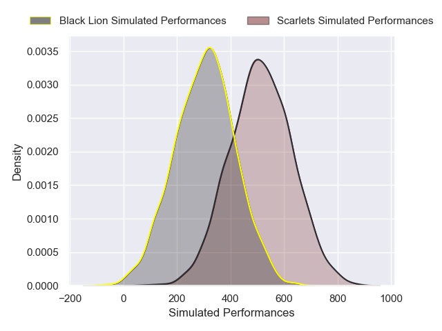
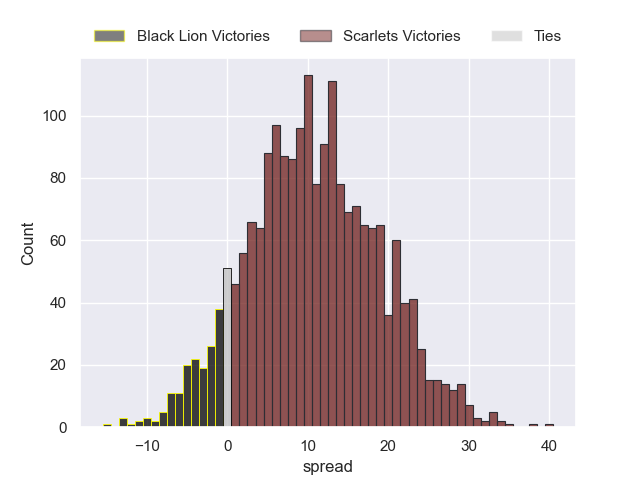
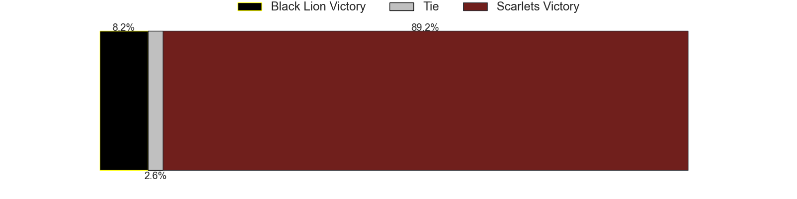

---  
layout: page  
title: Black Lion at Scarlets  
date: 2024-12-15 18:00:00 -0500  
categories: "Challenge Cup 2024" match projection  
---
# Black Lion at Scarlets

# Club Level Predictions

The first set of predictions treats a club as the smallest object, as the club develops its members, organizes a gameplan, and deploys its players as needed for each match. This club model has a prediction of 0.418, which translates to predicting Black Lion to win by -0.2.

Our Over/Under is 42.5 - and combined with the spread above, we have a predicted scoreline of 21 to 21

Each club has a rating and a rating deviation (similar to a Glicko rating), and expected performances can be generated. This allows for simulated matches and spreads like the ones below.
## Projected Performances - Club Model

## Projected Spreads - Club Model

## Projected Results - Club Model

# Player Level Predictions

Treating teams instead as an entity made up of the currently active players, I have ratings for each player in an altogether different system. These can be combined to form team ratings once teamsheets are announced, weighting starters a bit higher than the reserves. After the match is played, players can be weighted by their minutes on the field, allowing for an accurate measure of the team's composition. With these compiled team ratings, we can make predictions, measure inaccuracy, and update the individual player ratings.
## Prediction without Player Minutes: Scarlets by 10.8

Scarlets by 1.5 on a neutral pitch

## Projected Performances - Player Model

## Projected Spreads - Player Model

## Projected Results - Player Model

| Away Player             |   Away Percentile |   Number |   Home Percentile | Home Player          |
|:------------------------|------------------:|---------:|------------------:|:---------------------|
| Vasil Kakovin           |             42.27 |        1 |             83.89 | Kemsley Mathias      |
| Irakli Kvatadze         |            nan    |        2 |             92.93 | Marnus van der Merwe |
| Giorgi Chkhartishvili   |             43.04 |        3 |             67.48 | Henry Thomas         |
| Lado Chachanidze        |             40.66 |        4 |             89.57 | Max Douglas          |
| Mikheil Babunashvili    |             88.27 |        5 |             89.75 | Sam Lousi            |
| Sandro Mamamtavrishvili |             58.55 |        6 |             86.41 | Taine Plumtree       |
| Giorgi Tsutskiridze     |             81.11 |        7 |             79.32 | Josh MacLeod         |
| Luka Ivanishvili        |             50.83 |        8 |             96.32 | Vaea Fifita          |
| Tengiz Peranidze        |             43.27 |        9 |             43.91 | Gareth Davies        |
| Luka Matkava            |             90.58 |       10 |             67.54 | Sam Costelow         |
| Amiran Shvangiradze     |            nan    |       11 |             32.71 | Ellis Mee            |
| Tornike Kakhoidze       |             38.61 |       12 |             88.7  | Johnny Williams      |
| Demur Tapladze          |             84.84 |       13 |             20.15 | Joe Roberts          |
| Aka Tabutsadze          |             86.51 |       14 |             51.55 | Tom Rogers           |
| Luka Tsirekidze         |             35.53 |       15 |             21.79 | Ioan Nicholas        |
| Tengiz Zamtaradze       |             17.97 |       16 |              8.91 | Shaun Evans          |
| Dato Abdushelishvili    |            nan    |       17 |             83.17 | Alec Hepburn         |
| Bachuki Tchumbadze      |            nan    |       18 |            nan    | Archer Holz          |
| Demur Epremidze         |            nan    |       19 |             71.5  | Alex Craig           |
| Giorgi Sinauridze       |            nan    |       20 |             60.17 | Jarrod Taylor        |
| Davit Khuroshvili       |            nan    |       21 |             21.15 | Archie Hughes        |
| Ioane Metreveli         |             34.09 |       22 |             13.23 | Ioan Lloyd           |
| Sandro Todua            |             91.94 |       23 |             26.27 | Eddie James          |

