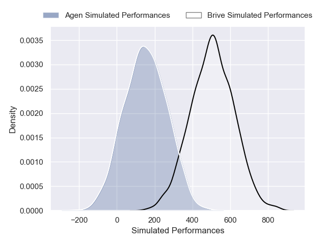
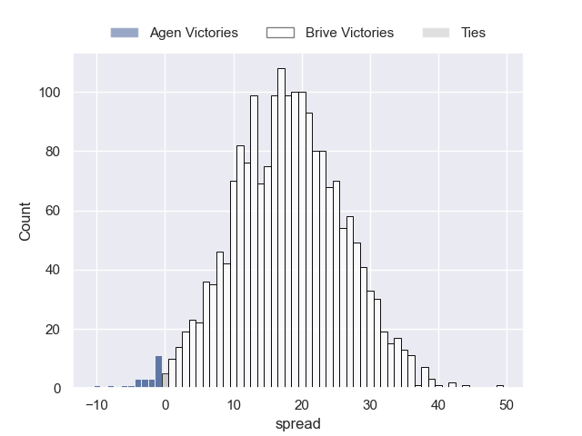
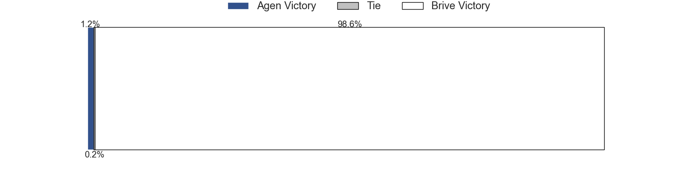

---  
layout: page  
title: Agen at Brive  
date: 2024-12-19 18:00:00 -0500  
categories: "Pro D2 2024" match projection  
---
# Agen at Brive

# Club Level Predictions

The first set of predictions treats a club as the smallest object, as the club develops its members, organizes a gameplan, and deploys its players as needed for each match. This club model has a prediction of 0.611, which translates to predicting Brive to win by 8.4.

Our Over/Under is 43.5 - and combined with the spread above, we have a predicted scoreline of 18 to 26

Each club has a rating and a rating deviation (similar to a Glicko rating), and expected performances can be generated. This allows for simulated matches and spreads like the ones below.
## Projected Performances - Club Model

## Projected Spreads - Club Model

## Projected Results - Club Model

# Player Level Predictions

Treating teams instead as an entity made up of the currently active players, I have ratings for each player in an altogether different system. These can be combined to form team ratings once teamsheets are announced, weighting starters a bit higher than the reserves. After the match is played, players can be weighted by their minutes on the field, allowing for an accurate measure of the team's composition. With these compiled team ratings, we can make predictions, measure inaccuracy, and update the individual player ratings.
## Prediction without Player Minutes: Brive by 17.7

Brive by 4.8 on a neutral pitch

## Projected Performances - Player Model

## Projected Spreads - Player Model

## Projected Results - Player Model

| Away Player             |   Away Percentile |   Number |   Home Percentile | Home Player               |
|:------------------------|------------------:|---------:|------------------:|:--------------------------|
| Hans Lombard-Buret      |             25.1  |        1 |             18.16 | Simon-Pierre Chauvac      |
| Santiago Socino         |             88.63 |        2 |             61.06 | Issam Hamel               |
| Beau Farrance           |            nan    |        3 |             58.64 | Marcel Van Der Merwe      |
| Evan Olmstead           |            nan    |        4 |            nan    | Tevita Ratuva             |
| William Demotte         |             38.83 |        5 |            nan    | Sitaleki Timani           |
| Julien Lebian           |             36.07 |        6 |            nan    | Retief Marais             |
| Tomasi Fineanganofo (2) |            nan    |        7 |             96.17 | Courtney Lawes            |
| Valentin Gayraud        |             36.07 |        8 |             37.48 | Taniela Sadrugu           |
| Jack Maunder            |             77.74 |        9 |             50.17 | Hugo Verdu                |
| Billy Searle            |             23.27 |       10 |             80.61 | Curwin Bosch              |
| Iban Etcheverry         |             32.84 |       11 |            nan    | Tevita Railevu            |
| Clément Garrigues       |             23.06 |       12 |            nan    | Paul Pimienta             |
| Kolinio Ramoka          |             30.13 |       13 |            nan    | Timilai Rokoduru          |
| Loris Tolot             |             28.56 |       14 |             56.5  | Erwan Dridi               |
| Franck Pourteau         |            nan    |       15 |             55.45 | Mathis Ferté              |
| Hayam El Bibouji        |            nan    |       16 |            nan    | Benjamin Boudou           |
| Florent Guion           |            nan    |       17 |            nan    | Nathan Fraissenon         |
| Javier Eissmann         |              1.91 |       18 |             57.06 | Asier Usarraga Latierro   |
| Matthieu Bonnet         |            nan    |       19 |              4.74 | Konstantin Mikautadze     |
| Théo Idjellidaine       |            nan    |       20 |            nan    | Rahboni Warren-Vosayaco   |
| Théo Belan              |            nan    |       21 |             50.83 | Léo Carbonneau            |
| Lucas Martins           |            nan    |       22 |            nan    | Guillaume Galletier       |
| Lasha Macharashvili     |             38.38 |       23 |            nan    | Francisco Coria Marchetti |

