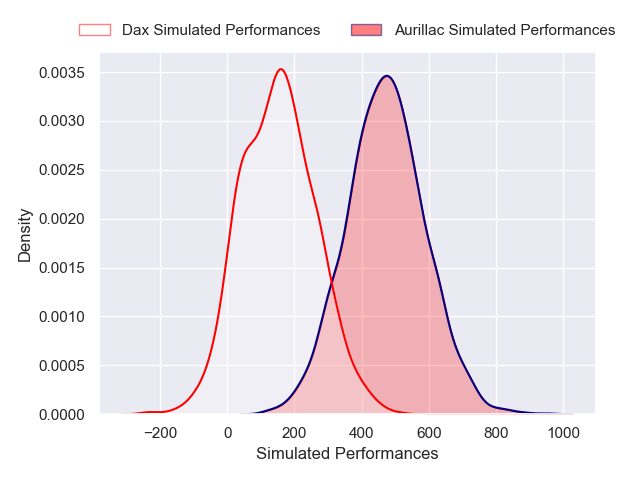
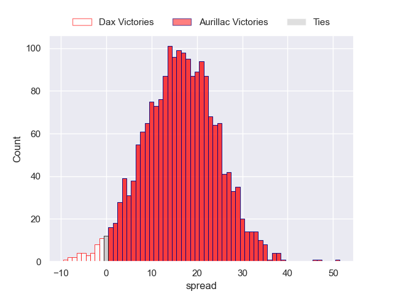
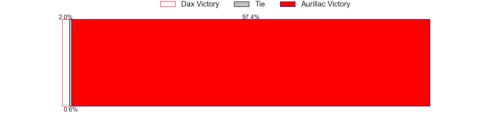

---  
layout: page  
title: Dax at Aurillac  
date: 2024-12-20 18:00:00 -0500  
categories: "Pro D2 2024" match projection  
---
# Dax at Aurillac

# Club Level Predictions

The first set of predictions treats a club as the smallest object, as the club develops its members, organizes a gameplan, and deploys its players as needed for each match. This club model has a prediction of 0.417, which translates to predicting Dax to win by -0.4.

Our Over/Under is 46.5 - and combined with the spread above, we have a predicted scoreline of 23 to 24

Each club has a rating and a rating deviation (similar to a Glicko rating), and expected performances can be generated. This allows for simulated matches and spreads like the ones below.
## Projected Performances - Club Model

## Projected Spreads - Club Model

## Projected Results - Club Model

# Player Level Predictions

Treating teams instead as an entity made up of the currently active players, I have ratings for each player in an altogether different system. These can be combined to form team ratings once teamsheets are announced, weighting starters a bit higher than the reserves. After the match is played, players can be weighted by their minutes on the field, allowing for an accurate measure of the team's composition. With these compiled team ratings, we can make predictions, measure inaccuracy, and update the individual player ratings.
## Prediction without Player Minutes: Aurillac by 16.4

Aurillac by 3.3 on a neutral pitch

## Projected Performances - Player Model

## Projected Spreads - Player Model

## Projected Results - Player Model

| Away Player           |   Away Percentile |   Number |   Home Percentile | Home Player             |
|:----------------------|------------------:|---------:|------------------:|:------------------------|
| Dino Casadeï          |             56.28 |        1 |             52.87 | Irakli Mtchedlidze      |
| Louis Barrère         |            nan    |        2 |            nan    | Luka Nioradze           |
| Diogo Hasse Ferreira  |             11.95 |        3 |             58.14 | Giorgi Kartvelishvili   |
| Etienne Loiret        |            nan    |        4 |             66.36 | Koen Bloemen            |
| Jean-Baptiste Singer  |             51.32 |        5 |            nan    | Abongile Nonkontwana    |
| Jean-Baptiste Barrère |             52.64 |        6 |             54.94 | Eoghan Masterson        |
| Paul Arnaud Ausset    |             51.87 |        7 |             55.79 | Lucas Oudard            |
| Genesis Mamea Lemalu  |            nan    |        8 |             46.58 | Didier Tison            |
| Paul Ravier           |            nan    |        9 |             54.49 | David Delarue           |
| Romuald Séguy         |             48.78 |       10 |             46.94 | Ugo Seunes              |
| Diego Miranda         |            nan    |       11 |             54.4  | Aj Coertzen             |
| Jale Vatubua          |              1.18 |       12 |             52.06 | Elijah Niko             |
| Benjamin Puntous      |            nan    |       13 |            nan    | Hugo Bastard            |
| Maxime Oltmann        |             48.61 |       14 |             52.06 | Karl Martin             |
| Théo Duprat           |            nan    |       15 |            nan    | Dachi Papunashvili      |
| Kito Falatea          |            nan    |       16 |            nan    | Ronan Loughnane         |
| Louis Mary            |            nan    |       17 |            nan    | Gymaël Jean-Jacques     |
| Brice Ferrer          |             49.04 |       18 |             57.52 | Mehdi Slamani           |
| Arnaud Aletti         |            nan    |       19 |            nan    | Heath Backhouse         |
| Sylvère Réteau        |             52.99 |       20 |             51.92 | Mael Perrin             |
| Hugo Fourquet         |            nan    |       21 |            nan    | Boris Hadinegoro        |
| Viliame Tutuvuli (2)  |            nan    |       22 |             53.06 | Tedo Abzhandadze        |
| David Lolohea         |             60.95 |       23 |             36.38 | Dominic Robertson-McCoy |

