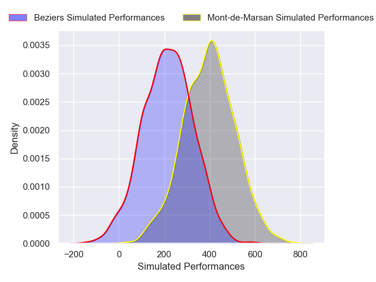
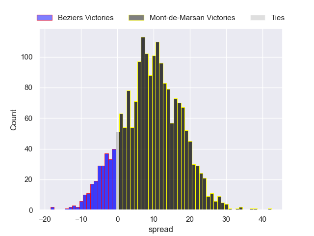
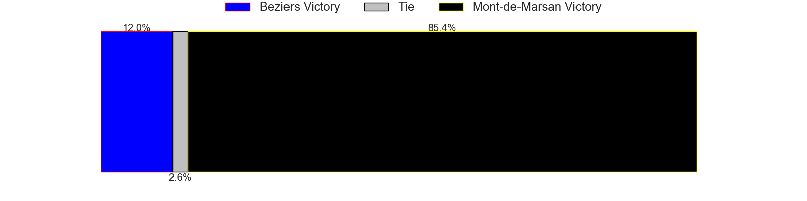

---  
layout: page  
title: Beziers at Mont-de-Marsan  
date: 2024-12-20 18:00:00 -0500  
categories: "Pro D2 2024" match projection  
---
# Beziers at Mont-de-Marsan

# Club Level Predictions

The first set of predictions treats a club as the smallest object, as the club develops its members, organizes a gameplan, and deploys its players as needed for each match. This club model has a prediction of 0.462, which translates to predicting Beziers to win by -2.7.

Our Over/Under is 43.5 - and combined with the spread above, we have a predicted scoreline of 20 to 23

Each club has a rating and a rating deviation (similar to a Glicko rating), and expected performances can be generated. This allows for simulated matches and spreads like the ones below.
## Projected Performances - Club Model

## Projected Spreads - Club Model

## Projected Results - Club Model

# Player Level Predictions

Treating teams instead as an entity made up of the currently active players, I have ratings for each player in an altogether different system. These can be combined to form team ratings once teamsheets are announced, weighting starters a bit higher than the reserves. After the match is played, players can be weighted by their minutes on the field, allowing for an accurate measure of the team's composition. With these compiled team ratings, we can make predictions, measure inaccuracy, and update the individual player ratings.
## Prediction without Player Minutes: Mont-de-Marsan by 9.2

Beziers by 3.9 on a neutral pitch

## Projected Performances - Player Model

## Projected Spreads - Player Model

## Projected Results - Player Model

| Away Player        |   Away Percentile |   Number |   Home Percentile | Home Player           |
|:-------------------|------------------:|---------:|------------------:|:----------------------|
| Marco Trauth       |             75.8  |        1 |             41.38 | Luka Goginava         |
| Jose Luis Gonzalez |            nan    |        2 |             43.51 | Samuel Lagrange       |
| Yannick Arroyo     |            nan    |        3 |             16.77 | Anthony Alves         |
| Gillian Benoy      |             22.71 |        4 |            nan    | Jules Dussutour       |
| Cam Dodson         |             57.02 |        5 |             46.18 | Romain Durand         |
| William Van Bost   |             67.1  |        6 |             35.89 | Ioane Iashagashvili   |
| Clément Ancely     |            nan    |        7 |             45.84 | Raphaël Robic         |
| Otunuku Pauta      |            nan    |        8 |            nan    | Michael Faleafa       |
| Samuel Marques     |             80.16 |        9 |             36.39 | Nicolas Darquier      |
| Charly Malié       |             48.89 |       10 |             43.84 | Willie Du Plessis     |
| Paul Réau          |            nan    |       11 |             51.35 | Pierre Sayerse        |
| Taleta Tupuola     |            nan    |       12 |             39.62 | Nacani Wakaya         |
| Paul Recor         |             48.04 |       13 |            nan    | Gatien Massé          |
| Pierre Courtaud    |             57.79 |       14 |             34.74 | Semi Lagivala (2)     |
| Gabin Lorre        |             54.12 |       15 |             40.54 | Alexandre de Nardi    |
| Yanis Boulassel    |            nan    |       16 |              6.89 | Luka Begic            |
| Yahnis El Maslouhi |             54.19 |       17 |            nan    | Thomas Bultel         |
| Sias Koen          |            nan    |       18 |             47.96 | Myles Edwards         |
| Baptiste Abescat   |             44.89 |       19 |             44.56 | Aurélien Lafforgue    |
| Damien Añon        |             54.43 |       20 |            nan    | Baptiste Canut        |
| Romain Uruty       |            nan    |       21 |            nan    | Yoann Laousse Azpiazu |
| Taylor Gontineac   |             84.5  |       22 |            nan    | Waël Ponpon           |
| Christian Judge    |             53.96 |       23 |             49.11 | Gheorghe Gajion       |

