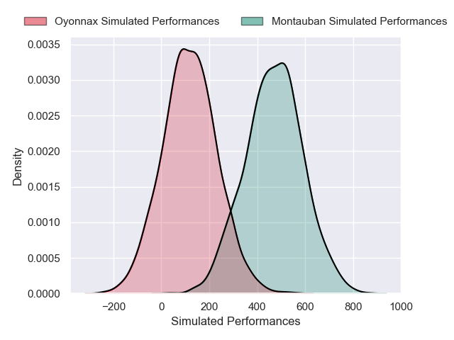
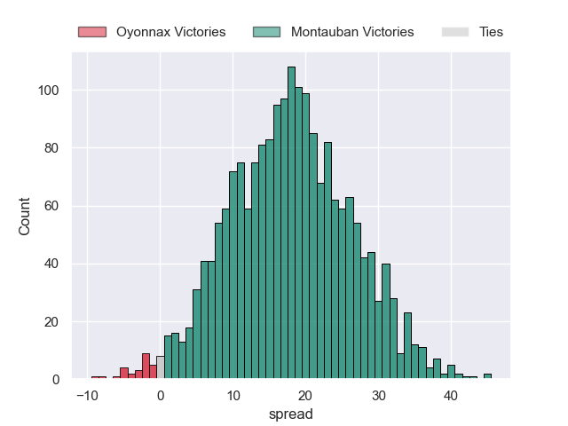
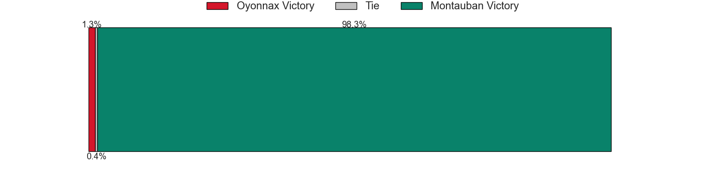

---  
layout: page  
title: Oyonnax at Montauban  
date: 2024-12-20 18:00:00 -0500  
categories: "Pro D2 2024" match projection  
---
# Oyonnax at Montauban

# Club Level Predictions

The first set of predictions treats a club as the smallest object, as the club develops its members, organizes a gameplan, and deploys its players as needed for each match. This club model has a prediction of 0.376, which translates to predicting Oyonnax to win by 1.6.

Our Over/Under is 50.5 - and combined with the spread above, we have a predicted scoreline of 26 to 25

Each club has a rating and a rating deviation (similar to a Glicko rating), and expected performances can be generated. This allows for simulated matches and spreads like the ones below.
## Projected Performances - Club Model

## Projected Spreads - Club Model

## Projected Results - Club Model

# Player Level Predictions

Treating teams instead as an entity made up of the currently active players, I have ratings for each player in an altogether different system. These can be combined to form team ratings once teamsheets are announced, weighting starters a bit higher than the reserves. After the match is played, players can be weighted by their minutes on the field, allowing for an accurate measure of the team's composition. With these compiled team ratings, we can make predictions, measure inaccuracy, and update the individual player ratings.
## Prediction without Player Minutes: Montauban by 17.8

Montauban by 6.7 on a neutral pitch

## Projected Performances - Player Model

## Projected Spreads - Player Model

## Projected Results - Player Model

| Away Player       |   Away Percentile |   Number |   Home Percentile | Home Player       |
|:------------------|------------------:|---------:|------------------:|:------------------|
| Adrien Bordenave  |             21.3  |        1 |            nan    | Thomas Bué        |
| Peniami Narisia   |             89.72 |        2 |             69.31 | Jérémie Maurouard |
| Paulo Tafili      |             74.23 |        3 |            nan    | Mirian Burduli    |
| Phoenix Battye    |             94.71 |        4 |            nan    | Clément Bitz      |
| Ewan Johnson      |             38.65 |        5 |             69.28 | Victor Moreaux    |
| Wandrille Picault |             76.58 |        6 |             64.22 | Fred Quercy       |
| Hugo Hermet       |             19.42 |        7 |            nan    | Kyllian Ringuet   |
| Loic Godener      |              3.51 |        8 |             83.99 | Sikhumbuzo Notshe |
| Vasil Lobzhanidze |             10.8  |        9 |             61.63 | Joe Powell        |
| Zack Holmes       |             70.2  |       10 |             56.01 | Baptiste Mouchous |
| Maxime Salles     |             16.42 |       11 |             62.65 | Josua Vici        |
| Maelan Rabut      |             67.62 |       12 |             50.44 | Simon Renda       |
| Eddie Sawailau    |             44.85 |       13 |             65.06 | Jt Jackson        |
| Gavin Stark       |              9.73 |       14 |            nan    | Romain Fonnicola  |
| Martin Bogado     |             58.96 |       15 |            nan    | Thomas Larregain  |
| Benjamin Geledan  |             25.7  |       16 |            nan    | Kévin Firmin      |
| Rémi Di Pietro    |            nan    |       17 |            nan    | Malino Vanaï      |
| Manuel Leindekar  |              1.73 |       18 |             62.01 | Noa Kanika        |
| Victor Lebas      |            nan    |       19 |             56.7  | Frank Bradshaw    |
| Darren Sweetnam   |             51.75 |       20 |            nan    | Tyrone Viiga      |
| Antoine Miquel    |             57.58 |       21 |            nan    | Hugo Zabalza      |
| Karim Qadiri      |             48.95 |       22 |            nan    | Maxime Espeut     |
| Thibault Berthaud |             59.75 |       23 |             49.6  | Lucas Seyrolle    |

