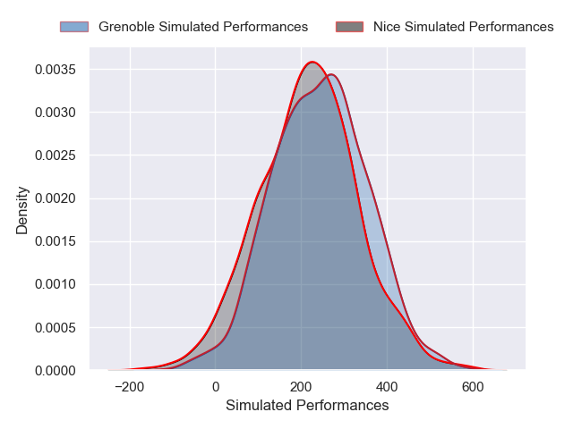
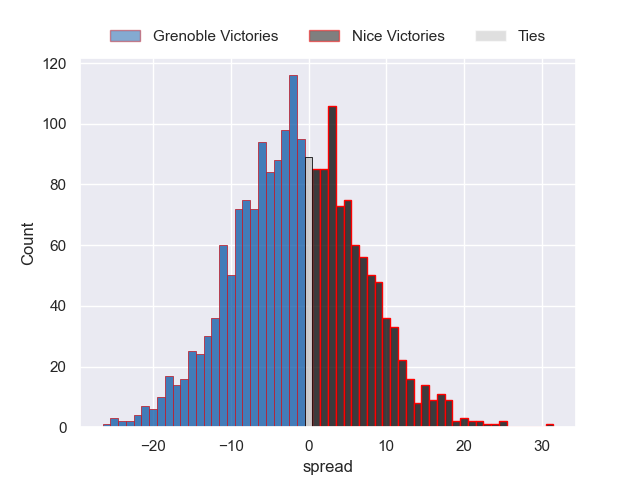

---  
layout: page  
title: Grenoble at Nice  
date: 2024-12-20 18:00:00 -0500  
categories: "Pro D2 2024" match projection  
---
# Grenoble at Nice

# Club Level Predictions

The first set of predictions treats a club as the smallest object, as the club develops its members, organizes a gameplan, and deploys its players as needed for each match. This club model has a prediction of 0.305, which translates to predicting Grenoble to win by 4.0.

Our Over/Under is 36.5 - and combined with the spread above, we have a predicted scoreline of 20 to 16

Each club has a rating and a rating deviation (similar to a Glicko rating), and expected performances can be generated. This allows for simulated matches and spreads like the ones below.
## Projected Performances - Club Model

## Projected Spreads - Club Model

## Projected Results - Club Model

# Player Level Predictions

Treating teams instead as an entity made up of the currently active players, I have ratings for each player in an altogether different system. These can be combined to form team ratings once teamsheets are announced, weighting starters a bit higher than the reserves. After the match is played, players can be weighted by their minutes on the field, allowing for an accurate measure of the team's composition. With these compiled team ratings, we can make predictions, measure inaccuracy, and update the individual player ratings.
## Prediction without Player Minutes: Grenoble by 1.8

Grenoble by 5.1 on a neutral pitch

## Projected Performances - Player Model

## Projected Spreads - Player Model

## Projected Results - Player Model

| Away Player        |   Away Percentile |   Number |   Home Percentile | Home Player        |
|:-------------------|------------------:|---------:|------------------:|:-------------------|
| Zack Gauthier      |             46.09 |        1 |             12.48 | Facundo Gigena     |
| nan                |            nan    |        2 |            nan    | Pierre Strippoli   |
| Giorgi Pertaia     |             48.2  |        3 |            nan    | Luvuyo Pupuma      |
| Pierce Phillips    |             54.51 |        4 |            nan    | Thibaud Rey        |
| Giorgi Javakhia    |             90.52 |        5 |             42.66 | Clément Chartier   |
| Thomas Ployet      |             54.24 |        6 |            nan    | Louis Suaud        |
| Victor Guillaumond |            nan    |        7 |            nan    | Joris Simon        |
| Hanru Sirgel       |             81.64 |        8 |            nan    | Ramiha Smiler      |
| Eric Escande       |             53.49 |        9 |             11.46 | Jules Gimbert      |
| Marc Palmier       |            nan    |       10 |             34.69 | Tanguy Ménoret     |
| Wilfried Hulleu    |            nan    |       11 |            nan    | Andrzej Charlat    |
| Romain Fusier      |             42.2  |       12 |            nan    | Luca Cutayar       |
| Julien Heriteau    |             65.46 |       13 |             33.46 | Nathan Courtade    |
| Geoffrey Cros      |             47.08 |       14 |             41.01 | Simon Delas        |
| Julien Farnoux     |             44.73 |       15 |             30.13 | Paul Auradou       |
| Bastien Soury      |            nan    |       16 |             43.15 | Sione Anga'Aelangi |
| Éli Églaine        |            nan    |       17 |            nan    | Julien Beaufils    |
| Cameron Holt       |            nan    |       18 |            nan    | Martin Freytes     |
| Camille Baz-Marcos |            nan    |       19 |            nan    | Hugo Sarrasin      |
| Barnabé Couilloud  |            nan    |       20 |             45.14 | Bastien Berenguel  |
| Max Clément        |            nan    |       21 |            nan    | Matéo Jeune Joly   |
| Kaminieli Rasaku   |             49.11 |       22 |             45.21 | David Odiete       |
| Cody Thomas        |            nan    |       23 |             19.89 | Tom Ross           |

