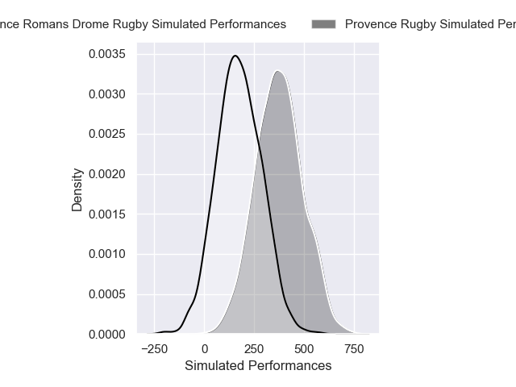
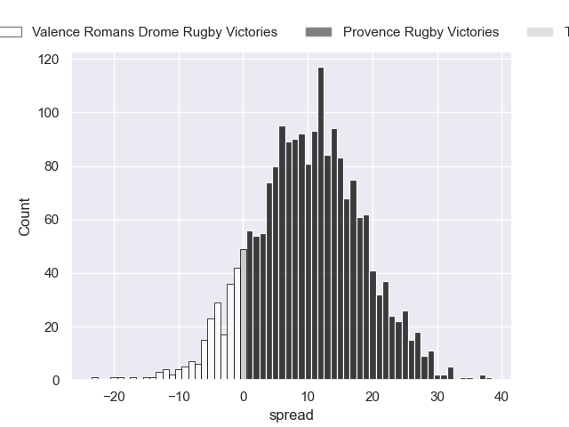
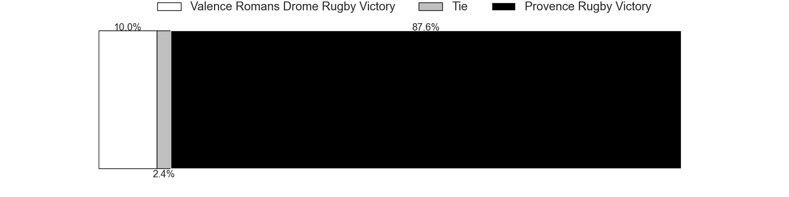

---  
layout: page  
title: Valence Romans Drome Rugby at Provence Rugby  
date: 2024-12-20 18:00:00 -0500  
categories: "Pro D2 2024" match projection  
---
# Valence Romans Drome Rugby at Provence Rugby

# Club Level Predictions

The first set of predictions treats a club as the smallest object, as the club develops its members, organizes a gameplan, and deploys its players as needed for each match. This club model has a prediction of 0.602, which translates to predicting Provence Rugby to win by 7.8.

Our Over/Under is 44.5 - and combined with the spread above, we have a predicted scoreline of 18 to 26

Each club has a rating and a rating deviation (similar to a Glicko rating), and expected performances can be generated. This allows for simulated matches and spreads like the ones below.
## Projected Performances - Club Model

## Projected Spreads - Club Model

## Projected Results - Club Model

# Player Level Predictions

Treating teams instead as an entity made up of the currently active players, I have ratings for each player in an altogether different system. These can be combined to form team ratings once teamsheets are announced, weighting starters a bit higher than the reserves. After the match is played, players can be weighted by their minutes on the field, allowing for an accurate measure of the team's composition. With these compiled team ratings, we can make predictions, measure inaccuracy, and update the individual player ratings.
## Prediction without Player Minutes: Provence Rugby by 10.4

Provence Rugby by 0.5 on a neutral pitch

## Projected Performances - Player Model

## Projected Spreads - Player Model

## Projected Results - Player Model

| Away Player         |   Away Percentile |   Number |   Home Percentile | Home Player              |
|:--------------------|------------------:|---------:|------------------:|:-------------------------|
| Anthony Aléo        |             39.79 |        1 |             44.19 | Thomas Vernet            |
| Dorian Marco-Pena   |            nan    |        2 |            nan    | Joseph Laget             |
| Vincent Vial        |             41.79 |        3 |             44.33 | Paul Mallez              |
| Ryan Mccauley       |             42.75 |        4 |            nan    | Jérôme Dufour            |
| Yassine Maamry      |            nan    |        5 |             36.73 | Josh Tyrell              |
| Adrien Roux         |            nan    |        6 |             46.85 | Teimana Harrison         |
| Ilia Spanderashvili |             13.37 |        7 |             45.94 | Andrés Zafra             |
| Matthieu Vachon     |             32.39 |        8 |            nan    | Malohi Suta              |
| Tim Menzel          |            nan    |        9 |             42.19 | Arthur Coville           |
| Lucas Méret         |             37.96 |       10 |             76.94 | Jules Soulan             |
| Mosese Mawalu       |             41.36 |       11 |             45.68 | Léo Drouet               |
| Louis Marrou        |             38.37 |       12 |             41.12 | Inga Finau               |
| Mathieu Guillomot   |             37.88 |       13 |             38.45 | Mathias Colombet         |
| Adam Vargas         |             41.36 |       14 |             43.58 | Adrien Lapègue           |
| Joris De Moura      |             84.84 |       15 |            nan    | Thomas Salles            |
| Cyril Deligny       |             38.63 |       16 |            nan    | Thomas Sauveterre        |
| Andréa Pontanier    |            nan    |       17 |             86.65 | Hayden Thompson-Stringer |
| Florian Goumat      |             40.75 |       18 |             46.34 | Bilel Taieb              |
| Thembelani Bholi    |            nan    |       19 |             10.52 | Tornike Jalagonia        |
| Mattéo Rodor        |            nan    |       20 |            nan    | Kévin Viallard           |
| Anatole Pauvert     |            nan    |       21 |             41.41 | Jimmy Gopperth           |
| Sven Girlando       |             41.65 |       22 |            nan    | Nadir Bouhedjeur         |
| Gareth Milasinovich |            nan    |       23 |             39.45 | Enrique Pieretto         |

