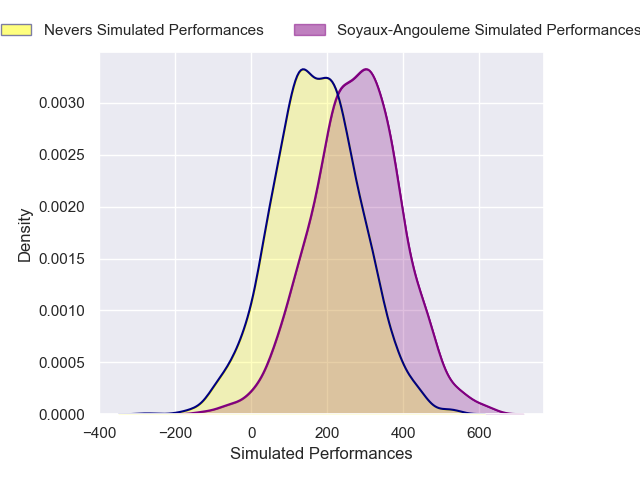
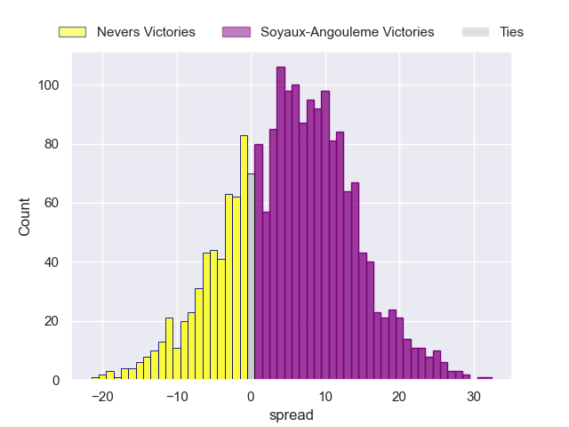
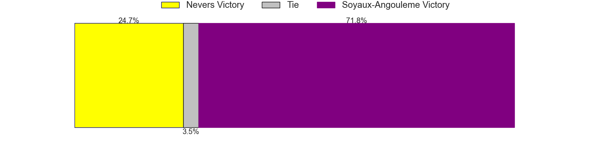

---  
layout: page  
title: Nevers at Soyaux-Angouleme  
date: 2024-12-20 18:00:00 -0500  
categories: "Pro D2 2024" match projection  
---
# Nevers at Soyaux-Angouleme

# Club Level Predictions

The first set of predictions treats a club as the smallest object, as the club develops its members, organizes a gameplan, and deploys its players as needed for each match. This club model has a prediction of 0.503, which translates to predicting Soyaux-Angouleme to win by 4.0.

Our Over/Under is 43.5 - and combined with the spread above, we have a predicted scoreline of 20 to 24

Each club has a rating and a rating deviation (similar to a Glicko rating), and expected performances can be generated. This allows for simulated matches and spreads like the ones below.
## Projected Performances - Club Model

## Projected Spreads - Club Model

## Projected Results - Club Model

# Player Level Predictions

Treating teams instead as an entity made up of the currently active players, I have ratings for each player in an altogether different system. These can be combined to form team ratings once teamsheets are announced, weighting starters a bit higher than the reserves. After the match is played, players can be weighted by their minutes on the field, allowing for an accurate measure of the team's composition. With these compiled team ratings, we can make predictions, measure inaccuracy, and update the individual player ratings.
## Prediction without Player Minutes: Soyaux-Angouleme by 5.8

Soyaux-Angouleme by 0.1 on a neutral pitch

## Projected Performances - Player Model

## Projected Spreads - Player Model

## Projected Results - Player Model

| Away Player                |   Away Percentile |   Number |   Home Percentile | Home Player        |
|:---------------------------|------------------:|---------:|------------------:|:-------------------|
| Tornike Mataradze          |            nan    |        1 |            nan    | Paul Tailhades     |
| Jean-Maxence Jules-Rosette |            nan    |        2 |            nan    | Patxi Bidart       |
| Farai Mudariki             |            nan    |        3 |             42.19 | Yassin Boutemanni  |
| Ugo Vignolles              |             25.34 |        4 |            nan    | Maxence Lemardelet |
| Lasha Jaiani               |             73.75 |        5 |            nan    | Sikeli Nabou       |
| Luka Plataret              |            nan    |        6 |            nan    | Gautier Gibouin    |
| Steven David               |             40.37 |        7 |            nan    | Germain Burgaud    |
| Jason Fraser               |             30.88 |        8 |            nan    | Alex Masibaka (2)  |
| Simon Tarel                |            nan    |        9 |            nan    | Emmanuel Saubusse  |
| Shaun Reynolds             |             33.06 |       10 |            nan    | Ben Botica         |
| Johan Wasserman            |            nan    |       11 |             45.14 | Nathan Farissier   |
| Noa Pommelet               |            nan    |       12 |            nan    | Mathis Lafon       |
| Rudy Derrieux              |             34.74 |       13 |            nan    | Arthur Proult      |
| Lucas Blanc                |            nan    |       14 |             11.83 | Jonny May          |
| Perry Mayo                 |            nan    |       15 |             34.75 | Jules Dubecq       |
| Efi Ma'Afu                 |             38.94 |       16 |             44.39 | Motu Matu'U        |
| Kamaliele Tufele           |            nan    |       17 |             45.19 | Sami Zouhaïr       |
| Wesley Lindor              |            nan    |       18 |            nan    | Léo Labarthe       |
| Julien Kazubek             |            nan    |       19 |            nan    | Léo Morand-Bruyat  |
| Hugo Bouyssou              |             37.21 |       20 |             45.27 | Hubert Texier      |
| Nicolas Ragoevi            |            nan    |       21 |             38.37 | Adrien Bau         |
| Gabin Rocher               |             40.19 |       22 |             35.38 | George Tilsley     |
| Cleopas Kundiona           |             39.05 |       23 |            nan    | Seydou Diakité     |

