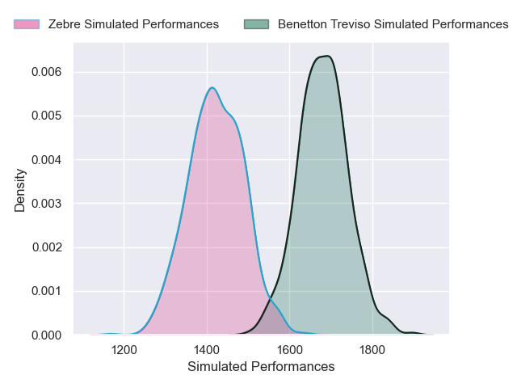
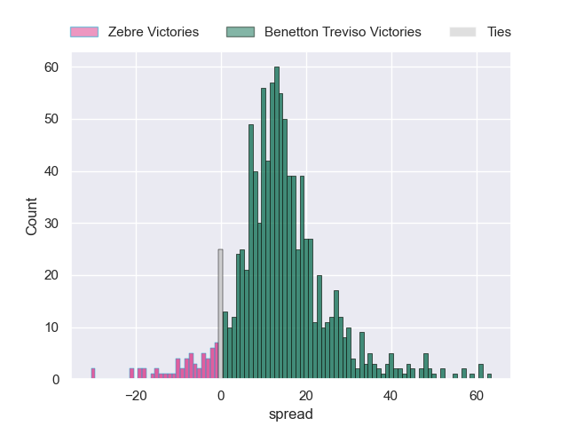
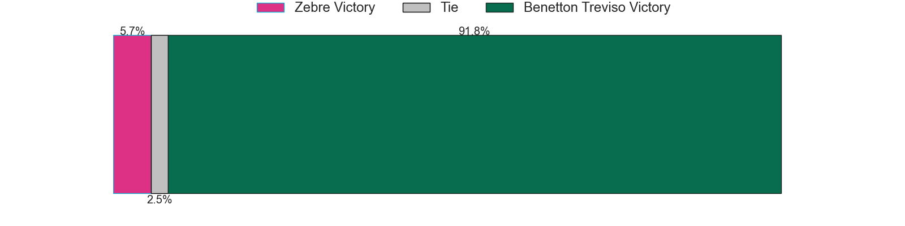
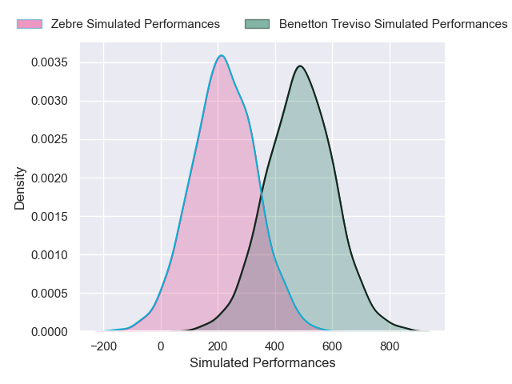
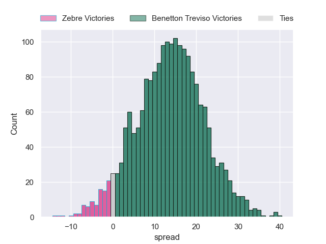
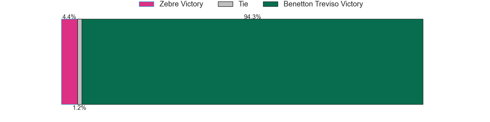

---  
layout: page  
title: Zebre at Benetton Treviso  
date: 2024-12-21 18:00:00 -0500  
categories: "United Rugby Championship 2024" match projection  
---
# Zebre at Benetton Treviso

# Club Level Predictions

The first set of predictions treats a club as the smallest object, as the club develops its members, organizes a gameplan, and deploys its players as needed for each match. This club model has a prediction of 0.754, which translates to predicting Benetton Treviso to win by 14.1.

Our Over/Under is 47.5 - and combined with the spread above, we have a predicted scoreline of 17 to 31

Each club has a rating and a rating deviation (similar to a Glicko rating), and expected performances can be generated. This allows for simulated matches and spreads like the ones below.
## Projected Performances - Club Model

## Projected Spreads - Club Model

## Projected Results - Club Model

# Player Level Predictions

Treating teams instead as an entity made up of the currently active players, I have ratings for each player in an altogether different system. These can be combined to form team ratings once teamsheets are announced, weighting starters a bit higher than the reserves. After the match is played, players can be weighted by their minutes on the field, allowing for an accurate measure of the team's composition. With these compiled team ratings, we can make predictions, measure inaccuracy, and update the individual player ratings.
## Prediction without Player Minutes: Benetton Treviso by 13.5

Benetton Treviso by 5.7 on a neutral pitch

## Projected Performances - Player Model

## Projected Spreads - Player Model

## Projected Results - Player Model

| Away Player            |   Away Percentile |   Number |   Home Percentile | Home Player           |
|:-----------------------|------------------:|---------:|------------------:|:----------------------|
| Danilo Fischetti       |             47.05 |        1 |             37.96 | Mirco Spagnolo        |
| Tommaso Di Bartolomeo  |             48.2  |        2 |              0.63 | Siua Maile            |
| Ion Neculai            |             23.44 |        3 |             84.06 | Simone Ferrari        |
| Matteo Canali          |             95.03 |        4 |             66.79 | Niccolo Cannone       |
| Andrea Zambonin        |             43.16 |        5 |             94.94 | Federico Ruzza        |
| Giacomo Ferrari        |             24.32 |        6 |             83.38 | Sebastian Negri       |
| Bautista Stavile       |             22.11 |        7 |             30.76 | Manuel Zuliani        |
| Giovanni Licata        |             16.82 |        8 |             63.96 | Toa Halafihi          |
| Gonzalo Garcia         |             75.9  |        9 |             16.89 | Andy Uren             |
| Giacomo Da Re          |             17.17 |       10 |             86.46 | Tomas Albornoz        |
| Simone Gesi            |             23.53 |       11 |             47.54 | Onisi Ratave          |
| Enrico Lucchin         |             59.14 |       12 |             92.82 | Juan Ignacio Brex     |
| Fetuli Paea            |             13.88 |       13 |             73.49 | Malakai Fekitoa       |
| Scott Gregory          |             55.6  |       14 |             44.83 | Louis Lynagh          |
| Geronimo Prisciantelli |             93.54 |       15 |             88.01 | Rhyno Smith           |
| Giampietro Ribaldi     |             28.79 |       16 |             56.34 | Bautista Bernasconi   |
| Luca Rizzoli           |             75.68 |       17 |             49.94 | Nahuel Tetaz Chaparro |
| Muhamed Hasa           |             26.98 |       18 |             64.52 | Giosue Zilocchi       |
| Leonard Krumov         |              8.61 |       19 |             23.12 | Riccardo Favretto     |
| Iacopo Bianchi         |             12.43 |       20 |             50.64 | Alessandro Izekor     |
| Thomas Dominguez       |             24.43 |       21 |             48.03 | Alessandro Garbisi    |
| Filippo Drago          |             25.26 |       22 |             65.66 | Jacob Umaga           |
| Rusiate Nasove         |            nan    |       23 |             56.74 | Leonardo Marin        |

