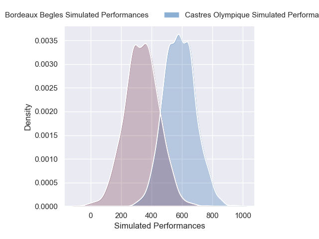
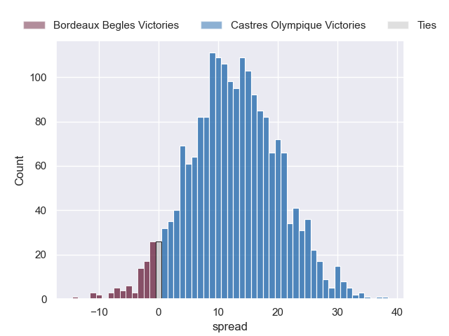
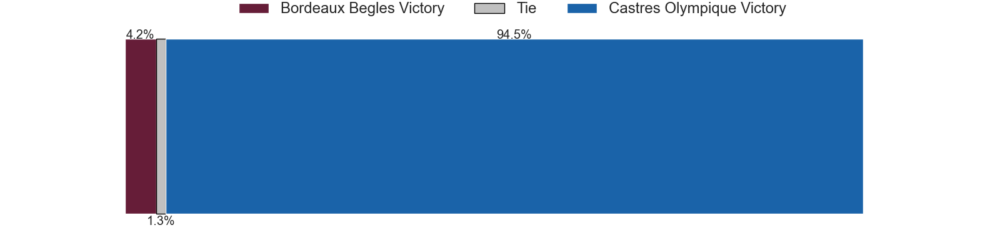

---  
layout: page  
title: Bordeaux Begles at Castres Olympique  
date: 2024-12-21 18:00:00 -0500  
categories: "Top 14 2024" match projection  
---
# Bordeaux Begles at Castres Olympique

# Club Level Predictions

The first set of predictions treats a club as the smallest object, as the club develops its members, organizes a gameplan, and deploys its players as needed for each match. This club model has a prediction of 0.348, which translates to predicting Bordeaux Begles to win by 2.4.

Our Over/Under is 49.5 - and combined with the spread above, we have a predicted scoreline of 26 to 23

Each club has a rating and a rating deviation (similar to a Glicko rating), and expected performances can be generated. This allows for simulated matches and spreads like the ones below.
## Projected Performances - Club Model

## Projected Spreads - Club Model

## Projected Results - Club Model

# Player Level Predictions

Treating teams instead as an entity made up of the currently active players, I have ratings for each player in an altogether different system. These can be combined to form team ratings once teamsheets are announced, weighting starters a bit higher than the reserves. After the match is played, players can be weighted by their minutes on the field, allowing for an accurate measure of the team's composition. With these compiled team ratings, we can make predictions, measure inaccuracy, and update the individual player ratings.
## Prediction without Player Minutes: Castres Olympique by 12.3

Bordeaux Begles by 1.9 on a neutral pitch

## Projected Performances - Player Model

## Projected Spreads - Player Model

## Projected Results - Player Model

| Away Player               |   Away Percentile |   Number |   Home Percentile | Home Player          |
|:--------------------------|------------------:|---------:|------------------:|:---------------------|
| Ugo Boniface              |             80.93 |        1 |            nan    | nan                  |
| Connor Sa                 |             35.05 |        2 |            nan    | nan                  |
| Carlu Sadie               |             76.33 |        3 |            nan    | nan                  |
| Guido Petti               |             95.65 |        4 |            nan    | nan                  |
| Adam Coleman              |             97.96 |        5 |            nan    | nan                  |
| Mahamadou Diaby           |             70.01 |        6 |             17.14 | Mathieu Babillot     |
| Temo Matiu                |              8.83 |        7 |             74.64 | Tyler Ardron         |
| Tevita Tatafu             |             70.57 |        8 |             21.47 | Abraham Papali'i     |
| Yann Lesgourgues          |              7.54 |        9 |             66.89 | Santiago Arata       |
| Joey Carbery              |             85.45 |       10 |             80.81 | Louis Le Brun        |
| Enzo Reybier              |             71.86 |       11 |             88.39 | Remy Baget           |
| Rohan Janse van Rensburg  |             77.51 |       12 |             81.34 | Adrea Cocagi         |
| Yoram Moefana             |             88.61 |       13 |             96.08 | Jack Goodhue         |
| Damian Penaud             |             96.9  |       14 |             97.69 | Geoffrey Palis       |
| Mateo Garcia              |             47.57 |       15 |             58.61 | Julien Dumora        |
| Romain Latterrade         |             29.26 |       16 |             22.38 | Loris Zarantonello   |
| Zinédine Aouad            |            nan    |       17 |            nan    | Wayan De Benedittis  |
| Cyril Cazeaux             |             90.05 |       18 |             86.32 | Florent Vanverberghe |
| Alexandre Ricard          |             76.82 |       19 |              3.64 | Gauthier Maravat     |
| Bastien Vergnes Taillefer |             76.86 |       20 |             52.46 | Jeremy Fernandez     |
| Paul Abadie               |              1.64 |       21 |             63.84 | Pierre Popelin       |
| Nicolas Depoortere        |             80.1  |       22 |             10.53 | Adrien Seguret       |
| Toma'akino Taufa          |             45.57 |       23 |             77.04 | Will Collier         |

